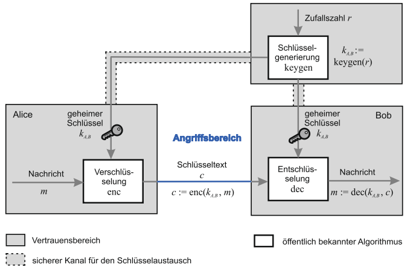
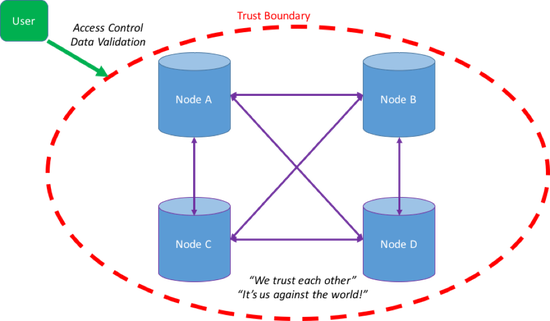
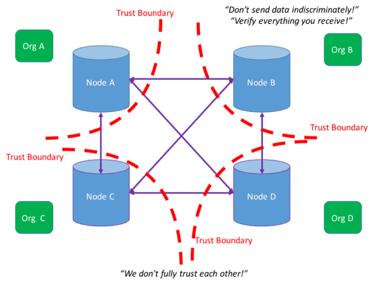
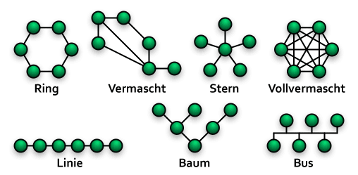
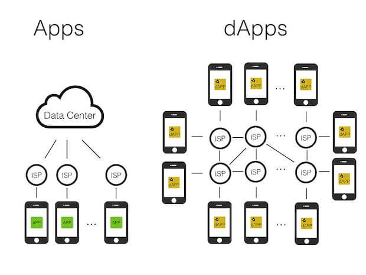
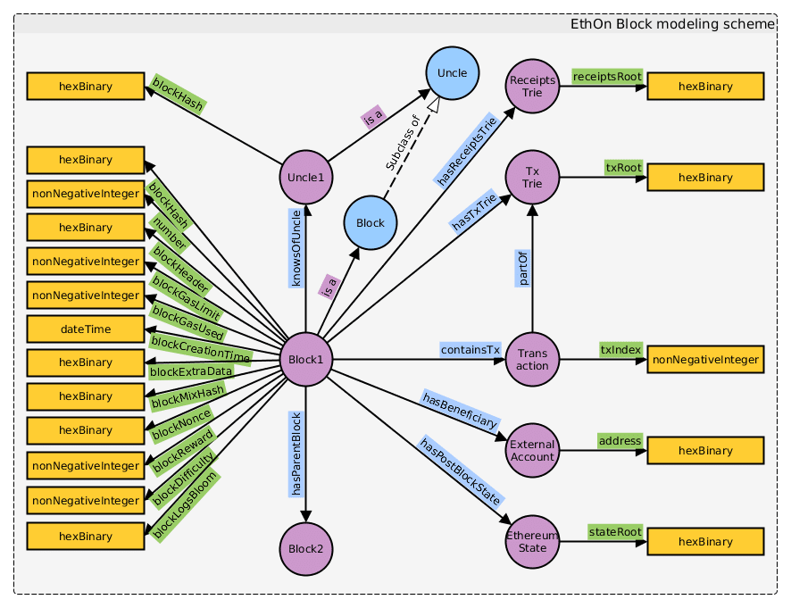

# Grundlagen

## Kryptographie
Autor: Lukas Stuckstette und Patrick Vogt

Um die Funktionsweise einer Blockchain verstehen zu können, ist ein grundsätzliches Verständnis im Bereich der Kryptographie unerlässlich. Dieses Kapitel soll deshalb einen Überblick über die Grundlagen der Kryptographie schaffen.
Hierzu werden zunächst einige grundlegende Begrifflichkeiten erläutert sowie Themenbereiche der Verschlüsselung und Signierung vorgestellt. Anschließend... 

TODO Lukas

### Einige wichtige Begriffe der Kryptographie
Autor: Patrick Vogt

**CIA-Schutzziele**

Kryptographie ist ein mögliches Mittel gegen gezielte Angriffe auf Softwaresysteme. Das Akronym *CIA* spiegelt drei wichtige Schutzziele wider. Es ergibt sich aus den folgenden drei Begriffen, [[BAUM14]](#ref_baum14):

* **C**onfidentiality (Vertraulichkeit): Informationen sind nur autorisierten Personen zugänglich
* **I**ntegrity (Integrität): Informationen sind korrekt, aktuell und vollständig
* **A**vailability (Verfügbarkeit): Informationen sind berechtigten Personen dort und dann zugänglich, wo und wann diese die Informationen benötigen

**Authentizität**

Das Sicherheitsziel *Authentizität* gewährleistet, dass ein Kommunikationspartner wirklich derjenige ist, der er vorgibt zu sein. Sind Daten oder Informationen authentisch, so ist deren Herkunft gewiss.

**Nichtabstreitbarkeit**

Ebenso wichtig ist der Begriff der *Nichtabstreitbarkeit*. Diese gewährleistet eine Nachweisbarkeit gegenüber Dritten, sodass der Versand und Empfang einer Nachricht, bzw. von Daten/Informationen, bewiesen werden kann. Hieraus ergeben sich zwei Unterkategorien:

* Nichtabstreitbarkeit der Herkunft: verhindert ein nachträgliches Abstreiten des **Versands** einer Nachricht

* Nichtabstreitbarkeit des Erhalts: verhindert ein nachträgliche Abstreiten des **Erhaltens** einer Nachricht

**Verbindlichkeit**

Der Begriff der *Verbindlichkeit* kombiniert Authentizität mit Nichtabstreitbarkeit. Im Falle einer Datenübertragung heißt das, dass der Absender seine Identität bewiesen hat und der Empfang der Nachricht nicht abgestritten werden kann <a>[[BSI18a]](#ref_bsi18a)</a>.

**Kerckhoffs’ Prinzip**

Ein wichtiger Grundsatz der Kryptographie wurde 1883 von Auguste Kerkchoffs von Nieuwenhof (* 1835, † 1903) festgestellt. In seiner Schrift beschrieb er das folgende Prinzip:

>Die Sicherheit eines Kryptosystems liegt allein in der Schwierigkeit, den Schlüssel zu finden – sie darf nicht auf der Geheimhaltung des Systems beruhen. <a>[[BAUM14]](#ref_baum14)</a>

Alle heutzutage gängigen Verschlüsselungsverfahren folgen diesem Grundsatz. 
Befolgt man diesen Grundsatz nicht, erhält ein potentieller Angreifer Zugriff auf alle Daten, sobald das Verfahren, z.B. aufgrund eines Informationslecks, bekannt wird. Des Weiteren ermöglicht dies, dass Experten über die Sicherheit der Verfahren offen diskutieren können und ggf. auftretende Sicherheitslücken erkannt und behoben werden können.

### Hashfunktionen
Autor: Patrick Vogt

Hashfunktionen bilden einen wichtigen Bestandteil innerhalb der Kryptographie. Sie berechnen aus einer gegebenen Nachricht einen sogenannten *Hashwert* fester Länge. Aus kryptografischer Sicht können Hashwerte als eine Prüfsumme gesehen werden. 
Hierbei handelt es sich im Prinzip um eine "Einwegfunktion", bei der der Weg vom Definitionsbereich hin zum Bildbereich einfach durchzuführen ist, die Rückrichtung jedoch nur mit großem Aufwand bestimmbar ist. Selbst wenn es einem Angreifer gelingen sollte einen passenden Wert für einen gegebenen Hashwert zu berechnen, so ist sein Ergebnis nicht eindeutig <a>[[PAAR16]](#ref_paar16)</a>. 

Der Grund hierfür ist, dass sogenannte *Kollisionen* auftreten können. Das bedeutet, dass aufgrund des eingeschränkten Bildbereichs (begrenzte Anzahl an Zeichen) und des gleichzeitig unbegrenzten Definitionsbereichs (quasi beliebig lange Zeichenfolge) zwangsweise Überschneidungen auftreten können. Je schwieriger man für eine gegebene Nachricht eine weitere Nachricht mit identischem Hashwert finden kann, desto *kollisionssicherer* ist das Hashverfahren.

Hashfunktionen können z.B. für das Speichern von Passwörtern verwendet werden, sodass innerhalb einer Datenbank das Passwort nicht als Klartext (sondern als Hashwert) hinterlegt wird <a>[[PAAR16]](#ref_paar16)</a>. Bei Blockchains werden Hashfunktionen z.B. dazu genutzt, um die einzelnen Blöcke miteinander zu verbinden (siehe Abschnitt "Die Blockchain" im Kapitel "Verteilte Systeme").

### Verschlüsselung
Autor: Patrick Vogt

*Symmetrische Verschlüsselung*

Eine Art der Verschlüsselung ist die symmetrische Verschlüsselung. Bereits Gaius Julius Caesar (* 100 v. Chr., † 44 v. Chr.)  verwendete diese Art der Verschlüsselung zur Kommunikation mit seinen Generälen 
(die sogenannte *Caesarchiffre*). Die Schlüssel dieser Verfahren werden *symmetrische Schlüssel* genannt, da Chiffrier- und Dechiffrierschlüssel identisch sind, siehe nachfolgende Abbildung.

Abbildung entnommen aus <a>[[SSL18]](#ref_ssl18)</a>

Nicht optimal ist hierbei, dass Sender und Empfänger den gemeinsamen Schlüssel einmalig vor der ersten Übertragung austauschen müssen. 
Es wird somit ein Kommunikationskanal benötigt, in dem die Teilnehmer ihren Schlüssel auf sichere Art und Weise austauschen können, siehe nachfolgende Abbildung.
 

Abbildung entnommen aus <a>[[BAUM14]](#ref_baum14)</a>

In der Abbildung ist außerdem zu erkennen, dass das zuvor vorgestellte Kerckhoffs’sche Prinzip eingehalten wird, indem alle Algorithmen öffentlich bekannt sind. 
Ebenso ist zu erwähnen, dass die Anzahl der benötigten Schlüssel mit der Anzahl der Kommunikationspartner drastisch steigt. Damit N Teilnehmer sicher miteinander kommunizieren können, werden 
**N(N-1)/2** Schlüssel benötigt <a>[[KÜST11]](#ref_kuesters11)</a>.
Als Vorteil ist unter anderem die hohe Geschwindigkeit für das Ver- und Entschlüsseln der Daten zu nennen, da diese Verfahren meist auf effizienten Operationen (z.B. XOR) beruhen <a>[[STOP18]](#ref_stop18)</a>.

*Asymmetrische Verschlüsselung*

Im Gegensatz zur symmetrischen Verschlüsselung verwendet die asymmetrische Verschlüsselung verschiedene Schlüssel zur Ver- und Entschlüsselung.
Es existiert ein *Schlüsselpaar*, das aus einem öffentlichen Schlüssel (public key) sowie einem privaten Schlüssel (private key/secret key) besteht. Das grundsätzliche Verfahren ist in der folgenden Abbildung 
dargestellt. 
  

Abbildung entnommen aus <a>[[SSL18]](#ref_ssl18)</a>

Der Absender verwendet den öffentlichen Schlüssel des Empfängers zum Verschlüsseln der Daten. Der Empfänger erhält den verschlüsselten Text und kann diesen mit seinem privaten Schlüssel
dechiffrieren. Hierbei wird das Kerckhoffs’sche Prinzip ebenfalls eingehalten. Der große Vorteil dieses Verfahrens liegt darin, dass der öffentliche Schlüssel nicht geheim gehalten werden muss, da er nicht zum Entschlüsseln der Daten genutzt werden kann. Der bei der symmetrischen Verschlüsselung benötigte sichere Kommunikationskanal entfällt somit, siehe nachfolgende Abbildung. Der private Schlüssel sollte dementsprechend nur dem jeweiligen Empfänger bekannt sein und von ihm geheim gehalten werden. Da die Schlüssel jeweils von nur einem Teilnehmer abhängig sind, steigt die Anzahl der Schlüssel bei steigender Anzahl an Teilnehmern nicht quadratisch, wie bei der symmetrischen Verschlüsselung, sondern linear.

Abbildung entnommen aus <a>[[BAUM14]](#ref_baum14)</a>

### Digitale Signaturen
Autor: Patrick Vogt

Ähnlich wie herkömmliche (analoge) Signaturen sollen digitale Signaturen sicherstellen, dass eine Nachricht bzw. ein Dokument tatsächlich von dem Absender/Signierer stammt, der vorgibt das Dokument erstellt zu haben.

Mithilfe von digitalen Signaturen kann sichergestellt werden, dass mit dem richtigen Gegenüber kommuniziert wird (beispielsweise beim Schlüsselaustausch zweier Teilnehmer).
Eine Verschlüsselung der Daten erfolgt bei der Signierung nicht, wenngleich eine zusätzliche Verschlüsselung der signierten Nachricht durchaus üblich ist <a>[[PAAR16]](#ref_paar16)</a>.

Die nachfolgende Abbildung zeigt den prinzipiellen Ablauf beim Übermitteln digital signierter Dokumente.

Abbildung entnommen aus <a>[[DOCU18]](#ref_docu18)</a>

Das zu signierende Dokument wird mithilfe einer Hashfunktion verarbeitet und anschließend mit dem privaten Schlüssel des Absenders ("Signierers") verschlüsselt und an das originale Dokument angefügt. Das nun signierte Dokument wird an den Empfänger gesendet, wo die Signatur mithilfe des öffentlichen Schlüssels des Signierers entschlüsselt wird. Der Empfänger wendet anschließend den gleichen Hash-Algorithmus wie der Absender 
auf das Dokument an und vergleicht sein Ergebnis mit der empfangenen Signatur. Stimmen die beiden Hashwerte überein, wurde der Text mit sehr hoher Wahrscheinlichkeit von der angegebenen Person signiert und nicht verändert. 

Im Gegensatz zu anderen (auf symmetrischen Verfahren basierenden) Signaturverfahren kann der Empfänger der Nachricht jedem, der ebenfalls den öffentlichen Schlüssel des Signierers kennt, beweisen, dass dieser die Nachricht verfasst hat.
Solche digitalen Signaturverfahren können deshalb auch zur juristischen Beweisführung verwendet werden <a>[[PAAR16]](#ref_paar16)</a>.

Anforderungen an die Verwendung von digitalen Signaturen werden in Deutschland im Signaturgesetz (SigG) bzw. in der Signaturverordnung (SigV) angegeben.
Hier werden drei verschiedene Arten von elektronischen Signaturen unterschieden, <a>[[BAUM14]](#ref_baum14)</a>:

>* Als **elektronische Signatur** werden in elektronischer Form vorliegende Daten betrachtet, die zur Authentifizierung dienen und die anderen elektronischen Daten beigefügt
werden können. Es könnte sich hierbei also auch um eine eingescannte Unterschrift
handeln.
>* **Fortgeschrittene elektronische Signaturen** sind ausschließlich dem Inhaber des Signierschlüssels zuzuordnen. Hier handelt es sich also um Signaturen, die mit einem digitalen
Signatursystem erzeugt wurden. Allerdings werden keine besonderen Anforderungen
an die Sicherheit gestellt.
>* **Qualifizierte elektronische Signaturen** müssen ebenfalls mit einem digitalen Signatursystem erzeugt werden. Zusätzlich müssen Sicherheitsanforderungen bei der Erzeugung dieser Signaturen erfüllt sein, und der Zusammenhang zwischen Testschlüssel
und Identität des entsprechenden Teilnehmers muss durch ein zum Zeitpunkt der Erstellung gültiges qualifiziertes Zertifikat bestätigt werden.

Letztere Signaturen beinhalten zusätzlich zum Namen und Testschlüssel weitere Details (z.B. das Erzeugungsdatum und die Gültigkeit des Zertifikats) <a>[[BAUM14]](#ref_baum14)</a>.

### Message Authentication Code (MAC)
Autor: Patrick Vogt

Message Authentication Codes (MACs) werden auch kryptografische Prüfsummen genannt. Sie dienen der Sicherstellung der Integrität und Authentisierung von Nachrichten. MACs beruhen, im Gegensatz zu digitalen Signaturen, auf einem symmetrischen Verfahren, wodurch eine Nichtzurückweisbarkeit nicht gewährleistet werden kann. Es werden Hashfunktionen oder Blockchiffren verwendet, wodurch sie in der Regel deutlich schneller als digitale Signaturen verarbeitet werden können.

Im Wesentlichen wird mithilfe eines symmetrischen Schlüssels *k* und der Nachricht *x* eine Prüfsumme *m* gebildet:

>m = MACk(x)

Auf diese Art und Weise soll sichergestellt werden, dass die Nachricht auf dem Weg zum Empfänger nicht verändert wurde <a>[[PAAR16]](#ref_paar16)</a>.

Der gesamte Vorgang läuft prinzipiell wie bei digitalen Signaturen ab:

Abbildung entnommen aus <a>[[WIKI18b]](#ref_wiki18b)</a>

Der Sender bildet mithilfe des gemeinsamen Schlüssels und der Nachricht eine Prüfsumme und verschickt die Nachricht mit angehängter Prüfsumme. Der Empfänger führt den gleichen Vorgang durch und prüft seine berechnete Prüfsumme mit der erhaltenen. 

### Public Key Infrastructure (PKI)
Autor: Patrick Vogt

Bei Verfahren, die auf asymmetrischen Methodiken beruhen, muss sichergestellt werden, dass ein bestimmter öffentlicher Schlüssel tatsächlich einer gewissen Person gehört. Die Gültigkeit dieser *Schlüsselbindung* wird von *Zertifizierungsstellen* (*certification authorities, CA*) mithilfe von *Zertifikaten* (*cetificates*) bestätigt <a>[[KÜST11]](#ref_kuesters11)</a>. Public Key Infrastructures (PKIs) verwalten und verteilen die Schlüssel und Zertifikate.

Digitale Zertifikate bestehen aus einem öffentlichen Schlüssel sowie aus zusätzlichen Informationen, z.B.:

* wer hat das Zertifikat ausgestellt?
* für wen wurde das Zertifikat ausgestellt (Besitzer des privaten Schlüssels)?
* Gültigkeitszeitraum des Zertifikats
* Fingerprint (eindeutige Kennung; z.B. durch Anwenden einer Hashfunktion auf den öffentlichen Schlüssel)

Damit der Austausch solcher Zertifikate einfach und sicher durchgeführt werden kann, erstellt eine Zertifizierungsstelle ein Wurzelzertifikat (Root-Zertifikat). Diese Stelle muss für alle Teilnehmer als vertrauenswürdig eingestuft sein. Mithilfe des zum Wurzelzertifikat gehörenden privaten Schlüssels können weiteren Zertifikate signiert werden. Private Schlüssel, deren Zertifikat von einem Wurzelzertifikat signiert wurde, können ebenfalls zum Signieren weiterer Zertifikate verwendet werden. Diese Zertifikate dürfen wiederum weitere Zertifkate signieren. Eine solche "Signatur-Kette" darf beliebig lang weitergeführt werden, solange sie beim Wurzelzertifikat einer CA beginnt.
Zur Überprüfung der Vertrauenswürdigkeit und Echtheit müssen dementsprechend alle Zertifikate der Kette überprüft werden [[BSI18b]](#ref_BSI18b).

### Algorithmen
Autor: Patrick Vogt

Im Bereich der Kryptographie gibt es eine Vielzahl von verschiedenen Algorithmen Arten . Die nachfolgende Tabelle soll, basierend auf den Empfehlungen in [[BSI18c]](#ref_bsi18c), einen Überblick über einige aktuell bedeutende Algorithmen Arten verschaffen.

| Verfahren          | Typ/Grundkategorie           | Anwendungsgebiet    | Sicherheitsbasis/-prinzip                                                                                    |
|--------------------|------------------------------|---------------------|-----------------------------------------------------------------------------------------------------|
| AES                | Blockchiffre                | Verschlüsselung     | kein effizienter Weg zur Bestimmung des symmetrischen Schlüssels bekannt; viele Jahre bewährt                                                                             |
| SHA                | Hashfunktion                | Signatur            | kollisionssichere Hashfunktion                                                                     |
| CMAC               | MAC (Blockchiffre)          | Signatur            |   sicheres Blockchiffre-Verfahren                                                                                                 |
| HMAC               | MAC (Hashfunktion)          | Signatur            | kollisionssichere Hashfunktion                                                                                                    |
| GMAC               | MAC (Blockchiffre)          | Signatur            |   sicheres Blockchiffre-Verfahren                                                                                                                                                 |
| RSA                | asym. Schlüsselpaar          | Verschl. & Signatur | Umkehrfunktion von Faktorisierung schwer zu berechnen                                                   |
| DSA                | asym. Schlüsselpaar & Hashfunktion   | Signatur    | Umkehrfunktion von diskreter Log. schwer zu berechnen                                                   |
| Elliptische Kurven | Einwegfunktion               | Signatur            | Umkehrfunktion von elliptischen Kurven schwer zu berechnen                                                   |
| Diffie-Hellman     | Protokoll                    | Schlüsselaustausch  | Umkehrfunktion diskreter Exponentialfunktionen schwer zu berechnen |
| Merkle-Signaturen  | Merkle-Tree & Einmalsignatur | Signatur            | mehrstufige Hash-Verfahren zu einem einzigen Hashwert zusammenfassen (als öffentlicher Schlüssel) |

In <a>[[BSI18c]](#ref_bsi18c)</a> werden im speziellen folgende Algorithmen empfohlenen: 

Blockchiffren (symmetrisches Verfahren für Blöcke fester Längen):
* AES-128
* AES-192
* AES-256

Stromchiffren (symmetrisches Verfahren für Blöcke beliebiger Längen):

*keine Verfahren empfohlen*

Hashfunktionen:
* SHA-256
* SHA-512/256
* SHA-384
* SHA-512
* SHA3-256
* SHA3-384
* SHA3-512

MAC:
* CMAC
* HMAC
* GMAC

Signaturverfahren:
* RSA
* DSA
* DSA auf Basis elliptischer Kurven
    * ECDSA
    * ECKDSA
    * ECGDSA
* Merkle-Signaturen

Schlüsseltransport (asymmetrische Verfahren):
* Diffie-Hellmann
* EC Diffie-Hellman (ECKA-DH)

### Zero knowledge Proofs 

Autor: Lukas Stuckstette

## Distributed Ledger vs. Datenbanken
Autor: Tim Jastrzembski

### Exkurs: Datenbank <a>[[GREE15]](#ref_gree15)</a> <a>[[BEGE18]](#ref_bege18)</a>
Allgemein kann man eine Datenbank als eine organisierte Sammlung von elektronischen Daten interpretieren, welche von einem Datenbankmanagementsystem (DBMS) zentral verwaltet werden. 
Dabei sollen hierbei viele Datensätze effizient, konsistent und dauerhaft verwaltet werden können. Zudem können Datenbanken logische Zusammenhänge zwischen den einzelnen Daten abbilden. 
Beispielsweise können sie in Tabellen abgebildet werden, wobei jede Reihe eine Entität und jede Spalte ein Attribut, welches die Entität beschreibt, darstellt. 
Zur Manipulation der Datenbanken sind Transaktionen notwendig. Dabei beinhaltet eine Transaktion ein oder mehrere Manipulationen der Datenbank (Datensatz anlegen, ändern oder löschen). 
Bei der Ausführung der Transaktion wird sie auf ihre Richtigkeit überprüft und entweder als ganzes oder gar nicht ausgeführt (getreu dem ACID-(bei RDBs) bzw. dem BASE-Theorem (bei NoSQL-DBs) <a>[[WIKI18]](#ref_wiki18a)</a>). Die Richtigkeit wird u.a. durch Regeln wie Unique Keys, Forein keys oder Check constraints. 
Wichtig dabei ist, dass die Datenbank nach jeder Transaktion einen validen Zustand erreicht und entsprechend konsistente Daten beinhaltet.	

### Distributed Ledger Technologie (DLT) <a>[[METZ18]](#ref_metz18)</a>
Blockchain basiert auf der Distributed Ledger Technologie, welche das Verarbeiten und Speichern von Daten ermöglicht.
Sie kann auch als eine dezentrale Datenbank verstanden werden, da sie im Gegensatz zu herkömmlichen verteilten (zentralen) Datenbanken gemeinsame Zugriffsrechte für mehrere Netzwerkteilnehmer auf Datensätze erlaubt, was eine zentrale Instanz zur Datenverwaltung überflüssig macht. 
Die Datenänderungen werden per Transaktion an die anderen Teilnehmer geschickt, wobei diese entscheiden können, ob die Transaktion für gültig erklärt wird oder nicht.  
Bezüglich der Zugangsmöglichkeiten lassen sich die Ledgers folgend unterteilen:

| Zugangsmöglichkeit |   |
| --- | --- |
| Unpermissioned Ledger | Diese Ledger sind am bekanntesten (z.B. durch Bitcoin). Sie sind prinzipiell für alle zugänglich und erfordern keine Authentifizierung. Entsprechend wird PoW als Konsensveriante eingesetzt, sodass kein Vertrauen zwischen den Teilnehmern notwendig ist. |
| Permissioned Legder | Bei diesen Ledgern  müssen sich die Teilnehmer registriert sein und entsprechende Auflagen(z.B. bzgl. Vertrauen) erfüllen, damit sie an dem Konsens teilnehmen dürfen. Dadurch können PoS oder PBFT-Mechanismen eingesetzt werden, welche im Gegensatz zu PoW  Rechenkapazitäten sparen.|

### Abgrenzung zu Datenbanken

Prinzipiell sind Distributed Ledger verteilte Datenbanken, welchen Nutzern, die kein richtiges Vertrauen ineinander haben, einen Konsens über den Inhalt und der Verwaltung der Datenbank ermöglichen. <a>[[BROW16]](#ref_brow16)</a> <a>[[COLA18]](#ref_cola18)</a>
Im Gegensatz verwalten verteilte Datenbanken im herkömmlichen Sinne ihre Daten zentral und synchonisieren die Daten auf den verschiedenen Standorten periodisch. <a>[[ITWI18]](#ref_itwi18)</a> 

|  |  |
| --- | --- |
| verteilte Datenbank <a>[[BROW16]](#ref_brow16)</a> | distributed Ledger <a>[[BROW16]](#ref_brow16)</a> |

## Verteilte Systeme

In diesem Kapitel soll definiert werden, was ein verteiltes System in Bezug auf die Blockchain ist und welche Probleme
gelöst werden müssen, damit Vertrauen zwischen den einzelnen Nodes aufgebaut werden kann. Zudem sollen die gebräuchlichsten 
Konsens-Algorithmen erläutert werden, welche zurzeit von den größten Blockchain-Netzwerken benutzt werden.

### Was ist ein verteiltes System
Ein verteiltes System ist prinzipiell eine Ansammlung von Computern, welche untereinander Nachrichten austauschen
können. Das Medium, über den dieser Austausch stattfindet, ist dabei unbedeutend. Heutzutage wird für den Nachrichtenaustausch 
in den allermeisten Fällen das Internet genutzt, da hier Rechner auf der Welt miteinander kommunizieren können und
die geschaffene Infrastruktur einen einfachen Zugang ermöglicht. Zudem wird ein verteiltes System darüber definiert, dass ein Benutzer das
Systems als ein einziges System sieht, egal mit welcher Node beziehungsweise Computer im Systems er sich verbindet. 

Verteilte Systeme können verschiedene Typologien haben. Eine Topologie beschreibt, in welcher Weise die Nodes im System miteinander verbunden
sind. 

Beispielsweise kennt eine Node in einem vollvermaschten System jede andere Node und kann so auf direktem Wege miteinander kommunizieren. 
Die direkte Kommunikation ist einer der Vorteile dieser Topologie. Wenn jedoch eine neue Node dem Netzwerk beitreten will, muss nicht nur
die neue Node alle bereits im Netzwerk bestehenden Nodes kennenlernen, auch müssen die bereits bestehenden Nodes über den Betritt informiert 
werden. Je nach größe des Netzwerkes und wie oft eine neue Node dem Netzwerk betritt kann dies zu einem Problem werden, wo das System nur noch
damit beschäftigt ist die Liste der Nodes aktuell zu halten. 

Bei den meisten Blockchain-Protokollen wird auf eine Abwandlung der vollvermaschten Topologie zurückgegriffen. Es kommt ein vermaschtes Netzwerk
oder auch Peer-to-Peer (P2P) Netzwerk zum Einsatz. Dabei können neue Nodes wie bei einem vollvermaschten Netz von jeder anderen Node 
hinzugefügt werden, allerdings können nicht alle Nodes eines Netzwerkes direkt miteinander kommunizieren. Stattdessen steht jede Node mit
einer Handvoll anderer Nodes in Kontakt. Soll eine Nachricht zu einer Node gesendet werden, welche nicht im direkten Kontakt mit der Absendernode
steht, so wird diese Nachricht vom Netzwerk selbst weitergeleitet, bis die Nachricht eine Node erreicht, welche in Kontakt mit der Empfängernode 
steht.

### Die Blockchain
Die Blockchain ist ein verteiltes Kontobuch (Ledger), in welchem jede Transaktion von jedem Nutzer verzeichnet ist. Eine bestimmte Anzahl an
Transaktionen werden zu Blöcken zusammengefasst. Diese Blöcke werden miteinander verkettet. Dies bedeutet, dass der Hash eines Nachfolgerblockes
im Header des Vorgängerblockes gespeichert wird. Über die Blockchain kann so die Reihenfolge 
der Transaktionen gespeichert werden. In einem verteilten Blockchain System hält jede Node eine Kopie der Blockchain. Zudem kann jede Node 
Transaktionen eines Nutzers entgegennehmen und diese im Netzwerk bekannt machen. Das Problem, welches sich nun jeder Blockchain-Algorithmus lösen
muss, ist, welche Node die gesammelten Transaktionen zu einem Block zusammenfassen und der Blockchain hinzufügen darf. Damit das Protokoll 
funktioniert müssen alle Nodes im Netzwerk sich auf eine einzige Blockchain einigen. Hinzu kommt, dass Nodes dem Netzwerk frei betreten können,
ohne das eine zentrale Stelle die Node überprüft hat. So kann keiner Node im Netzwerk vertraut werden. Es muss also ein Weg gefunden werden, der
es dem Netzwerk erlaubt Blöcke von einer Node zur Kette hinzufügen zu lassen, obwohl die Absichten der hinzufügenden Node nicht bekannt sind. 
Zudem muss geregelt werden was passiert, wenn es zu Unstimmigkeiten in der Blockchain kommt, wenn beispielsweise zwei Blöcke zur selben Zeit gefunden
wurden und es zu einer gabelung (fork) in der Blockchain kommt. Bei einem fork würden zwei verschiedenen Blöcke am Ende der Kette stehen. Dadurch
könnten Währungen doppelt ausgegeben werden, falls in den beiden letztens Blöcken Transaktionen von einem Konto zu zwei verschiedenen Empfängern 
verzeichnet sind. Die Aufgabe eines Konsens-Algorithmus ist es deshalb zu einer eindeutigen, gabelungsfreien Blockchain zu gelangen, auf welche
sich alle Nodes im Netzwerk einigen können. 

### Konsens-Algorithmen
Es gibt verschiedene Wege zu einem Konsens in einem verteilten System zu kommen. Viele Cryptowährungen unterscheiden sich alleine in ihrem
Konsens-Algorithmus und versuchen so ein Alleinstellungsmerkmal zu erlangen. Zu den gebräuchlichsten Konsens-Algorithmen zählen:

* Proof-of-Work
* Proof-of-Stake
* Practical Byzantine Fault Tolerance
* Proof of Elapsed Time
* Federated Byzantine Agreement 

Diese Algorithmen werden unteranderem von jeweils Bitcoin, Etherium, Ripple, InterLedger (Hyperledger) und Hyperledger Fabric verwendet. 

#### Proof-of-Work
Wie bei allen Blockchain-Protokollen wird auch beim Proof-of-Work Transaktionen zu Blöcken zusammengefasst. Jede Node die eine Transaktion empfängt
speichert diese zunächst in einem Cache und leitet sie an alle anderen Nodes im Netzwerk weiter. Liegen genug Transaktionen in einem Cache können
diese zu einem Block zusammengefasst werden. Alle Nodes fassen Transaktionen in einem eigenen Block zusammen. Dies hat zur Folge, dass nicht alle Nodes
die gleichen Transaktionen in ihrem Block aufgenommen haben, da Transaktionen beim verschicken zwischen Nodes verloren gegangen sein können oder es
durch eine Verzögerung nicht in den aktuellen Block geschafft haben. 

Nachdem eine Node einen Block zusammengefasst hat, versucht sie einen Nonce zu finden, welcher, gehasht mit dem Blockhash, einen neuen Hashwert
bildet. Dieser neu gebildete Hashwert muss allerdings eine bestimmte Anzahl von anführenden Nullen besitzen um vom Netzwerk als der rechtmäßige 
Nachfolgerblock anerkannt zu werden. Die Anzahl der führenden Nullen des Hashes wird Schwierigkeit (Difficulty) genannt. Diese Schwierigkeit passt
sich dynamisch an das Netzwerk an, sodass mit sich ändernder Rechenleistung der zeitliche Abstand der Blockerstellung gleichbleibend ist.
Der eigentliche zeitliche Abstand ist je nach Implementierung des Proof-of-Work unterschiedlich. Im Falle von Bitcoin beträgt er 10 Minuten. 

Der neu gefundene Block wird von der findenden Node direkt in die Kopie ihrer Blockchain eingefügt und anschließend an alle weiteren Nodes gesendet.
Nodes die den neuen Block empfangen prüfen ihn auf seine Richtigkeit und fügen ihn dann zu ihrer eigenen Kopie der Blockchain hinzu. Sollte es in der
eigenen Blockchain bereits einen Nachfolgerblock geben, weil zwei Nodes zur selben Zeit einen Block gefunden haben, werden zunächst beide Blöcke als Nachfolger 
behandelt. Nodes können frei entscheiden welchen der beiden Nachfolgerblöcke sie als legitim ansehen. Wird allerdings ein neuer Block gefunden welcher die 
Blockchain um einen Block verlängert, so wird nur der längste Teil der Blockchain als legitim angesehen und der andere Teil der Blockchain wird verlassen.
Es kann vorkommen das eine Gabelung in der Kette zwei bis drei Blöcke erreicht, bevor ein Ast sich als legitim herrausstellt. Transaktionen, die nur
auf dem abgeschnittenen Ast verzeichnet waren, werden somit ungültig. Aufgrund dessen sollte bei einer Transaktion gewartet werden bis mindestens sechs 
Blöcke nach der eigentlichen Transaktion angehängt worden sind.  

Aufgrund der Tatsache das die Findung eines Blockes Rechenleistung benötigt, kann davon ausgegangen werden das keine einzelne Person alle Blocks zur 
Kette hinzufügen kann. Da nur die längste Kette von allen Nodes als legitim angesehen wird, müsste eine Person alleine jeden einzelnen neuen Block
finden, damit seine eigene Blockchain schneller wächst als die Blockchain an der das Rest des Netzwerkes arbeitet. Durch diesen Umstand wird die
Dezentralisierung gewährleistet. Sollte allerdings eine Person oder Organisation mehr als 51% der Rechenleistung kontrollieren, könnte diese 
Organisation den Verlauf der Blockchain manipulieren. <a>[[NAKA08]](#ref_naka08)</a> 

### Proof-of-Stake
Auch bei dem sogenannten Proof-of-Stake geht es darum einen Block mit Transaktionen zu finden, auf den sich das gesamte Netzwerk einigen kann.
Anders als bei dem Proof-of-Work Algorithmus muss dazu allerdings kein Hashwert erraten werden. Beim Proof-of-Stake wird eine Node im Netzwerk
zufällig ausgelost. Die ausgeloste Node darf dann einen neuen Block zur Blockchain hinzufügen. Zusätzlich erhält die ausgewählte Node eine 
Belohnung (Blockreward) für das hinzufügen des Blockes. Die Chancen der Nodes auf eine Auswahl kann gesteigert werden, fall die Nodes einen
Einsatz (Stake) besitzen. Je größer dabei die Anzahl der gehaltenen Coins ist, desto höher ist die Chance ausgewählt zu werden und den neuen Block
zu stellen.

Der Hintergedanke beim Proof-of-Stake ist der, das je größer das Investment in eine Cryptowährung ist, desto größer ist auch der Anreiz des
Investors in die "Gesundheit" der Währung. Der Wert einer Cryptowährung ist über das Vertrauen der Anleger bestimmt. Sollten große 
Investoren, die aufgrund ihres gehaltenen Vermögens häufig einen Block stellen, versuchen die Chain zu manipulieren, so würden sie beim
Auffliegen von diesen manipulationen auf Grund des Vertrauensverlusts selber Geld verlieren. 

In der Praxis zeigt sich allerdings ein anders Bild. Der Proof-of-Stake zeigte sich anfällig für das "Nothing at Stake" Problem. Auch wenn
Großinvestoren im Allgemeinfall einen ökonomischen Anreiz haben die Blockchain frei von forks zu halten, so gibt es keinen eingebauten 
mechanischen Mechanismus der Miner davon abhält jeden Block zu validieren um an die Blockreward zu gelangen. <a>[[SIIM17]](#ref_siim17)</a> 

### Practical Byzantine Fault Tolerance
Der Practical Byzabtibe Fault Tolerance (PBFT) ist der erste hier vorgestellte Konsens-Algorithmus welchem Nodes nicht frei beitreten können (permissioned).
Während bei PoW und PoS jeder Computer im Netzwerk beim Finden eines neuen Blockes mithelfen kann, so gibt es beim PBFT ein zentrales Netzwerk an
Nodes, welche die Entscheidung über einen neuen Block treffen. Diese Nodes wurden von einer zentralen Organisation oder Komitee bestimmt. Diese
Nodes bilden ein voll vermaschtes Netzwerk und sind somit alle untereinander bekannt. 

Unter diesen zentralen Node wird periodisch eine Anführernode (Primary) gewählt. Die Auswahl des Primary erfolgt in der Regel zufällig. Nur der 
Primary darf neue Blöcke erstellen und den andern Nodes (Replicas) im zentralen Netzwerk als Vorschlag unterbreiten. Dabei wird der vorgeschlagene
Block in drei Stufen vom zentralen Netzwerk überprüft: Pre-prepared, prepared und commited. In der Pre-prepared Phase wird der neue Block an alle
Replicas gesendet. Der Block wird von allen anderen Replicas überprüft. Das Ergebnis dieser Überprüfung wird wiederum an alle anderen Replicas
per Broadcast übermittelt. Auf diese Weise erhalten alle Replicas die Ergebnisse der anderen Replicas. Dies ist der prepared Schritt. Stimmen
mindestens 2/3 alle Ergebnisse der Replicas überein, so wird der Block anerkannt. In diesem Fall broadcastet jede Node im Netzwerk, dass der
neue Block angenommen wurde. Dies ist der Commit Schritt. Damit wird der Block sowohl beim Primary als auch bei den Replicas in die Blockchain 
aufgenommen. 

Die Fault Tolerance im Namen des Algorithmus kommt daher, dass es auch zu einem Konsens kommt falls eine oder mehrere Node nicht richtig 
funktionieren. Dies kann durch einen "natürlichen" Computerfehler oder aber auch durch böswillige Absicht passieren. Über die Formel
n = 3f+1 kann herausgefunden werden, wie viele fehlerhafte Nodes das System aushalten kann. Dabei ist n die Anzahl der gesamt Nodes und
f die Anzahl der Fehlerhaften Nodes. In einem System mit 4 Nodes könnte also eine Node fehlerhaft sein. Über die 3 funktionieren Nodes kann
eine 3/4 Mehrheit erreicht werden, was zu einem Konsens führen würde. Bei 2 fehlerhaften Node würde die 2/3 nicht erreicht werden können. <a>[[CAST99]](#ref_cast99)</a>

### Proof of Elapsed Time
Der Proof-of-Elapsed-Time (PoET) ist ein von Intel entwickelter Konsens Algorithmus. Dabei erstellen Nodes einen Timer, welcher eine zufällige
Ablaufzeit besitzt. Falls der Timer einer Node abgelaufen ist, darf diese Node einen Block zur Blockchain hinzufügen. Die Schwierigkeit die es
zu überwinden gilt ist zum einen wie die Erstellung des Timers gehandhabt wird und zum anderen wie kontrolliert werden kann das die gewählte Zeit
auch wirklich gewartet worden ist. Sollten diese Bedingungen nicht überprüft werden könnten Node einfach eine kurze Zeit als Timer wählen oder die
Zeit schlicht nicht warten. 

Um dem entgegenzuwirken stellt Intel in ihren Prozessoren ein spezielles Instruktionsset names Intel Software Guard Extensions (SGX) zur Verfügung.
Mit Hilfe von SGX ist es möglich Code ausführen zu lassen. Nach Ablauf des Codes wird ein Zertifikat erstellt, welches nachweist das der Code ohne
Veränderung von außen ausgeführt wurde. Die Erstellung des Timers wird deshalb von der SGX überwacht und ein neuer Block wird nur dann vom Netzwerk
akzeptiert falls ein Zertifikat beigelegt wird was die korrekte Erstellung und Ablauf des Timers belegt. 

Ein Problem mit dem PoEL ist, dass dieser momentan nur auf neueren CPUs von der Firma Intel ausgeführt werden kann. So werden alle anderen Node 
aufgrund ihres Prozessors ausgeschlossen. Auch wenn andere Hersteller ihre CPU mit einem kompatiblen Instruktionsset ausrüsten bleibt der 
Nachteil das ein Teil des Vertrauens nicht von dem Netzwerk selber aufgebaut wird, sondern von einer zentralen Stelle, in diesem Fall der
CPU Hersteller, erbracht wird. Dieser Umstand sollte genau genommen von einem Konsens Algorithmus vermieden werden, da im Falle von PoET ein 
Potentieller Schwachpunkt direkt auf der Hand liegt, nämlich der Prozessor selbst. <a>[[RILE18]](#ref_rile18)</a>

### Federated Byzantine Agreement 
Im Federated Byzantine Agreement (FBA) versucht das Netzwerk über ein Mehrheitsvotum einen nachfolgenden Block zu finden. Ein einfaches Mehrheitsvotum in einem dezentralen System bringt allerdings den Nachteil mit sich, dass  bei einem Netzwerk von vielen tausend Nodes ein gewaltiger Overhead an zu verschickenden Nachrichten entsteht. Um diesen Overhead zu verringern werden von den Nodes im Netzwerk Teilmengen gebildet. Bei der Erstellung einer Node muss deshalb vom Ersteller eine Liste mit bereits vorhandenen Nodes im Netzwerk angelegt werden. Des Weiteren müssen mindestens 40 Prozent der angegebenen Nodes auf Listen von bereits bestehenden Nodes stehen. Die Mindestanzahl an Nodes auf dieser Liste liegt bei 1000 Nodes, dies gewährleistet das alle Nodes im Netzwerk erreichbar sind. Diese Liste an Nodes sind nun Validatoren der neuen Node.

Wie bei anderen Konsens Algorithmen auch werden zunächst alle empfangen Transaktionen von jeder Node zu einem Block zusammengefasst. Dieser Block wird anschließend alle Node auf der inital definierten Liste verschickt. Nun besitzt jede Node
eine Sammlung an Blöcken, zu welchen sie eine Stimme abgeben dürfen. Erhält ein Block einer Node mindestens 50 Prozent der Stimmen im ersten Wahlgang von seinen Validatoren, so kommt der Block in die nächste Runde des Wahlvorgangs. Ein Wahlvorgang geht über vier Runden, wobei in jeder Runde der Grenzwert für eine Entscheidung erhöht wird. Am Ende eines Wahlgangs müssen mindestens 80 Prozent der Nodes für einen Block gestimmt haben, damit dieser hinzugefügt werden kann. <a>[[SCHW14]](#ref_schw14)</a>

### Übersich über die Vorgestellten Algorithemen
Algorthmus | PoW | PoS | PBFT | PoET | FBA
--- | --- | --- | --- | --- | ---
Erlaubt Anonyme Nodes | Ja | Ja | Nein | Ja | Ja
Energieverbrauch | Hoch | Moderat | Niedrig | Niedrig | Moderat
Hauptnachteil | Energieverbrauch | Nothing-at-Stake Problem | Nicht dezentral | CPU Hersteller ist Source of Trust | Nachrichten Overhead
Grenzwert Angrifftoleranz | >50% Rechenleistung | >50% Kapital | <33.3% Angreifernodes | - | <20% Angreifernodes
Referenz Implementierung | Bitcoin | Peercoin | Hyperledger Fabric | Sawtooth | Ripple

## Dezentrale Anwendungen

Autor: Patrick Starzynski 

### DApps

#### Definition
Dezentrale Anwendungen (DApps) stellen eine Möglichkeit für die Umsetzung skalierbarer Applikationen durch die Blockchain-Technologie dar.
Während konventionelle Anwendung maßgeblich durch einzelne Anbieter betrieben werden, werden DApps auf einer Vielzahl von Anwendern verteilt.
Durch die Verteilung werden die Anwenderdaten nicht zentralisiert gespeichert und verwaltet, wodurch durch das Peer-to-Peer-Modell ein bspw. serverbedingter Ausfall
verhindert werden kann. 

Abbildung entnommen aus <a>[[SCHI18]](#ref_schi18)</a>

Bei konventionellen Anwendungen, sind die Nutzer mit dem Internet-Service-Provider verbunden, durch diesen wird die Verbindung zum Anbieter ermöglicht.
Wohingegen bei DApps die Verbindung durch die ISPs zu den Anwendern untereinander ermöglicht wird, dies führt zur Redundanz eines zentralen Knotenpunktes.

Dabei muss eine dezentrale Anwendung vier grundlegende Kriterien erfüllen, <a>[[JOHN15]](#ref_john15)</a>:
1. Die Anwendung muss quelloffen und autonom funktionsfähig sein. Zudem existiert keine zentrale Instanz, die die zukünftigen Entwicklungen der Anwendung diktiert. 
Zukünftige Entwicklungen werden durch den Konsens der Anwender entschieden.
2. Die Daten und Protokolle der Operationen müssen kryptografisch mittels einer dezentralen und
öffentlichen Blockchain gespeichert werden. Somit wird ein zentraler Point-of-Failure ausgeschlossen. 
So ist im Gegensatz zu konventioneller Anwendungen kein Angriff gegen eine zentrale Stelle möglich, da nur durch die Elimination aller Anwender ein Ausfall der Anwendung möglich ist. 
3. Die Applikation muss kryptografische Token nutzen, die zum Zugang zur Anwendung genutzt werden. Dabei werden die Miner, die zur Tokengenerierung beigetragen haben entsprechend entlohnt.
4. Die Anwendung muss die genutzten Token unter Berücksichtigung kryptografischer Algorithmen und Konsensverfahren, z.B. durch Proof of Work, generieren können.

Durch das Einhalten dieser Kriterien wird eine Kontrolle durch ein einzelnes Gremium verhindert. 

#### Klassifizierung von DApps
Zur Klassifizierung von dezentralen Anwendungen werden drei verschiedene Typen berücksichtigt, <a>[[JOHN15]](#ref_john15)</a>: 
1. **Type I** Anwendungen nutzen eine eigene Blockchain.
2. **Type II** Anwendungen nutzen die Blockchain einer Type I Anwendung. Jedoch sind die Type II Anwendungen Protokolle, die Token zur Funktionalität nutzen.
3. **Type III** Anwendungen nutzen die Protokolle einer Type II Anwendung. Dabei sind Type III Anwendungen ebenfalls Protokolle und nutzen ebenso Token zur Funktionalität.

#### Entwicklung einer dezentralen Anwendung

Die Entwicklung einer dezentralen Anwendung wird üblicherweise in drei Teilschritte gegliedert, <a>[[JOHN15]](#ref_john15)</a>:
1. Es wird ein Whitepaper veröffentlicht, dass die Funktionalitäten und Mechanismen der Anwendung beschreibt. Darunterfallen sowohl die Beschreibung des Anwendungszwecks als auch eine Erläuterung der technischen Mechanismen wie z.B. des Konsensverfahren.
2. Die initialen Tokens werden ausgegeben. Des Weiteren wird, wie z.B. beim Bitcoin, eine Software veröffentlicht, die als Referenzprogramm zum Minen genutzt werden kann.
3. Die Tokens der Anwendung werden verbreitet, wodurch die Anwendung zunehmend dezentralisiert wird.

### Web 3.0

Ursprünglich existiert keine Versionierung des World Wide Web, erst mit der Definition des Web 2.0 als Mitmach-Internet erfolgte die weitere Klassifizierung.
So ist die Urform als Web 1.0, bzw. Dokumenten- oder Downloadinternet, zu bezeichnen. Das Web 1.0 besteht dabei aus vorwiegend statischen Inhalten, erst die Entwicklung zum Web 2.0
ermöglichte es den Anwendern aktiv Inhalte hinzuzufügen und/oder zu editieren. Somit stellt das Web 2.0 eine Erweiterung des ursprünglichen World Wide Web dar. Wohingegen das Web 3.0, auch bekannt als Semantic Web,
eine Erweiterung des Web 2.0 darstellt, mit dem Ziel maschinenlesbare Datenmodelle zu etablieren <a>[[STAP10]](#ref_stap10)</a>. 

Das Resource Description Framework (RDF), erlaubt es Inhalte einer Webseite mit zusätzlichen Informationen zu ergänzen. 
RDF wird dabei als Triple aus Subjekt, Prädikat und Objekt dargestellt, wobei ein Objekt auch als Property bezeichnet wird <a>[[WWWC04]](#ref_wwwc04)</a>.
Ein RDF Triple besteht dabei aus den Komponenten:
* Das Subjekt kann dabei eine RDF URI Referenz oder ein leerer Knoten des RDF-Graphen sein.
* Das Prädikat ist eine RDF URI Referenz.
* Das Objekt ist eine RDF URI Referenz, ein Literal oder ein leerer Knoten.

Ähnlich der Zeile einer relationalen Datenbank kann ein RDF-Graph Daten repräsentieren.

Abbildung entnommen aus <a>[[WWWC04]](#ref_wwwc04)</a>.

So ist in der Abbildung des RDF-Graphens zu sehen, dass die korrespondierende Adresse der STAFFID in die logischen Bestandteile der Straße, des Staates, der Stadt und der Postleitzahl gegliedert ist.
Wobei das Subjekt jedes Triple der leere Knoten, ein Prädikat der Bezeichner des Attributs und das Objekt der zugeordnete Wert ist. 

Jedoch hat sich eine weitere Definition des Begriffs Web 3.0 im Zusammenhang mit der Blockchain-Technologie herauskristallisiert. 
So haben sich in der Vergangenheit, begünstigt durch das Web 2.0 entsprechende Web-Services etabliert. Diese bewirkten im Gegensatz zum ursprünglichen Gedanken des Internets eine zunehmende Zentralisierung des Internets.
Dabei muss zwischen einer zentralisierten, dezentralisierten und verteilten Systemarchitektur unterschieden werden.

Abbildung entnommen aus <a>[[GOYA15]](#ref_goya15)</a>.

Die Zentralisierung ist der aktuelle Status quo vieler Webservices, so stellt ein zentraler Dienstleister ein Angebot für alle Nutzer des Systems zur Verfügung. Dies hat zur Folge, das ein einzelner Point-of-Failure existiert.
Ebenso sind die entsprechenden Nutzerdaten gebündelt. Bei der verteilten Systemarchitektur, werden die Daten durch eine Vielzahl von Servern verwaltet und bearbeitet. Jedoch wird dieses durch ein einzelnes Gremium, z.B. durch einen Konzern, verwaltet und gesteuert.
Beide Typen haben gemein, dass durch den Ausfall eines Knotens die Systemfunktionalität nicht gewährleistet ist.
Beim dezentralen System, existiert eine Vielzahl von Knoten die voneinander unabhängig agieren können. Jedoch sind, bedingt durch die Definition einer dezentralen Anwendung, sämtliche Daten auf einer Blockchain abgebildet. So ist die Funktionalität einer Anwendung nicht von einem zentralen Knotenpunkt abhängig.

Das dezentrale System spiegelt dabei die Grundlage für die Definition des Web 3.0 als dezentrales Internet wider. 
Damit ist gemeint, dass das Web 3.0 als Plattform für dezentrale Anwendung zu verstehen ist. Die Ethereum-Blockchain ist dabei als "back end" für ein dezentralisiertes und sicheres Internet konzipiert, so sind Kernfunktionalitäten wie bspw. das Domain Name System realisierbar.
So ist eine Blockchain als Infrastruktur für dezentrale Anwendungen zu sehen.

Der Begriff Web 3.0 hat dementsprechend eine, bezogen auf den Kontext, unterschiedliche Definition. Jedoch ist eine Integration des ursprünglichen Web 3.0 bzw. des Semantic Webs in die Blockchain-Technologie möglich.
So sind bspw. die RDF-Definitionen innerhalb einer Blockchain speicherbar, ebenso sind Protokolle nutzbar, die eine Interoperabilität von Blockchains ermöglichen zum Repräsentieren von RDF-Graphen. Auch ist die Zuordnung von Blockchain Daten zur RDF-Klassen die nicht auf der Blockchain abgebildet sind möglich <a>[[KIML18]](#ref_kiml18)</a>.
Als Beispiel hat ein Blockchain Blöcke, diese wiederum haben Vorgänger als auch Nachfolger, mit Ausnahme des Genesisblock. Ein Block hat eine Liste von Transaktionen, ebenso ist diesem ein Miner zugeordnet. Resultierend ist der Aufbau eines Graphen, ähnlich des RDF-Graphen, möglich.

Abbildung entnommen aus <a>[[PFEF17]](#ref_pfef17)</a>.

Folglich ist eine parallele Entwicklung der Blockchain-Technologie und des Semantic Webs vorstellbar, wodurch die Definitionen des Web 3.0 ergänzend zueinander sein können.

## Literaturverzeichnis

<a name="ref_baum14">[BAUM14]</a>: Baumann, Ulrike ; Franz, Elke ; Pfitzmann, Andreas: Kryptographische Systeme. Berlin: Springer Vieweg, 2014, ISBN: 978-3-642-45332-8 

<a name="ref_bege18">[BEGE18]</a>: Begerow, Markus: Datenbank – Was ist eine Datenbank?  URL: http://www.datenbanken-verstehen.de/datenbank-grundlagen/datenbank/ (abgerufen am 29.04.2018)

<a name="ref_brow16">[BROW16]</a>: Brown, Richard 'Gendal': On Distributed Databases and Distributed Ledgers  URL: https://gendal.me/2016/11/08/on-distributed-databases-and-distributed-ledgers/ (abgerufen am 29.04.2018)

<a name="ref_bsi18a">[BSI18a]</a>:  Bundesamt für Sicherheit in der Informationstechnik (BSI) - Referat B 23, Cyber-Sicherheit für den Bürger und Öffentlichkeitsarbeit: IT-Sicherheit: 4 Glossar und Begriffsdefinitionen. Bonn, 2018, URL: https://www.bsi.bund.de/DE/Themen/ITGrundschutz/ITGrundschutzKataloge/Inhalt/Glossar/glossar_node.html (abgerufen am 29.04.2018)

<a name="ref_bsi18b">[BSI18b]</a>:  Bundesamt für Sicherheit in der Informationstechnik (BSI), Sicherheitsmechanismen in elektronischen Ausweisdokumenten: Public Key Infrastructure (PKI). Bonn, 2018, URL: https://www.bsi.bund.de/DE/Themen/DigitaleGesellschaft/ElektronischeIdentitaeten/Sicherheitsmechanismen/sicherPKI/pki_node.html (abgerufen am 08.05.2018)

<a name="ref_bsi18c">[BSI18c]</a>:  Bundesamt für Sicherheit in der Informationstechnik (BSI), BSI – Technische Richtlinie: Kryptographische Verfahren: Empfehlungen und Schlüssellängen. Kürzel: BSI TR-02102-1, Bonn, 2018

<a name"ref_cast99">[CAST99]</a>: Castro, Miguel; Liskov, Barbara: Practical Byzantine Fault Tolerance URL:
http://pmg.csail.mit.edu/papers/osdi99.pdf

<a name="ref_cola18">[COLA18]</a>: Complexity Labs: Distributed Ledger  URL: https://www.youtube.com/watch?v=Cqk7PN8f8gM (abgerufen am 29.04.2018)

<a name="ref_docu18">[DOCU18]</a>:  DocuSign Inc.: What are digital signatures?, San Francisco, 2018, URL: https://www.docusign.com/how-it-works/electronic-signature/digital-signature/digital-signature-faq (abgerufen am 04.05.2018)

<a name="ref_ethc16">[ETHC16]</a>: Ethereum community: Web 3: A platform for decentralized apps. URL: http://ethdocs.org/en/latest/introduction/web3.html (abgerufen am 11.05.2018)

<a name="ref_goya15">[GOYA15]</a>: Goyal, Saurabh: Centralized vs Decentralized vs Distributed. URL: https://medium.com/@bbc4468/centralized-vs-decentralized-vs-distributed-41d92d463868 (abgerufen am 11.05.2018)

<a name="ref_gree15">[GREE15]</a>: Greenspan, Gideon: Private blockchains are more than “just” shared databases.  URL: https://www.multichain.com/blog/2015/10/private-blockchains-shared-databases/ (abgerufen am 29.04.2018)

<a name="ref_hect17">[HECT179]</a>: Héctor Ugarte: Semantic Blockchain: A more realistic Web 3.0. URL: https://medium.com/@heeduugar/semantic-blockchain-a-more-realistic-web-3-0-9eda20867645

<a name="ref_itwi18">[ITWI18]</a>: itwissen.info: Verteilte Datenbank  URL: https://www.itwissen.info/Verteilte-Datenbank-distributed-database-DDB.html?query=Datenbank (abgerufen am 29.04.2018)

<a name="ref_john15">[JOHN15]</a>: Johnston, David: The General Theory of Decentralized Applications, Dapps URL: https://github.com/DavidJohnstonCEO/DecentralizedApplications (abgerufen am 06.05.2018)

<a name="ref_kuesters11">[KÜST11]</a>: Küsters, Ralf ; Wilke, Thomas: Moderne Kryptographie : Eine Einführung. 1. Aufl. Wiesbaden : Vieweg + Teubner, 2011, ISBN: 978-3-519-00509-4

<a name="ref_metz18">[METZ18]</a>: Metzger, Jochen: Distributed Ledger Technologie (DLT)  URL: https://wirtschaftslexikon.gabler.de/definition/distributed-ledger-technologie-dlt-54410 (abgerufen am 29.04.2018)

<a name "ref_naka08">[NAKA08]</a>: Nakamoto, Satoshi: Bitcoin: A Peer-to-Peer Electronic Cash System URL:
https://bitcoin.org/bitcoin.pdf

<a name="ref_paar16">[PAAR16]</a>: Paar, Christof ; Pelzl, Jan: Kryptografie verständlich : Ein Lehrbuch für Studierende und Anwender. Berlin, Heidelberg : Springer Vieweg, 2016, ISBN: 978-3-662-49296-3

<a name="ref_pfef17">[PFEF17]</a>: Pfeffer, Johannes: EthOn — introducing semantic Ethereum. URL: https://blockgeeks.com/what-is-semantic-ethereum/ (abgerufen am 12.05.2018)

<a name="ref_rile18">[RILE18]</a>: Rile, Kynan: Understanding Hyperledger Sawtooth — Proof of Elapsed Time URL:
https://medium.com/kokster/understanding-hyperledger-sawtooth-proof-of-elapsed-time-e0c303577ec1 (Abgerufen 05.05.2018)

<a name="ref_schi18">[SCHI18]</a>: Blockchainwelt, Was ist eine DApp (dezentralisierte App)? URL: https://blockchainwelt.de/dapp-dezentralisierte-app-dapps/ (abgerufen am 09.05.2018)

<a name="ref_schw14">[SCHW14]</a>: Schwartz, David ; Youngs, Noah ; Britto Arthur: The Ripple Protocol Consensus Algorithm URL: https://ripple.com/files/ripple_consensus_whitepaper.pdf (abgerfufen 10.05.2018)

<a name="ref_siim17">[SIIN17]</a>: Siim, Janno: Proof-of-Stake - Research Seminar in Cryptography URL:
https://courses.cs.ut.ee/MTAT.07.022/2017_fall/uploads/Main/janno-report-f17.pdf

<a name="ref_ssl18">[SSL18]</a>:  SSL2BUY LLC.: Symmetric vs. Asymmetric Encryption – What are differences?. Anaheim, 2018 URL: https://www.ssl2buy.com/wiki/symmetric-vs-asymmetric-encryption-what-are-differences (abgerufen am 04.05.2018)

<a name="ref_stap10">[STAP10]</a>: Stapelkamp, Torsten: Web X.0 Erfolgreiches Webdesign und professionelle Webkonzepte : Springer, 2010, ISBN: 978-3-642-02071-1

<a name="ref_stop18">[STOP18]</a>: Stobitzer, Christian: Symmetrische Verschlüsselung. Karlsruhe. URL: http://www.kryptowissen.de/symmetrische-verschluesselung.html (abgerufen am 27.04.2018)

<a name="ref_thom16">[THOM16]</a>: Thompson, Collin : Private Blockchain or Database?  URL: https://www.linkedin.com/pulse/private-blockchain-database-collin-thompson (abgerufen am 29.04.2018)

<a name="ref_wiki18a">[WIKI18a]</a>: Wikipedia, ACID. URL: https://de.wikipedia.org/wiki/ACID (abgerufen am 29.04.2018)

<a name="ref_wiki18b">[WIKI18b]</a>: Wikimedia: Message authentication code. URL: https://en.wikipedia.org/wiki/Message_authentication_code (abgerufen am 04.05.2018)

<a name="ref_wwwc04">[WWWC04]</a>: World Wide Web Consortium: RDF 1.1 Concepts and Abstract Syntax. URL: https://www.w3.org/TR/rdf-concepts/ (abgerufen am 11.05.2018)

<a name="ref_kiml18">[KIML18]</a>: Kim, Laskowski, Nan: A First Step in the Co-Evolution of Blockchain and Ontologies: Towards Engineering an Ontology of Governance at the Blockchain Protocol Level, CoRR, 2018

