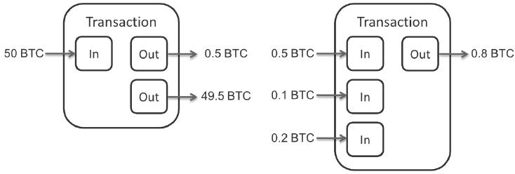
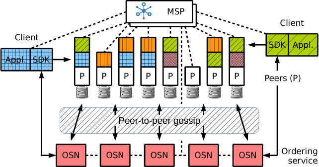

# Populäre Blockchain Plattformen

## Bitcoin 
Autor: Nils Dralle

Bitcoin ist eine sogenannte Kryptowährung, die ohne eine zentrale Kontrollinstanz (wie z.b. eine Bank) auskommt. Stattdessen bilden alle, die am Zahlungsverkehr mit Bitcoin teilnehmen wollen, ein Netzwerk von Knoten, eine sogenannte Blockchain. Die Bitcoin-Blockchain fungiert als Kontrollinstanz. In ihr werden alle Transaktionen mit Bitcoins vermerkt, und alle Teilnehmer des Netzwerks sind gemeinsam dafür verantwortlich, dass die zugrunde liegende Blockchain aktuell und konsistent ist. Um eine Überweisung mit Bitcoins vornehmen zu können, müssen Sender und Empfänger eine aktuelle Kopie der Blockchain haben. Jede Transaktion im Bitcoin-Netzwerk wird kryptografisch abgesichert.

### "Geschichte" des Bitcoin

Das Bitcoin-Netzwerk wurde im Jahr 2008 erstmals theoretisch unter dem Pseudonym Satoshi Nakamoto beschrieben und 2009 praktisch umgesetzt. Das Konzept kryptografischer Währungen wurde bereits 1998 veröffentlicht. Auch wenn der Bitcoin als Währung gedacht ist, so ist er in den letzten Jahren immer mehr zum Investitions- und Spekulationsobjekt geworden. Der Bitcoin-Wechselkurs erreichte Ende 2017 sein bisheriges Maximum von circa 16.000€ pro Bitcoin und steht derzeit (wenige Monate später) bei 7500€ pro Bitcoin.

### Bootstrapping

Um sich initial mit anderen Knoten zu verbinden, nutzt der Bitcoin einen sogenannten "Bootstrapping"-Prozess. Mehrere Knoten des Netzwerks fungieren als Startknoten, die die Adressen weiterer Knoten an neue Knoten verteilen. Die Adressen der Startknoten sind im Domain-Name-System eingetragen, welches der Bitcoin-Client nutzt, um die Adressen der Startknoten zu erhalten. Nachdem die initiale Verbindung erfolgt ist und die Adressen weiterer Knoten von den Startknoten weitergegeben wurden, kommt das Bitcoin-Netzwerk auch ohne die Startknoten aus.

### Blöcke

Die Bitcoin-Blockchain ist aus 1 Megabyte großen Blöcken aufgebaut. Jeder Block kann mehrere Transaktionen beinhalten. Neue Blöcke werden mittels "Mining" erzeugt. Bei der Erzeugung von neuen Blöcken wird ein Algorithmus mit anpassbarer Schwierigkeit verwendet, so dass ein neuer Block etwa alle 10 Minuten erzeugt wird.
Jeder Block in der Blockchain verweist auf den vorherigen Block mit dem Hashwert des vorherigen Blockes. Eine Manipulation eines Blockes vor dem aktuellen ist damit nicht möglich. Eine Sonderstellung nimmt der sogenannte Genesis-Block (der erste Block) ein: Dieser hat keinen Vorgänger und wurde nicht von der Blockchain berechnet. Beim Bitcoin ist der Genesis-Block zudem im Quellcode fest integriert.

### Transaktionen 

Jede Transaktion im Bitcoin-Netzwerk besteht aus der kryptografischen Signatur des Senders und dem mit dem Public-Key des Empfängers signierten Hash der vorherigen Transaktion. Auf diese Weise kann der Empfänger die Transaktion verifizieren. Transaktionen werden an alle Knoten im Netzwerk verteilt. <a>[[NAKA08]](#ref_naka08)</a> Jede Transaktion hat beim Bitcoin mehrere In- und Outputs, um die Transaktion in mehrere Teilbeträge zerlegen zu können. Abbildung 8.4.1.1 zeigt den Prozess.



Abbildung 8.4.1.1 - Bitcoin Transaktionen (Quelle: <a>[[MONA15]](#ref_mona15)</a>)

Die Outputs einer Transaktion können auch "unspent" sein. Beträge, die "unspent" sind, wurden noch nicht in einer weiteren Transaktion ausgegeben und werden dem Empfänger der Transaktion zugerechnet.
Das Bitcoin-Netzwerk kann maximal 7 Transaktionen pro Sekunde verarbeiten. Jede Transaktion muss zuerst in einen Block eingefügt und zur Blockchain hinzugefügt werden, bevor sie von anderen Knoten verifiziert (und vom Empfänger verwendet) werden kann.
Jede Transaktion wird mit einer Gebühr belegt. Diese Transaktionsgebühr geht an den "Miner" des Blockes, mit dem diese Transaktion zur Blockchain hinzugefügt wird.

### Mining

Die Aufgabe des "Mining" ist es, Transaktionen zu Blöcken zusammenzufügen und in der Blockchain zu veröffentlichen. Dabei wird der "Proof-of-Work" Algorithmus genutzt. Für das erfolgreiche minen neuer Blöcke werden neue Bitcoins an den erfolgreichen Miner vergeben. Über diesen Mechanismus werden neue Bitcoins erzeugt. Die Anzahl an Bitcoins, die mit jedem neuen Block erzeugt werden, halbiert sich alle 210.000 Blöcke.

#### Proof-of-Work

Der Bitcoin nutzt einen Proof-of-Work Algorithmus zu Entscheidungsfindung über neue Blöcke. Dabei wird innerhalb des neuen Blocks ein spezieller Wert, eine sogenannte *Nonce*, angelegt. Dieser Wert wird solange erhöht, bis ein Hash für den Block gefunden wird, der mit einer bestimmten Anzahl Nullen beginnt. Über die benötigte Anzahl Nullen kann die Schwierigkeit des Proof-of-Work angepasst werden. Beim Bitcoin wird die Schwierigkeit automatisch so angepasst, dass ein neuer Block etwa alle 10 Minuten gefunden wird.

### Zeitstempel

Damit jeder Knoten die Transaktionen zeitlich einordnen kann, implementiert Bitcoin einen verteilten Zeitstempel-Server. <a>[[NAKA08]](#ref_naka08)</a> Der Zeitstempel besteht aus dem Hashwert der Daten, die einen Zeitstempel erhalten sollen, sowie dem Hashwert des vorherigen Zeitstempels.

## Hyperledger
Autor: Cem Basoglu

Das in 2016 gegründete Hyperledger Projekt fasst mehrere Frameworks und Tools
zusammen, die den Einsatz von Distributed Ledger Technologien in Business
Applikationen ermöglichen sollen <a>[[CHAC16]](#ref_cach16)</a>.
Neben den von IBM und Intel initial beigesteuerten Distributed Ledger Codebasen,
Fabric und Sawtooth, gehören mittlerweile drei weitere Frameworks und eine Vielzahl
von Tools zum Hyperledger Projekt.

Im Gegensatz zu anderen populären Blockchain Plattformen, bei dem eine
Kryptowährung im Vordergrund steht, setzen die Frameworks in Hyperledger auf
einen möglichst modularen Distributed Ledger und überlassen die Implementierung
einer Währung und Zahlungsabwicklung, der auf dem Framework aufbauend
Applikation <a>[[OWEN17]](#ref_owen17)</a>.

### Frameworks
Jedes Framework im Hyperledger Projekt stellt eine eigene Blockchain Plattform
dar, die sich sowohl konzeptionell als auch von der Codebasis unterscheiden.
Bevor die einzelnen Frameworks in den folgenden Abschnitten im Detail beschrieben
werden, bietet nachstehende Übersicht einen Vergleich der jeweiligen Distributed
Ledger Technologien.

Merkmal | Fabric | Sawtooth | Iroha | Indy | Burrow
--- | --- | --- | --- | --- | ---
Projekt Status | Aktiv | Aktiv | Aktiv | Inkubation | Inkubation
Berechtigung | permissioned | permissioned / permissionless | permissioned | permissioned | permissioned
Konsensus | SOLO, Kafka, SBFT | PoET, RAFT | YAC (BFT) | RBFT <a>[[AUBL13]](#ref_aubl13)</a> | Tendermint
Smart Contract / Business Model | ja | ja | nein | nein | ja
SDK | Go, Node.JS, Java | Python, Go, Javascript | gRPC API | - | Solidity

#### Fabric
Hyperledger Fabrik ist ein Distributed Ledger Framework für *permissioned*
Blockchains, zum Ausführen von verteilten Applikationen unter der Verwendung
von Standard Sprachen wie Go, Java oder Javascript <a>[[ANDR18]](#ref_andr18)</a>.

Wie in Abbildung 8.4.2.1 dargestellt, wird das Framework in die Komponenten
Membership Service Provider, Peer, Ordering Service und Chaincode unterteilt,
wobei durch den modularen Aufbau die Komponenten beliebig ausgetauscht oder
durch eigene Implementierungen ersetzt werden können. Die Kommunikation zwischen
den Komponenten erfolgt mittels gRPC.



Abbildung 8.4.2.1 - Fabric Architektur (Quelle: <a>[[ANDR18]](#ref_andr18)</a>)

##### Membership Service Provider
Damit eine Entität, wie z.b. ein Peer oder Client, mit dem Distributed Ledger
interagieren kann, muss dieser im System bekannt sein. Dazu wird jeder Entität
ein Zertifikat nach dem X.509 Standard ausgestellt und der *Public Key* beim
Membership Service Provider registriert. Die Zertifikate dienen als Identität
und werden sowohl für die Signierung von Transaktionen, als auch für die TLS
gesicherte Kommunikation zwischen der Peers verwendet.

Der MSP kann zentral oder, wenn es das Geschäftsmodell voraussetzt, durch
mehrere Teilnehmer der Blockchain in einem Verbund betrieben werden. Ebenfalls
lassen sich ein oder mehrere Organisationen und die dazugehörigen Root- bzw.
Intermediate-Zertifkate beim MSP registrieren. Mittels der organisatorischen
Einheiten können komplexere Anwendungsfälle konstruiert werden, bei dem z.B.
mehrere Unternehmen miteinander agieren können, Transaktionen jedoch nur von
den Unternehmen gelesen werden können, die von der Transaktion tangiert werden.


Abbildung 8.4.2.2 - Organisationen und Channels (Quelle: <a>[[FABR18]](#ref_fabr18)</a>)

Darüber hinaus können sogenannte Channels verwendet werden, um das
Blockhain-Netzwerk noch weiter zu unterteilen. Jedes dieser Sub-Netzwerke
besitzt sowohl einen eigenen Kommunikationskanal, als auch einen eigenen
Distributed Ledger. Wie in Abbildung 8.4.2.2 dargestellt, können somit mehrere
private Ledgers zwischen den Teilnehmern betrieben werden.

Um eine für Bitcoin oder Ethereum typische Blockchain Topologie zu
implementieren, würde somit nur ein Channel benötigt werden. Alle Peers würden
diesen Channel nutzen, um über einen gemeinsamen Distributed Ledger im Konsens
zu sein.

##### Peer
Ein Fabric Blockhain-Netzwerk besteht in der Regel aus mehreren Peers. Jeder
Peer kann an einem oder mehreren Channels teilnehmen, für den jeweils ein
eigener, logisch getrennter Ledger verwaltet und mittels Smart Contracts
zugegriffen wird. Dazu verbindet sich der Client mit einem Peer und nutzt die
Funktionen der auf diesem Peer verfügbaren Smart Contracts, um Daten von dem
Ledger abzufragen bzw. zu ändern. Trotz eines gemeinsamen Ledgers je Channel,
müssen nicht alle Peers die selben Smart Contracts bereitstellen.

Für die Persistierung des Ledgers wird standardmäßig LevelDB verwendet, um den
Zustand der Smart Contracts als Schlüsselwertepaar abzulegen. Alternativ kann
auch CouchDB eingesetzt werden, um Datenstrukturen im JSON-Format zu
persistieren und damit komplexere Abfragen aus dem Ledger zu ermöglichen.

##### Ordering Service
Während eine Abfrage vom Distributed Ledger von einem einzelnen Peer verarbeitet
werden kann, müssen bei Änderungen die Peers im Konsens sein. In diesem Prozess
nimmt der Ordering Service eine essenzielle Rolle ein. Wie es der Name schon
erahnen lässt, ist es die Hauptaufgabe des Ordering Service die Transaktionen in
eine Reihenfolge zu bringen, zu einem Block zu verpacken und an die Peers zu
verteilen. Dadurch wird sichergestellt, dass genug Peers der Änderung zugestimmt
haben und alle Transaktionen in der selben Reihenfolge an den Ledger angehängt
werden.

##### Client
Wie bei klassischen Client-Server-Architekturen stellt der Client, auch im
Hyperledger Fabric Kontext, die vom Nutzer lokal ausgeführte Applikation dar.
Für diesen Zweck stellt das Hyperledger Fabric Framework, eine Client-Bibliothek
bereit, mit dem die Applikation mit den Peers und Ordering Services interagieren
kann.

##### Chaincode
Ein zentrales Element im Fabric Framework bildet der Smart Contract, der auch
Chaincode genannt wird. Über diesen werden sämtliche Funktionalitäten der
Blockchain abgebildet. Somit existieren nur zwei Arten von Transaktionen - das
Deployen eines Smart Contracts und das Aufrufen einer Funktion im Smart
Contract. Über sogenannte System Smart Contracts, die jeder Peer besitzt, können
ebenfalls Konfigurationen am Blockhain Netzwerk vorgenommen werden.

Smart Contracts können in Standard Programmiersprachen wie Go, Node.Js oder Java
geschrieben werden. Wie in Listing 8.4.2.1 dargestellt, implementiert
jeder Smart Contract das *ChaincodeInterface* aus dem Hyperledger Fabric SDK.

```javascript
const shim = require('fabric-shim');

var Chaincode = class {
  async Init(stub) {
    //initialize Chaincode State
  }
  async Invoke(stub){
    //Chaincode invokation handler
  }
}
```
Listing 8.4.2.1 - Smart Contract Beispiel

Die Deploy-Transaktion stellt eine spezielle Form der Invoke-Transaktion dar,
mit dem zunächst der Smart Contract auf dem jeweiligen Peer instanziiert und
anschließend die *Init(...)*-Methode aufgerufen wird. In dieser Methode hat der
Smart Contract die Gelegenheit die eigenen State-Variablen im Distributed Ledger
zu initialisieren.
Jede Invoke-Transaktion eines Smart Contracts wird von der Methode *Invoke(...)*
behandelt. Über die Eigenschaften in dem Parameter *stub* kann ermittelt werden,
welche Funktionen des Smart Contracts mit welche Argumenten aufgerufen wurde, um
die gewünschte Aktion vorzunehmen.

##### Transaktion-Workflow
Abfragen vom Distributed Ledger werden umgehend vom Peer beantwortet. Für
Aktualisierungen muss der Client eine bestimmte Anzahl von Bestätigungen
(*Endorsement*) von mehreren Peers einholen. Wie in Abbildung 8.4.2.3
dargestellt, ruft die Applikation dazu zunächst die gewünschte Funktion im
Smart Contract auf, wodurch ein Antrag (*Proposal*) zur Änderung des
Distributed Ledgers initiiert wird. Die Peers führen dabei die Funktion im
Smart Contract aus und erzeugen eine signierte Bestätigung des Antrags. Hierbei
wird der Ledger jedoch noch nicht geändert und lediglich die Bestätigungen der
Peers erzeugt und an den Client zurück geschickt.


Abbildung 8.4.2.3 - Chaincode Aufruf (Quelle: <a>[[FABR18]](#ref_fabr18)</a>)

Der Client sammelt die Bestätigungen der einzelnen Peers und überträgt diese
samt Antrag an den Ordering Service. Erst mit der Übertragung des Antrags an den
Ordering Service, wird der Änderungsprozess eingeleitet. Der Ordering Service
sammelt die Anträge von allen Applikationen, verpackt diese in einen Block und
überträgt diese schliesslich an alle Peers. Die Peers hängen anschließend den
Block an den jeweils lokalen Ledger und aktualisieren den State. Wenn alle Peers
die Änderung übernommen haben, wird die Applikation über die Änderung des
Distributed Ledgers benachrichtigt und die Transaktion damit abgeschlossen.

#### Sawtooth
Das Sawtooth Framework ist ebenfalls eine *permissioned* Blockchain Plattform,
für die Entwicklung von Distributed Ledger Applikationen im Unternehmensumfeld.
Auch wenn diese Blockchain Plattform ohne Berechtigungen betrieben werden kann,
so sind die derzeit verfügbaren Konsens-Algorithmen nur für Netzwerke ausgelegt,
in dem ein gewisses Vertrauen an die Teilnehmer vorausgesetzt wird.

Wie in Abbildung 8.4.2.4 dargestellt, besteht das Netzwerk aus Peers
(*Validator*), einer optionalen REST-Schnittstelle für die Client-Applikationen
und den optionalen Transaction-Processoren.


Abbildung 8.4.2.4 - Sawtooth Architektur (Quelle: <a>[[SAWT18]](#ref_sawt18)</a>)

##### Validator
Der Validator ist zuständig für das Ausführen, Validieren und Verteilen der
Transaktionen an die restlichen Validatoren. Dazu werden zwei Netzwerk-Ebenen
verwendet, um zum einen neue Transaktionen mit den benachbarten Peers
auszutauschen und zum anderen mit den Transaction Processoren zu kommunizieren.
Für die Kommunikation zwischen den Validatoren, wird das Open-Source Projekt 0MQ
verwendet.

##### Transaction Processor
Für die Entwicklung einer Applikation auf Basis des Sawtooth Framworks, muss ein
sogenannter Transaction Processor implementiert werden. Im Gegensatz zu Smart
Contracts, wird die implementierte Applikation nicht in das Blockchain-Netzwerk
zur Ausführung auf den Peers ausgeliefert. Stattdessen wird der Transaction
Processor eigenständig ausgeführt und registriert sich bei den Peers zur
Verarbeitung von Transaktionen eines bestimmten Typs (*Transaction Family*).
Dabei gibt die Client Applikation in der Transaktion an, um welche Typ von
Transaktion es sich handelt und serialisiert die Applikationsdaten in den
Payload der Transaktion. Daher kann das Netzwerk an Validatoren als Tunnel
zwischen dem Client und dem Transaction Processor betrachtet werden,
während der State der Applikation im Distributed Ledger persistiert wird.

Daher kann das Netzwerk an Validatoren als Tunnel zwischen dem Client und dem
Transaction Processor betrachtet werden, während der State der Applikation im
[Distributed Ledger persistiert wird.
Durch die Erweiterung Sawtooth-Seth, können Ebenfalls Ethereum kompatible Smart
Contracts in der Sawtooth Blockchain ausgeführt werden.

##### REST-Schnittstelle
Um den Zugriff auf das Blockchain-Netzwerk zu vereinfachen, kann die
REST-Schnittstelle aus dem Framework verwendet werden. Der REST-Dienst verbindet
sich mittels 0MQ, mit dem in der Konfiguration festgelegten Validator und stellt
die Validator Funktionen über REST-Ressourcen bereit.

#### Iroha
Das Hyperledger Iroha Framework ist eine *permissioned* Blockchain Plattform mit
dem Fokus digitale Assets, Identitäten und serialisierte Daten in einem
Distributed Ledger zu verwalten <a>[[IROH18]](#ref_iroh18)</a>.

Während Iroha auf dem Fabric Framework basiert, sind im Gegensatz dazu keine
Smart Contracts möglich <a>[[MAKA17]](#ref_maka17)</a>. Damit beschränkt sich
der Use-Case für Iroha, in der Verwaltung, Abfrage und dem Transfer von
digitalen Objekten innerhalb des Distributed Ledgers. Dazu werden bereits
generierte gRPC Clients für C++, Java, Objective-C, Swift, Python und NodeJS
bereitgestellt.  

#### Indy & Burrow
Während Hyperledger Indy eine weitere Blockchain Plattform zur Verwaltung von
Identitäten darstellt, wird mit dem Burrow Framework die Ausführung von Ethereum
Smart Contracts (Solidity) auf Basis der Fabric Plattform ermöglicht. Beide
Projekte befinden sich noch in der Inkubation.

### Tools
Neben den Blockchain Plattformen, gehören auch diverse Tools rund um das Thema
Distributed Ledger zum Hyperledger Projekt. So kann beispielsweise mit dem Tool
*Caliper*, die Performance der Blockchain Plattform gemessen. Während diese
Tools eher in die Kategorie Administration eingeordnet werden können, bietet
folgendes Entwicklungswerkzeug Unterstützung bei der Entwicklung von Distributed
Ledger Applikationen.

#### Composer
Das als Webapplikation ausgelegte Entwicklungswerkzeuge Composer, bietet die
Möglichkeit Distributed Ledger Applikationen für das Fabric Framework zu
entwickeln. Dabei werden die Funktionalitäten von Fabric gekapselt und dem
Benutzer eine auf folgende Schablonen reduzierte Umgebung bereitgestellt.

* **Model File** Mit dieser Schablonen können Daten modelliert werden,
  die im Distributed Ledger abgelegt werden sollen.

* **Script File** Mittels Javascript kann mit dieser Schablone die Applikations-
  und Business-Logik implementiert werden.

* **Query File** Eine SQL ähnliche Abfrage Sprache, um unter Verwendung der
  Models, Abfragen gegen den Distributed Ledger zu formulieren.

* **Access Control File** Definiert welche Rollen und Benutzer Zugriff auf
  welche Daten dieser Applikation im Distributed Ledger haben.

Diese Schablonen werden im Anschluss in ein *Business Network Archiv* gebündelt
und können als Chaincode in die Fabric Blockchain deployed werden. Zusätzlich
kann aus dieser eine Client-Bibliothek generiert werden, um den Zugriff auf die
Funktionen in dem Chaincode zu ermöglichen.

## Ethereum

Autor: Philipp Möller

Testing, Verifikation, etc.

Tools (Truffle, etc.)


## Literaturverzeichnis

<a name="ref_andr18">[ANDR18]</a>: Androulaki, Elli, et al. Hyperledger fabric: a distributed operating system for permissioned blockchains. arXiv preprint arXiv:1801.10228, 2018

<a name="ref_aubl13">[AUBL13]</a>: P. L. Aublin, et al.: RBFT: Redundant Byzantine Fault Tolerance. 2013 IEEE 33rd International Conference on Distributed Computing Systems, Philadelphia, 2013, URL: <a>[http://ieeexplore.ieee.org/stamp/stamp.jsp?tp=&arnumber=6681599&isnumber=6681559](http://ieeexplore.ieee.org/stamp/stamp.jsp?tp=&arnumber=6681599&isnumber=6681559)</a>

<a name="ref_cach16">[CHAC16]</a>: Cachin, Christian: Architecture of the Hyperledger Blockchain Fabric. Workshop on Distributed Cryptocurrencies and Consensus Ledgers, 2016

<a name="ref_fabr18">[FABR18]</a>: Fabric Documentation. URL: <a>[http://hyperledger-fabric.readthedocs.io/en/release-1.1/peers/peers.html](http://hyperledger-fabric.readthedocs.io/en/release-1.1/peers/peers.html)</a>

<a name="ref_iroh18">[IROH18]</a>: Iroha Dokumentation. URL: <a>[http://iroha.readthedocs.io/en/latest/overview.html](http://iroha.readthedocs.io/en/latest/overview.html)</a>

<a name="ref_maka17">[MAKA17]</a>: Makato, Takemiya: Design for smart contracts. URL: <a>[https://github.com/hyperledger/iroha/issues/249](https://github.com/hyperledger/iroha/issues/249)</a>

<a name="ref_mona15">[MONA15]</a>: Monaco, V.: Time intervals as a Behavioral Biometric, 2015

<a name="ref_naka08">[NAKA08]</a>: Nakamoto, S., Bitcoin: A peer-to-peer electronic cash system., 2008

<a name="ref_owen17">[OWEN17]</a>: Owens, Luke: Cryptoasset Framework on Intel's Hyperledger Sawtooth. URL: <a>[https://fullmetalhealth.com/cryptoasset-framework-intels-hyperledger-sawtooth-part-one/](https://fullmetalhealth.com/cryptoasset-framework-intels-hyperledger-sawtooth-part-one/)</a>

<a name="ref_sawt18">[SAWT18]</a>: Sawtooth Documentation. URL: <a>[https://sawtooth.hyperledger.org/docs/core/releases/latest/contents.html](https://sawtooth.hyperledger.org/docs/core/releases/latest/contents.html)</a>

<a name="ref_zhen17">[ZHEN17]</a>: Z. Zheng, et al.: An Overview of Blockchain Technology: Architecture, Consensus, and Future Trends, 2017 IEEE 6th International Congress on Big Data, 2017
