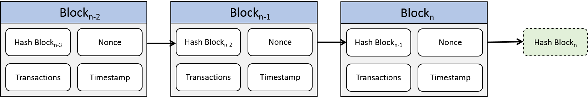
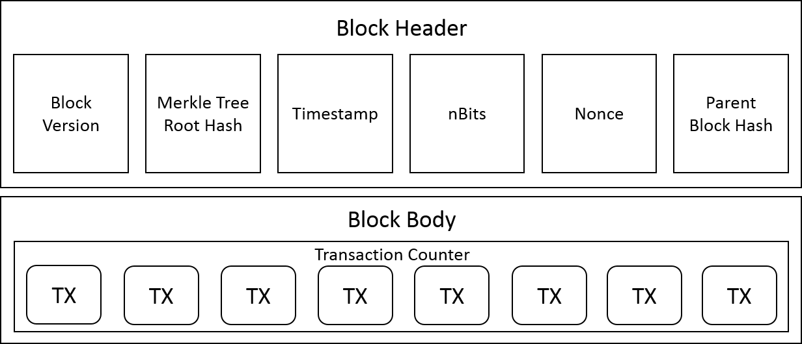
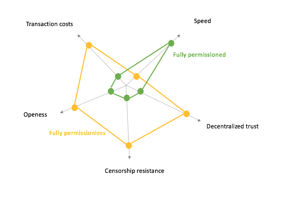
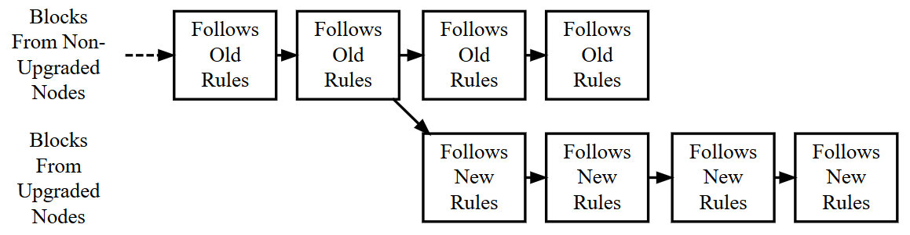
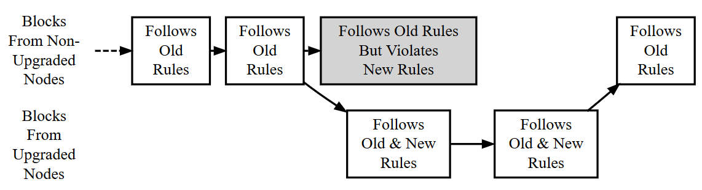
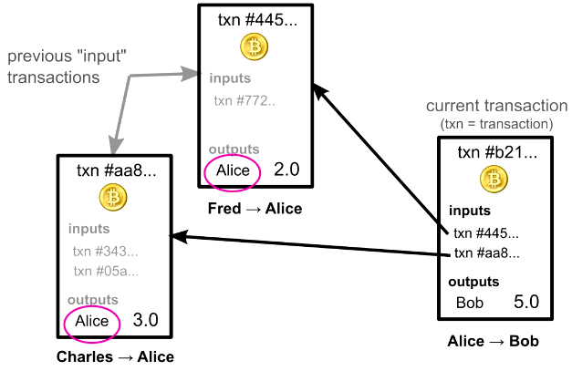
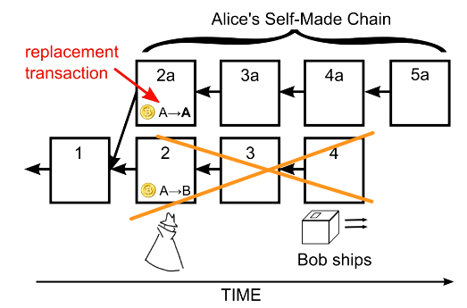
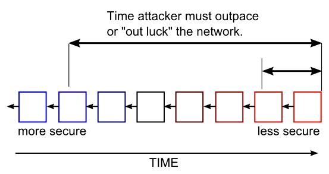
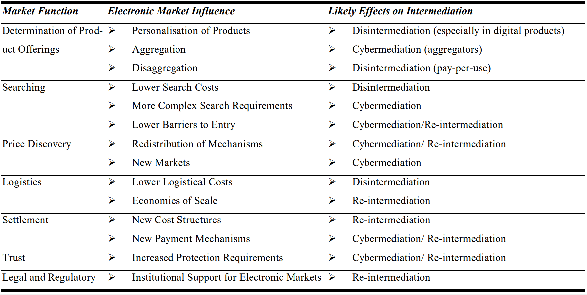

# Blockchain Technologie

## Architektur und Funktionsweise
Autor: Sebastian Janzen

Was ist eine Blockchain?  
Es gibt mehrere Definitionen, da die Entwicklung der Blockchain noch recht jung ist. Eine Definition besagt, dass es ein elektronischer Register für Datensätze, Ereignisse oder Transaktionen ist, wo die Teilnehmer eines Netzwerkes diesen verwalten. Hier wird zwischen der Blockchain als Datenstruktur und dem zugehörigen Verwaltungssystem unterschieden.  
Eine andere Definition ist, dass die Blockchain eine Datenbank ist in welcher Einträge chronologisch in Blöcken gruppiert und miteinander kryptografisch verknüpft werden. Wobei hier Blockchains von Distributed Ledgers abgegrenzt werden.  
Die Blockchain-Verwaltungssysteme werden als verteilte Konsensussysteme bezeichnet, welche auf Kryptografie und P2P-Prinzipien aufbauen. So erreichen sie eine Verifikation des Systemsstatus im ganzen Netzwerk. Aus diesen Definitionen geht hervor, dass Blockchain-Systeme den verteilten Systemen angehören. <a>[[SCHL16]](#ref_Schl16)</a>

In anderen Worten: Ein Blockchain-System ist eine sequenzielle Datenbank mit konstanten Datensätzen, welche in einem P2P-Netzwerk mithilfe von Crypto-Economics und Konsensusalgorithmen validiert und gespeichert werden.

Der Aufbau einer Blockchain ist eine Blocksequenz in denen die komplette Transaktionshistorie festgehalten wird, wie zum Beispiel einem öffentlichen Konto. Jeder Block zeigt auf den Vorgänger die ganze Blockkette entlang bis auf den ersten Block einer Blockchain, den sogenannten "Genesisblock".   
Er ist der erste und älteste Block der Blockchain. Als Ursprungsblock kann nur er alleine keinen sogenannten „parent block“, frei übersetzt Elternblock, haben. Jeder andere Block der Blockchain verweist jeweils auf den vorherigen Block. Die Blockchain ähnelt somit der Datenstruktur einer einfach verketteten Liste.  
Die Aufgabe von Blöcken ist es Transaktionen innerhalb der Blockchain zu bündeln. Diese Blöcke werden dann mit unterschiedlichsten Verfahren auf alle Netzwerkknoten verteilt. Ein Block lässt sich in einen „block header“ und den „block body“ unterteilen. Der Block header enthält Metainformationen über den Block selbst, Elternblock und die Transaktionen. <a>[[ZHENG17]](#ref_Zheng17)</a>, [Björn Enders-Müller"]

Die Abbildung "Blockchain Architektur" zeigt, dass eine zufällige Zeichenkette (Nonce) solange iteriert wird, bis ihr Hashwert den Zielvorgaben des Netzwerkes entspricht. Ist dies der Fall, kommt der Block in die Blockchain. <a>[[ANDE16]](#ref_Ande16)</a>

_Blockchain Architektur_ Abbildung angepasst aus <a>[[ANDE16]](#ref_Ande16)</a>

### Block

_Blockchain Block_, Abbildung angepasst aus <a>[[ZHENG17]](#ref_Zheng17)</a>

Der Block besteht aus einem Blockheader und Blockbody.
In den Blockheader gehören: <a>[[ZHENG17]](#ref_Zheng17)</a>
- __Block version:__			Beinhaltet die Regeln für die Validierung eines Blocks
- __Merkle tree root hash:__	Ist der Hashwert aller Transaktionen im Block
- __Timestamp:__				Aktueller Zeitwert in Sekunden seit 01.01.1970
- __nBits:__ 					Schwellwert eines Hashes ab dem ein Block als valide gilt
- __Nonce:__					Ist ein 4-Byte Feld, welches üblicherweise mit Null anfängt und pro Hash-Kalkulation inkrementiert
- __Parent block hash:__		Ist ein 256-Bit Hashwert das auf den Vorgänger zeigt

Der Body besteht aus dem Transaktionszähler und den Transaktionen selbst. Je nach Block- und Transaktionsgröße variiert die Anzahl der Transaktionen im Block. Zur Verifizierung von Transaktionen dient asymmetrische Kryptografie. <a>[[ZHENG17]](#ref_Zheng17)</a>

### Digitale Signatur

Jeder Benutzer besitzt ein Schlüsselpaar aus einem öffentlichen Schlüssel und einem privaten Schlüssel. Damit kann eine digitale Signatur generiert werden. Eine Nachricht oder Transaktion wird mit dem privaten Schlüssel signiert und an den Empfänger gesendet, der die Echtheit der Nachricht mit dem öffentlichen Schlüssel anhand der Signatur überprüfen kann. <a>[[ZHENG17]](#ref_Zheng17)</a>

Aufgrund dessen, dass nur der Absender den privaten Schlüssel kennt, kann so die Authentizität der Nachricht und des Absenders sichergestellt werden. Des Weiteren kann die Nachricht nicht durch asymmetrische Verschlüsselung unbemerkt verändert werden. <a>[[SCHL16]](#ref_Schl16)</a>

In diesem Unterkapitel wird die digitale Signatur nur am Rande erwähnt. Für mehr Informationen siehe Unterkapitel "Digitale Signaturen" in Kryptografie, Grundlagen.

### Konzept einer Blockchain

__Dezentralisierung__

In zentralisierten Transaktionssystemen spielt eine Vertrauensperson, z. B. eine Zentralbank, die Rolle des Validierungsknoten, was häufig zu Engpässen in der Leistung führt. Für die Blockchain werden Konsensusalgorithmen verwendet, was den Einsatz von Dritten überflüssig macht und zu einer besseren Performance führt. <a>[[ZHENG17]](#ref_Zheng17)</a>

__Beständigkeit__

Transaktionen sind schnell validierbar und invalide Transaktionen werden gar nicht erst akzeptiert. Die Struktur der Blockchain macht eine Änderung an den gespeicherten Transaktionen kaum möglich. <a>[[ZHENG17]](#ref_Zheng17)</a>

__Anonymität__

Die Identität eines Benutzers ist geschützt, denn für die Interaktion mit der Blockchain wird eine generierte Adresse verwendet, aus der nicht ohne weiteres möglich ist auf einen Benutzer zurückzuführen. Dennoch gibt es keine hundertprozentige Garantie, dass ein Benutzers absolut anonym ist. <a>[[ZHENG17]](#ref_Zheng17)</a>

### Arten einer Blockchain 

Es gibt drei Arten von Blockchain: öffentliche, private und diejenigen welche einem Konsortium angehören.

__Öffentlich__

Die ursprüngliche Art einer Blockchain (siehe Bitcoin-Blockchain). Alle Einträge sind öffentlich sichtbar. Jeder kann im Netzwerk eine Transaktion tätigen und solange diese valide ist, wird sie auch einer Blockchain hinzugefügt. Es ist allen freigestellt am Konsensus teilzunehmen und sogar die Netzwerke zu verwalten. Im Gegenzug gibt es niemanden der das Alleinrecht im Netzwerk hat - alle Teilnehmer sind gleich. Aus diesem Grund wird ein öffentliches Blockchain auch _permissionless blockchain_ genannt.
Der Einfluss ist proportional der Ressourcen eines Teilnehmers. Öffentliche Blockchains nutzen Crypto-Economics, eine Kombination aus Konsensalgorithmen und wirtschaftlichen Anreizen, als Ersatz für eine zentralen Entität der vertraut wird.  Die üblichen Konsensusalgorithmen sind Proof of Work und Proof of Stake (Bitcoin, Ethereum). Die Vorteile von öffentlichen Blockchains sind Transparenz und Anonymität, wobei die Skalierbarkeit und Effizienz eher zweitrangig sind. Diese Art der Blockchain wird als völlig dezentral bezeichnet. <a>[[DEMUSH]](#ref_Demush)</a>, <a>[[BUTE15]](#ref_Bute15)</a>

Im öffentlichen Blockchain-Netzwerk kann jeder Knoten am Konsensus teilnehmen, um den nächsten Block zu validieren. Ist die Validierung abgeschlossen, wird der Block der Blockchain hinzugefügt, siehe nächste Abbildung.

_Öffentliches Blockchain-Netzwerk_, eigene Abbildung

__Privat und Konsortium__

Wie der Name schon andeutet, sind private Blockchains nicht für jeden sichtbar und zugänglich. Sie werden aufgrund einer überschaulichen Anzahl von Knoten viel effektiver verwaltet. Die Schreibrechte an der Blockchain gehören üblicherweise einer einzigen Organisation, die Leserechte können zum Teil oder ganz öffentlich sein. Diese Art von Blockchain heißt _permissioned blockchain_. Die üblichen Verwendungszwecke sind Datenhaltung und Wirtschaftsprüfung im Rahmen einer einzigen Firma.  
Konsortium-Blockchains unterscheiden sich insofern von privaten, dass nur vorausgewählte Knoten am Konsensus teilnehmen können. Diese Knoten können einer Gruppe von Banken gehören, wo jede Bank einen Knoten steuert. Wie im Falle der privaten Blockchain, kann das Leserecht teilweise oder ganz öffentlich sein, was dazu führt, dass Teilnehmern außerhalb des Konsortiums eine eingeschränkte Möglichkeit haben über eine API die Block Hashes zu überprüfen. Banken und Unternehmen bekommen damit eine Möglichkeit direkt ihre Vermögenswerte untereinander in Sekunden zu übertragen und die private P2P-Netzwerke zu überwachen. Diese Blockchains werden als teilweise dezentralisiert bezeichnet.
<a>[[DEMUSH]](#ref_Demush)</a>, <a>[[BUTE15]](#ref_Bute15)</a>

Private bzw. Konsortium Blockchain-Netzwerke bestehen aus einer zugelassenen Anzahl von Knoten, was den Konsensusprozess erheblich beschleunigt. Zur Validierung eines Blocks sind öffentliche Knoten nicht zugelassen, siehe nächste Abbildung.

_Privates und Konsortium Blockchain-Netzwerk_, eigene Abbildung

### Unterschiede zwischen permissionless und permissioned

In dieser Tabelle sind die wichtigsten Unterschiede nochmals zusammengefasst.

|                                                       | __Permissioned Blockchain__     | __Permissionless Blockchain__ |
|-------------------------------------------------------|---------------------------------|-------------------------------|
|_Instandhaltung:_                                      | Kleine Gruppe von Entitäten     | Jeder der will                |
|_Schutz vor Unaufrichtigkeit:_                         | Reputationsschaden              | Crypto-Economics              |
|_Transaktionsrechte:_                                  | Zugelassene Gruppe von Menschen | Jeder der will                |
|_Zugang:_                                              | Kleine Gruppe von Entitäten     | Jeder der will                |
|_Speicherort:_                                         | Zentraler Server                | Verteilt                      |
|_Vertrauen in eine zentrale Entität zur Sicherheit:_   | Ja                              | Nein                          |
|_Transaktionskosten:_                                  | Klein                           | Hoch                          |
|_Geschwindigkeit:_                                     | Schnell                         | Langsam                       |
|_Schutz vor Zensur:_                                   | Nein                            | Ja                            |
|_Token:_                                               | Nein                            | Ja                            |

_Blockchain Unterschiede_, Tabelle angepasst aus <a>[[GHAL15]](#ref_Ghal15)</a>

In einer begrenzten Umgebung, bezogen auf die Knoten, spielt permissioned Blockchain ihre Stärken aus - hohe Geschwindigkeit und niedrige Transaktionskosten. Aufgrund ihres Grundprinzips sind Zensurresistenz, Offenheit und dezentrales Vertrauen hierfür unnötig, während sie für eine permissionless Blockchain unabdingbar sind. Ein Radar-Diagramm in der nächsten Abbildung macht nochmal die Unterschiede deutlich. 

_Permissioned vs Permissionless_, Abbildung aus <a>[[GHAL15]](#ref_Ghal15)</a>

Während oben die Merkmale der öffentlichen und privaten Blockchain aufgezählt worden sind, gibt es außerdem die allgemeinen Eigenschaften einer Blockchain.

## Eigenschaften einer Blockchain 

Autor: Björn Enders-Müller

### Immutability

Der Begriff der „immutability“ bedeutet übersetzt Unveränderlichkeit und ist eine zentrale Eigenschaft einer Blockchain. Dieser Abschnitt soll dazu dienen die Unveränderlichkeit einer Blockchain zu erklären und verdeutlichen.

In der Literatur wird eine Blockchain häufig wie folgt definiert. Eine Blockchain ist eine so gut wie unveränderbare verteilte Datenbank die durch die Verwendung von einem Peer-to-Peer Netzwerk, Konsensmechanismen, Kryptografie und Rückwärtsreferenzierung auf vorherige Blöcke die Validität und Reihenfolge von Transaktionen sicherstellt.

Systeme, die auf Blockchain Technologie basieren, wie z.B. Bitcoin, werden immer wieder damit beworben, dass kein Vertrauen zu anderen Anwendern oder einer dritten Partei, wie einer Bank, nötig sei. Diese Aussage entspricht auf Grund der Unveränderlichkeit der Blockchain sogar weitestgehend der Wahrheit.

Trotz der grundlegenden Eigenschaften und Mechanismen der Blockchain ist es theoretisch möglich die Unveränderlichkeit der Blockchain zu verletzen. Dazu können schon simple Softwarefehler in der Anwendersoftware führen. So viel nochmal zum nicht benötigten Vertrauen. Wer nicht in der Lage ist seine eigene Anwendung zu programmieren muss zumindest dem Softwareentwickler vertrauen. Selbst mit der Annahme, dass die Implementierung der Software fehlerfrei ist gibt es noch Möglichkeiten die Unveränderlichkeit zu verletzen. In der Regel werden diese Szenarien jedoch als unwahrscheinlich oder extrem schwer betrachtet. 

Eine theoretisch möglicher aber unwahrscheinlicher Angriff auf die Unveränderlichkeit einer Blockchain basiert dabei auf der Datenstruktur selbst. Es wird versucht die Hash-Werte der Blöcke zu manipulieren. Solang die verwendete Hash-Funktion nicht Kollisionsresistenz ist sind solche Angriffe theoretisch möglich. Für die Hash-Funktion müsste also garantiert werden, dass es so gut wie unmöglich ist, zwei unterschiedliche Blöcke zu finden, die einen identischen Hashwert produzieren. Selbst in Systemen, in denen ein einzelner Benutzer oder eine Gruppe über einen überproportionalen Anteil an Rechenleistung verfügen, könnten die Hash-Werte der Blöcke dann mit kollisionsresistenten Hash-Funktion abgesichert werden. Leider wurde bisher für viele der weitverbreiteten Hash-Funktionen genau diese Kollisionsresistenz noch nicht bewiesen. 

Die Unveränderlichkeit der Blockchain kann auch durch ihre Konsensmechanismen angegriffen werden. Dies ist jedoch in der Regel schwer oder kostspielig. Bei der Bitcoin Blockchain könnte dies mit einem sogenannten „51% attack“ versucht werden. Dies bedeutet, dass ein Einzelner oder eine Gruppe mehr als 50% der Rechenleistung im Peer-to-Peer Netzwerk kontrolliert. Dies könnte dafür genutzt werden um das gesamte Netzwerk dahingeht zu lenken, dass eine manipulierte Blockchain akzeptiert wird und Transaktionen verfälscht werden. Im Bitcoin System wäre dieser Angriff sehr kostspielig. Die Hash-Power des gesamten Netzwerkes betrug im Oktober 2017 ca. 10.000.000 TH/s (1 TH/s eine Billionen/Tera Berechnungen pro Sekunde). Spezialisierte Hash-Hardware wie der Antminer S9 liefern 13,5 TH/s also spiegeln 740.741 dieser Gräte die gesamte Hash-Power des Systems wieder. Jedes dieser Geräte kostete am vierten Oktober letzten Jahres 1265 US-Dollar. Um also auf 51% Rechenleistung zu kommen wäre ca. 460 Millionen US-Dollar alleine an Hardware nötig.

Anscheint wurden bisher die Unveränderlichkeit der Blockchain nur indirekt verletzt. Dies passiert, wenn ein sogenannter Blockchain „fork“ entsteht. Dies bedeutet so viel, dass sich die Blockchain nach einem bestimmten Block aufgabelt bzw. aufspaltet. Dies ist in der folgenden Abbildung nochmal verdeutlicht. Die Pfeile stellen die Hash-Werte, die jeweils auf den vorherigen Block zeigen dar. 

Beispiel für einen Blockchain Fork.
Abbildung selbst erstellt

Nach dem Block 3 folgen zwei unterschiedliche Block 4 Blöcke und auf diese jeweils ein Block 5. Solche Ereignisse können z.B. auftreten, wenn Änderungen an der Anwendersoftware durchgeführt werden oder diese durch ein andere ersetzt wird. Anwendersoftware für Blockchain Systeme sind häufig Open-Source und so für jeden frei zugänglich. So könnte z.B. jeder der in der dazu fähig ist die aktuelle Bitcoin Blockchain forken und seinen eigenen „Coin“ weiterführen. 

So etwas Ähnliches ist bei der DAO passiert. Die DAO des Ethereum Netzwerk ist eine sogenannten „Decentralized Autonomous Organization“ und ist in dem entsprechenden Abschnitt genauer erläutert. Kurz beschrieben ist die DAO im Grunde ein „Unternehmen“, das durch kaufbare Stimmrechte (Tokens) gesteuert wurde. Die DAO arbeitet dabei stark mit Smart Contracts welche ebenfalls in ihrem eigenen Abschnitt beschrieben sind. Die Funktionsweise dieses Unternehmens und die damit verbundene Ethereum Blockchain wurde als unveränderlich angesehen. Ein Problem ist dann Anfang 2016 aufgetreten. Durch einen Softwarefehler in der DAO war es Angreifern gelungen Stimmrechte im Wert von 50 Millionen USD zu entwenden.

Dieser Betrug trat eine ausschweifende Diskussion über die Unveränderlichkeit der Ethereum Blockchain los. Viele wünschten sich natürlich, dass dieser Betrug ausgeglichen wird und sprachen sich daher auch für eine Veränderung des Ethereum Protokolls aus. Eine weitere stark vertretene Meinung war die, dass der Quelltext als einzige Quelle von „Wahrheit“ niemals nachträglichen verändert werden darf, weil genau durch solche Eingriffe das sogenannte „immutability principle“ verletzt wird. Schlussendlich wurde die Diskussion gar nicht aufgelöst, sondern es wurde ein Fork der ursprünglichen Ethereum Blockchain erzeugt. Die Mehrheit der Anwender hat am Ende dafür gesorgt, dass die Blockchain angepasst wurde. Jedoch wird die alte Blockchain von einem Teil der Benutzer die alte Blockchain als Ethereum Classic weitergeführt. Wenn die DAO ein herkömmliches Unternehmen wäre hätte man diesen Betrug einfach zurückbuchen können, jedoch ist dies ein einer Blockchain durch die Konsensmechanismen nicht ohne weiteres möglich. Solche Probleme und der Umgang mit diesen erschüttern das Vertrauen der Benutzer und schädigen den Ruf von Blockchain Systemen. Die DAO zeigt schön auf wie die Unveränderlichkeit der Blockchain nur gegeben ist, wenn alle Benutzer im System damit einverstanden sind. 

<a>[[HOFM17]](#ref_HOFM17)</a>

In dem Fall der DAO spricht man davon, dass es sich um einen sogenannten „hard fork“ handelt. Von einem Hard-Fork wird gesprochen, wenn eine radikale Änderung am System vorgenommen wird. Das kann dazu führen das Blöcke und Transaktionen, die vor dem Fork invalide ware valide werden.  Anders herum könnte es auch gehen indem valide Blöcke invalide werden wie bei der DAO. Damit so etwas möglich ist müssen alle Knoten des Systems sich darüber einig sein was geändert werden soll und diese Änderung dann an ihrer Anwendersoftware durchführen. Dadurch entsteht dann der eigentlich Fork, weil die Blöcke des alten Systems im neuen abgelehnt werden und Blöcke des neuen Systems im alten System abgelehnt werden. Knoten die nicht die neuste Version verwenden können nicht mehr am System teilnehmen und updaten in der Regel daraufhin ihre Software. Beide Systeme unabhängig voneinander und folgen unterschiedlichen Regeln. In der folgenden Abbildung ist ein Hard-Fork einer Blockchain visualisiert.

Veraltete Knoten nehmen die neuen Blöcke nicht an und spalten die Blockchain.
Abbildung entnommen aus
<a>[[INVE18]](#ref_INVE18)</a>

Von einem „soft fork“ wiederum wird gesprochen, wenn nach einem Fork nur eine der beiden neuen Blockchains weitergeführt wird und diese mit dem Teil vor dem Fork kompatible ist. Anders als beim Hard-Fork brauchen nur die Mehrheit ihre Anwendersoftware updaten. Ein Vorteil eines Soft-Fork ist, dass z.B. neue Arten von Transaktionen und Regeln zur deren Validierung in das System eingeführt werden können. Diese Erweiterungen müss lediglich den Sendern und Empfängern solcher Transaktionen bekannt sein. Für alle veralteten Knoten wird eine solche Transaktion als eine „pay-to-anybody“ Transaktion markiert.

Ein Soft-Fork kann auch einfach dadurch entstehen, dass einige Miner ihre Software noch nicht aktualisiert haben und somit gegen eventuell neu hinzugefügte Konsensmechanismen verstoßen. Solche Forks sind nur temporär und die neu erzeugten aber veralteten Blöcke der nicht aktuellen Knoten werden dann von der Mehrheit der aktuellen Knoten abgestoßen. In der folgenden Abbildung ist dieser Prozess noch einmal verdeutlicht. Der grau gekennzeichnete Block wird nicht in die Blockchain eingefügt, weil er gegen die neuen Regeln verstößt.

Blöcke die von veralteten Knoten erzeugt wurden werden von der Mehrheit abgestoßen.
Abbildung entnommen aus
<a>[[INVE18]](#ref_INVE18)</a>

Es müssen also nicht immer alle Knoten aktuell gehalten werden, weil die neuen Blöcke schlussendlich abwärtskompatible sind. Wenn, aus welchen Gründen auch immer, ein Soft-Fork rückgängig gemacht werden soll, so ist dies nur durch einen Hard-Fork möglich.

<a>[[INVE18]](#ref_INVE18)</a>

### Transaktion

In einem Blockchain System sind Transaktionen das was in den Blöcken der Blockchain gespeichert wird. Bei Bitcoin (BTC) z.B. besteht eine Transaktion aus der Übertragung von Bitcoins. Wenn z.B. die Benutzerin Alice 5 BTC and Bob senden würden dann müsste sie dies in einer Nachricht an das Netzwerk boadcasten. Die Nachricht könnte also „Sende 5.0 BTC von Alice zu Bob.“ lauten. Um allerdings sicherzustellen, dass diese Nachricht überhaupt von Alice geschickt wurde und nicht von einem Angreifer ist eine „digitale Signatur“ nötig. Eine solche Signatur agiert als eine Art Nachweis, dass Alice der Besitzer des Kontos ist aus dem die 5 BTC entnommen werden sollen. Um etwas zu signieren werden kryptografische Funktionen genutzt. Um diese Funktionen wiederum zu verwenden benötigt Alice zwei Schüssel, die auf spezielle weiß verknüpft sind, einen „public key“ und einen „private key“, genaueres zu der Funktionsweise ist in dem entsprechenden Abschnitt zu finden. Der Private-Schlüssel wird im folgenden als „secret key“ bzw. SK abgekürzt und der public key als PK. Alice kann ihren SK nutzen um ihre Nachricht mit ihrer Signatur zu versehen. Dies ist im Grunde eine digitale Unterschrift, die von anderen Nutzern mit dem PK überprüft werden kann, um sicherzustellen das tatsächlich Alice die Nachricht geschickt hat und das diese auf dem Weg durch das Netzwerk nicht verändert wurde. In der folgenden Abbildung ist dieser Vorgang nochmal verdeutlicht.

Erzeugung von Signatur und Verifizierung mit SK und PK.
Abbildung entnommen aus
<a>[[IMPO18]](#ref_IMPO18)</a>

Es ist zwingend notwendig das Alice niemals ihren SK preisgibt, da dieser auch den Zugriff auf ihre BTC sichert. Die Signatur ist sozusagen ein Proxy-Passwort, das bewiesen soll das Alice im besitz des echten SK ist. Bei jeder Transaktion die Alice durchführt erzeugt sie immer wieder eine neue Signatur, weil ansonsten ein Angreifer einfach die Signatur einer älteren Transaktion dahingehende missbrauchen das er sich als Alice ausgibt.

In Systemen in denen Benutzer ein Konto besitzen, wie z.B. Bitcoin, wird häufig der PK als Zieladresse für Transaktionen genutzt. Mit dem bisher Beschriebenen lässt sich jedoch nicht Nachweißen, dass Alice überhaupt jemals im Besitz von 5 BTC war. Eine Transaktion besteht daher nicht nur aus der Signatur, Zieladresse und Menge an BTC, sondern aus vorherigen Transaktionen die beweisen das Alice 5 BTC besaß (Inputs). In der folgenden Abbildung ist die Transaktion visualisiert. Diese verweist auf zwei ältere Transaktionen in denen Alice der Empfänger (Outputs) war. Natürlich muss die gesamte Summe an erhaltenen BTC gleich oder größer dem zu versendenten Betrag (5 BTC) sein. Im Bitcoin System gibt es noch eine Besonderheit, dass wenn die nachgewiesene Summe den zu versendenden Betrag überschreitet eine zusätzliche Output-Transaktion eingefügt wird, die sozusagen das Wechselgeld and Alice zurück überweißt.

Eine Transaktion die auf zwei unverbrauchte Input-Transaktionen verweißt.
Abbildung entnommen aus
<a>[[IMPO18]](#ref_IMPO18)</a>

Diese Verknüpfung von Transaktionen resultiert in einer Transaktionskette. Der wichtige Punkt ist, dass jede Transaktion mit älteren Transaktionen abgesichert ist. In der folgenden Abbildung ist die Transaktionskette dargestellt.

Verkettung von Transaktionen.
Abbildung entnommen aus
<a>[[IMPO18]](#ref_IMPO18)</a>

Nur weil Alice allerdings irgendwelche alten unverbrauchten Transaktionen aufführt heißt, dass nicht das diesen vertraut werden können. Daher müssen auch deren aufgeführten eingehenden Input-Transaktionen überprüft werden, natürlich können diesen ebenso nicht vertraut werden also müssen alle Transaktionen des gesamten Systems geprüft werden um sicherzustellen, dass keine manipuliert wurde. Auf den ersten Blick erscheint diese Aufgabe sehr zeitaufwendig jedoch kann sie mit unterschiedlichen Hilfsmitteln wie Indexen optimiert werden. Für Alice bedeutet dies auch, dass sie beim Überprüfen wie viel BTC sie noch besitzt sie alle unverbrauchten Input-Transaktionen aufaddieren muss um auf ihren Kontostand zu erhalten. Eine Transaktion kann also aus mehreren eingehenden und ausgehenden Transaktion bestehen. 

Bitcoin z.B. unterstützt mehr als nur simple Überweisungen von einem Konto zum anderen. Um komplexere Transaktionen durchzuführen wird eine eigene Scriptsprache verwendet. Man kann sich, dass in etwa so vorstellen, dass Alice BTC in ein öffentlich zugängliches Bankschließfach deponiert und diesen mit einer Art mathematischem Rätsel absichert. Im simpelsten Fall gestaltet Alice das Rätsel so, dass nur ein Empfänger das Schließfach öffnen kann. Im Beispiel davor also Bob. Alternativ könnte sie z.B. dafür sorgen, dass mehrere Personen nötig sind um auf den Inhalt zuzugreifen. Dann wären z.B. zwei von drei Empfänger Signaturen nötig um das Schließfach zu öffnen. Eine weitere spezielle Transaktion ist die erste Transaktion im Bitcoin System. Diese konnte theoretisch von jedem gelöst werden. Diese speziellen Aspekte und die Scriptsprache werden häufig hinter Anwenderfreundlicher Software verstreckt. Auch wenn theoretisch jeder die Scriptsprache nutzen könnte ist davon abzuraten, da Fehler zu unerwünschten Ergebnissen führen können.

Ein Problem mit dem bisher dargestellten System bleibt jedoch. Eine Transaktion über das Netzwerk zu verteilen brauch Zeit. Physikalisch weit entfernte Knoten erhalten die Nachricht über eine Transaktion später als dichtere Knoten. Es ist zwingend notwendig die Reihenfolge von Transaktionen festzulegen. Ein simpler Zeitstemple reicht jedoch leider nicht aus, da dieser einfach gefälscht werden könnte. Falls die Reihenfolge nicht eindeutig im System festgelegt werden kann ist ein sogenannter „double spend attack“ möglich. Dies bedeutet soviel wie, dass Geld zweimal ausgeben werden kann.

Alice könnte also z.B. eine Transaktion an Bob schicken in der sie ihm z.B. 5 BTC überweißt. Daraufhin würde Bob beginnen ein Produkt zu liefern und Alice könnte eine zweite Transaktion mit dem selben Nachweisen für den besitz von BTC and sich selbst zurückschicken. Die Knoten im Netzwerk erhalten die Transaktionen in unterschiedlicher Reihenfolge und können nicht festlegen welche Transaktion valide ist und welche nicht, weil zweimal dieselben Input-Transaktionen verwendet wurden und dies nicht erlaubt ist. Um in einem Blockchain System die Reihenfolge von Transaktionen festzulegen, werden diese in verketteten Blöcken abgespeichert und die Blöcke untereinander verlinkt. Daher natürlich auch der Name Blockchain. 

Für die Erzeugung von Blöcken existieren unterschiedliche Möglichkeiten wie z.B. „Proof of Work“ (POW). Diese Verfahren werden auch Konsensmechanismen genannten und werden in ihrem eigenen Abschnitt ausführlich erläutert. Kurz beschrieben sorgen diese Verfahren dafür, dass die Knoten im System Blöcke generieren, jedoch wird so das Problem der Reihenfolge nur von den Transaktionen auf die Blöcke verlagert.

In Bitcoin wird POW verwendet und das System ist so organisiert, dass durchschnittlich all 10 Minuten ca. ein Block erzeugt wird und dabei 2400 Transaktionen abspeichert werden. Wenn aber zwei Blöcke fast zeitgleich im System erzeugt werden und an die anderen Knoten verteilt werden ist wieder unklar, welcher zuerst existiert hat und die Blockchain fortsetzen soll. Eine Möglichkeit ist es einfach den ersten erhaltenden zu verwenden und die anderen Blöcke parallel dazu, wie bei einem Fork, in die Blockchain zu hängen. Wenn dann der nächste Block im System gefunden wird und verteil wird zeigt sich durch die spezielle Hash-Verlinkung von Blöcken welcher der richtige war. Denn in einem Blockchain System kann kein Block erzeugt werden bevor nicht der Block davor erzeugt wurde, weil der Hash-Wert vorherigen Teil des darauffolgenden ist. Dies hat jedoch einen Hacken, die parallel eingebauten Blöcke werden verworfen und Transaktionen, die in diesen enthalten waren werden zurück in einen Topf von nicht verifizierten Transaktionen geschoben. Hierbei ist das Problem was mit den Blöcken der Blockchain selbst vermieden werden sollte wieder möglich, der Double-Spend-Attack. 

Bitcoin verwendet, da die einfache Methode. Wenn mehrere neue Blöcke auf den letzten Block zeigen sind die parallel in der Blockchain bis ein längerer Strang entsteht. Der Grund dafür ist, dass in der längsten Blockchain am meisten Arbeit steckt, die in der Regel nur vom größten Teil des Systems geleistet werden kann. Somit ist die längste Blockchain auch die vertrauenswürdigsten ist. 

Wie wäre also ein Angriff auf das Ender der Blockchain möglich? Kurz beschrieben könnte die Angreiferin Alice ein Produkt von Bob kaufen und hoffen, dass dieser es verschickt. Zu dem Zeitpunkt müsste Alice ein alternatives Ende der Blockchain zum Netzwerk präsentieren in dem sie die Input-Transaktion die ursprünglich an Bob gingen wieder an sich selbst überweißt. Daraufhin wäre die Transaktion an Bob invalide, weil die kürzere Blockchain verworfen wird. Die Transaktion an Bob würde dann in den Topf der nicht verifizierten Transaktionen umgeleitet werden. Jedoch würde die Transaktion nie validiert werden und verworfen werden, weil die Input-Transaktionen, welche die Transaktion an Bob unterstützen in der Blockchain von Alice verwendet wurden. Bob hätte also weder sein Geld noch sein Produkt. In der folgenden Abbildung ist dieser Angriff nochmal dargestellt. 

Double-Spend-Attack von Alice an Bob mit alternativem Blockchain Ende.
Abbildung entnommen aus
<a>[[IMPO18]](#ref_IMPO18)</a>

Zum Glück ist dieses Szenario in einem POW System extrem unwahrscheinlich, weil die Erzeugung von Blöcken so schwer ist. Für einen einzelnen handelsüblichen Computer würde es Jahre dauern um einen einzelnen Block zu erzeugen. Alice bräuchte also sehr viel Glück bei der Erzeugung von Blöcken oder extrem leistungsfähige Hardware um schneller Blöcke als der Rest des Systems zu generieren, siehe 51% Angriff. Durch die Unklarheiten am Ende der Blockchain wird eine Transaktion umso sicherer je älter sie ist. Es wird empfohlen mehrere Blöcke z.B. mindestens sieben oder höher abzuwarten bis man eine Transaktion als unveränderlich betrachtet. In der folgenden Abbildung ist dies nochmal verdeutlich.

Unsicherheiten von Transaktionen bzw. Blöcken am Ende der Blockchain.
Abbildung entnommen aus
<a>[[IMPO18]](#ref_IMPO18)</a>

Obwohl es so schwer ist das Ende der Blockchain zu manipulieren ist ein solcher Angriff theoretisch möglich. Es gibt viele Benutzer die sich zu sogenannten Mining-Gilden zusammenschließen und gemeinsam daran arbeiten Blöcke zu finden und den sogenannten „block reward“ unter sich aufzuteilen. Das Problem dieser Gilden ist, dass sie sehr große Anteile des Systems ausmachen können. So wurden z.B. von der Gruppierung „BTC Guild“, am 23. April 2013, sechs Blöcke in Folge gefunden, daraufhin hat die Gruppe selbst dafür gesorgt, dass dies in ihrem System nicht mehr möglich ist, damit das Vertrauen an Bitcoin nicht verloren geht. In der folgenden Abbildung ist die Wahrscheinlichkeit, dass ein solches Ereignis eintritt dargestellt. Dazu ist ausschlageben wie viel Rechenleistung der Angreifer im Verhältnis zum restlichen System besitzt.

Graph zur Wahrschenlichkeit, dass eine Gruppe oder einzelne Person sechs Blöcke in Folge generiert.
Abbildung entnommen aus
<a>[[IMPO18]](#ref_IMPO18)</a>

<a>[[IMPO18]](#ref_IMPO18)</a>

### Blöcke

Der Begriff Blockchain setzt sich aus den englischen Wörten „block“ und „chain“ zusammen. Dies übersetzt bedeutet so viel wie Blockkette, Kette aus Blöcken oder verkettete Blöcke. Dieser Abschnitt behandelt den Aufbau eines einzelnen Blockes der Blockchain.

In jeder Blockchain gibt es einen besonderen Block. Den sogenannten „genesis block“ oder auch Ursprungsblock. Er ist der erste und älteste Block der Blockchain. Als Ursprungsblock kann nur er alleine keinen sogenannten „parent block“, frei übersetzt Elternblock, haben. Jeder andere Block der Blockchain verweist jeweils auf den vorherigen Block. Die Blockchain ähnelt somit der Datenstruktur einer einfach verketteten Liste.

Die Aufgabe von Blöcken ist es Transaktionen innerhalb der Blockchain zu bündeln. Diese Blöcke werden dann mit unterschiedlichsten Verfahren auf alle Netzwerkknoten verteilt. Ein Block lässt sich in einen „block header“ und den „block body“ unterteilen. Der Block header enthält Metainformationen über den Block selbst, Elternblock und die Transaktionen. 

Beispielhafter Aufbau von drei Blöcken.
Abbildung entnommen aus
<a>[[ZHEN17]](#ref_ZHEN17)</a>

Aufbau eines einzelnen Blocks.
Abbildung entnommen aus
<a>[[ZHEN17]](#ref_ZHEN17)</a>

Wie in der Abbildung zu sehen ist besteht der Block aus unterschiedlichen Elementen. Der Header unterteilt sich in die folgenden sechs Teile:

* Block Version: Mit der Block version wird beschrieben mit welchen Regeln der Block validiert werden muss.
* Merkle Tree Root Hash: Enthält die Wurzel des „Merkel Tree“ oder auch sogenannten Hash-Baum. Der Baum enthält Hash-Werte zu jeder Transaktion des Blockes. Was genau eine Transaktion und ein Merkel Tree ist wird in anderen Abschnitten genauer erläutert. 
* Timestamp: Ein Timestamp ist ein Integer-Wert der jeder Sekunde seit dem 1. Januar 1970 UTC inkrementiert wird. 
* nBits: Der sogenannte nBits Wert ist ein Schwellwert um die Validität des Blocks zu überprüfen. Wenn der Hash-Wert des Blockes selbst größer ist als der nBits Wert ist der Block nicht zulässig. 
* Nonce: Die Nonce ist 4-Byte großes Datenfeld, welches in der Regel bei 0 startet und bei jedem Hash-Versuch inkrementiert wird. Miner verändern den Wert der Nonce und Hashen den Block danach erneut um zu überprüfen ob er in einem bestimmten Wertebereich liegt. Wenn dies nicht der Fall ist wird die Nonce erneut verändert und der Wertebereich wird erneut geprüft. Falls der Wert passt kann der Block verteilt werden und von anderen Netzwerkknoten überprüft werden und an die Blockchain gehängt werden.
* Parent Block Hash: Speichert den Hash-Wert des Elternblockes um eine einfach verkettete Liste von Blöcken zu erzeugen. Diese Mechanik sorgt für die Sicherheit vor Manipulation der älteren Blöcke.

Im body des Blocks befindet sich ein Zähler für die Anzahl der Transaktionen des Blockes. Zusätzlich lassen sich die Transaktionen selbst dort finden. Der genaue Aufbau einer Transaktion wird in anderen Abschnitten erläutert.

<a>[[ZHEN17]](#ref_ZHEN17)</a>

### Merkle Tree

Ein Merkle tree ist eine Datenstruktur die auf einem Binär-Baum basiert. Bei einem Merkle tree wird jedoch in jeder Ebene eine One-Way-Hash-Funktion verwendet um den Baum und die Blätter vor Manipulation oder Fehlern zu schützen. Häufig wird daher der Merkle tree auch Hash-Baum genannt. Die Funktionsweise innerhalb einer Blockchain ist wie folgt. Jeder Block der Blockchain hält einen Hash-Baum oder zumindest die Wurzel des Baums, dazu im Folgenden mehr. Für eine Blockchain werden als Blätter die abzusichernden Transaktionen verwendet. Die Knoten direkt über den Transaktionen werden mit der Hash-Funktion erzeugt. In der darüberliegenden Ebene werden jeweils zwei Knoten zusammengeführt in dem für die Hash-Werte der beiden Knoten erneut ein dritter Hash-Wert erzeugt wird. Dieser Prozess wird fortgesetzt bis in der höchsten Ebene nur noch ein Knoten befindet. Die sogenannte Wurzel bzw. Root-Hash des Hash-Baums. In der folgenden Abbildung ist der Vorgang nochmal verdeutlicht.  

Aufbau eines einzelnen Blocks.
Abbildung entnommen und angepasst aus
<a>[[VUJI18]](#ref_VUJI18)</a>

Zuerst wird für jede Transaktion (TX0 bis TX3) ein Hash-Wert (Hash0 bis Hash3) generiert. Anschließend wird für jeweils zwei benachbarte Hash-Werte (z.B. Hash0 und Hash1) noch ein dritter Hash-Wert (Hash01) gebildet. In der Abbildung wird so aus Hash0 und Hash1 der darüberliegende Knoten Hash01. Wenn der Block mehr als vier Transaktionen halten würde hätte der Hash-Baum mehr Ebenen als in der Abbildung. Im Block header wird die Wurzel des Baums gespeichert. In vielen Blockchain Systemen werden nach der Verifizierung des Blocks alle Knoten des Hash-Baums gelöscht um Speicherplatz einzusparen. Nur die Wurzel und die Transaktionen bleiben erhalten, da die Wurzel zum überprüfen ausreicht. Falls nachträglich jemand versucht z.B. die Transaktion TX0 zu manipulieren so würde dies bei einer Verifizierung auffallen, da sich der Hash-Wert der Transaktion verändert und somit auch der von dem Knoten Hash01. So propergiert der Fehler sich bis zur Wurzel und somit kann eine Manipulation erkannt werden. Theoretisch würde es reichen für alle Transaktionen nur einen Hash-Wert abzuspeichern, jedoch kann dann nicht nachvollzogen werden welche der Transaktionen manipuliert wurde. 

<a>[[VUJI18]](#ref_VUJI18)</a>

## Crypto-Economics

Autor: Kevin Schima

### Fiatgeld

Fiatgeld (von lat. "fiat" - "es werde") ist ein Tauschmittel, dessen Gegenwert von den ausstellenden Notenbanken garantiert wird und dessen Verwendung als gesetzliches Zahlungsmittel von den jeweiligen Ländern vorgeschrieben ist. Die Schaffung eines eigenen Währungssystems ermöglicht einem Staat den Wert und das Wirtschaftssystem zu steuern.

### Tokenization
Tokenization (von Englisch "token": "Wertmarke") beschreibt den Prozess, ein digitales Abbild eines Assets (Edelmetalle, Immobilien usw.), über Smart Contracts bzw. Blockchain Technologie im Allgemeinen, handelbar zu machen. Schon vor der Entwicklung von Währungssystemen, wurden von Goldschmieden und Banken Wertscheine ausgestellt, die den Besitz einer hinterlegten Goldmenge bescheinigten, wodurch Händler einfacher Zahlungen untereinander tätigen konnten ohne physisch Gold auszutauschen. Später wurde durch Banknoten eine universelle Akzeptanz ermöglicht und durch elektronische Überweisungen der Transfer von Geld erleichtert.

Durch Tokenization kann dieses Konzept noch weiter getrieben werden: Es gibt in der Regel keine zentrale Entität, der vertraut werden muss, Vertrauen wird geschaffen durch die Nutzung von Blockchain Technologie und durch die Offenlegung der Quellcodes, die eine Token Transaktion ausführen. Schließlich erlaubt die Verwendung von Token viele neue Anwendungsmöglichkeiten und eine weltweite potentielle Nutzerbasis.

### Arten von Token
  

Abbildung entnommen aus <a>[[HAHN18]](#ref_hahn18)</a>

Bisweilen ist die Einordnung eines Tokens schwierig, es können durchaus mehrere Typen zutreffen. Thomas Euler <a>[[EULE18]](#ref_eule18)</a> hat dazu eines der ersten Klassifizierungssysteme vorgestellt.

#### Utility Token

Die häufigste Tokenform, der Utility Token, stellt bei Startups, die diesen Token anbieten, ein Coupon für die zukünftige Verwendung des Services / Produktes dar, der Token ist damit zentraler Plattformbestandteil. Ein Beispiel für diese Token Art ist "BAT (basic attention token)" welcher das Geschäft rund um Onlinewerbung reformieren soll. Ziel ist es, Nutzer für das Ansehen von Werbung mit BAT Token zu bezahlen, die wiederum ausgegeben werden können um z.B. werbefreie Formate zu finanzieren.

#### Equity Token (Securities)

Equity Token stellen eine wertpapierähnliche Unternehmensbeteiligung dar. Ein Beispiel ist der ERC20 Token PAY der Firma TenX. TenX stellt Kreditkarten aus die es erlauben Zahlungen mit Kryptowährungen zu tätigen. Um Kapital für die Umsetzung der Geschäftsidee einzusammeln hat die Firma den PAY Token ausgegeben. In unbestimmter Zukunft sollen 0,5% des Umsatzes den die TenX Kreditkarten jährlich generieren anteilig an alle PAY Token Besitzer ausgeschüttet werden. Zuletzt wurde diese wertpapierähnliche Eigenschaft, wegen der daraus resultierenden Regulierungsanforderungen, nicht mehr öffentlich kommuniziert.

#### Digitale Währungen

Coins wie Bitcoin, Ethereum und ähnliche, sind zunächst spekulative Wertaufbewahrungsmittel, ihr Wert wird nicht durch eine gesetzliche Stelle festgelegt, sondern durch die Marktteilnehmer selber und ist meist hoch volatil also starken Schwankungen ausgesetzt. Aufgrund einer meist algorithmisch festgelegten Maximalgeldmenge findet z.B. beim ursprünglichen Bitcoin keine Inflation mehr statt, wenn in Zukunft alle 21 Mio. Einheiten erzeugt wurden. (Mining) 

#### Asset-backed Token

Unter Asset-based Token werden mit Assets, also mit Anlagegütern, gestützte Token verstanden. Beispiele dafür ist die mit Rohöl gedeckte, von der brasilianischen Regierung lancierte, aber umstrittene Kryptowährung "Petrol" oder der mit Gold gedeckte, noch nicht öffentliche gehandelte "Digix Gold Token (DGX)". Anteile an weiteren beispielhaften Anlagegütern sind möglich z.B. Windkraftanlagen, Immobilien, deren Finanzierung eventuell dadurch erst möglich ist. 

### Initial Coin Offering (ICO)

Ein Initial Coin Offering ist eine, bis dato, weitgehend unregulierte Methode der Kapitalaufnahme bei der im Gegensatz zum klassischen Initial Public Offering (IPO) (deutsch: Börsengang), die Kapitalaufnahme in Form von Kryptowährungen erfolgt. Vergleichbar mit dem Börsenhandel bei dem mit Echtgeldwährungen (FIAT Währungen) Anteile an einem Unternehmen in Form von Aktien erworben werden können, werden bei einem ICO üblicherweise Token ausgegeben die mittels Kryptowährungen gekauft werden. Die Mindestinvestition ist, ähnlich wie bei Crowdfunding Finanzierungsmodellen, so niedrig, dass auch private Kleininvestoren partizipieren können. <a>[[HAHN18]](#ref_hahn18)</a>

Im Jahr 2017 haben laut [ICODATA.IO](https://www.icodata.io/stats/2017) 871 ICOs insgesamt 6 Mrd. Dollar Kapital eingesammelt, wobei dieser Betrag je nach aktuellem Wechselkurs der Kryptowährungen schwanken kann.

Während der traditionelle Finanzmarkt durch nationale und internationale Finanzaufsichten rechtlich stark reguliert ist, ist dies bei den neuartigen ICOs durch die rasante technische Entwicklung und unterstützt durch die anonymen bzw. pseudonymen Transaktionen von Kryptowährungen bisher kaum der Fall.

#### Typischer Ablauf eines ICOs basierend auf Ethereum (ERC20) Token

* Ein Unternehmen bzw. loses Entwicklerkollektiv veröffentlicht ein Whitepaper in dem eine Geschäftsidee / Anwendungsbereich für den Token und eventuell zukünftige Entwicklungsziele formuliert sind

* Ein Smart Contract auf ERC20 Basis wird für den ICO erstellt, um Investoren Anteile an dem Projekt zur Verfügung zu stellen, in diesem Smart Contract wird unteranderem Bezeichnung und Maximalmenge an Token definiert

* Optionale nicht-öffentliche Pre-Sale bzw. Pre-ICO Phase für Großinvestoren, die individuelle Konditionen beinhaltet
 
* Der öffentliche Token Verkauf (Sale) beginnt, der ICO Ersteller legt einen initialen Verkaufspreis fest, beispielsweise 1000 Token / 1 Ether.

* Der Token Sale endet erfolgreich wenn mindestens das Soft-Cap (Mindestausgabemenge) innerhalb einer zeitlichen Deadline erreicht ist bzw. spätestens wenn das Hard-Cap erreicht ist (Maximalausgabemenge)

* Der Token wird an speziellen Kryptowährungs / Token Börsen gelistet, und kann öffentlich gehandelt werden, der Wert der Token wird durch die Marktmechanismen Angebot/Nachfrage bestimmt

Für die Investoren des ICOs hat sich der Wert der Token im Idealfall durch mediale Aufmerksamkeit, Entwicklungsfortschritt und Kooperationen mit anderen Unternehmen gegenüber des initialen Sales bzw. Pre-Sales vervielfacht. 

#### Vorteile

* Durch geringem organisatorischen Aufwand und Online-Marketing können Projekte schnell und weltweit eine große potentielle Investorenschaft ansprechen

#### Nachteile

* Vorallem bei Aufkommen der ersten ICOs wurden, nur durch die Veröffentlichung eines Whitepapers, sehr hohe Kapitalmengen eingenommen, ohne das eine Verwirklichung garantiert ist, die Investition in ICOs ist somit hoch spekulativ

* Aufgrund der anonymen Struktur von ICOs und der bisher kaum erfolgenden rechtlichen Regulierung kam es in der Vergangenheit wiederholt zu sogenannten exit-scams, dabei sind die Projektinitiatoren mit sämtlichen Investments untergetaucht

### ERC Token Standards

Die Etablierung von Token und ICOs wird vorallem ermöglicht durch eine vereinfachte Entwicklung, unterstützt durch die ERC Standards (Ethereum Request for Comments) für die Smart Contract Plattform der Ethereum Blockchain. 

Sie bieten ein einheitliches Interface, dass alle grundlegenden Funktionalitäten, die ein Token benötigt, bereitstellt. Der erste und verbreiteste Tokenstandard ist ERC-20 <a>[[VOGE15]](#ref_voge15)</a>, daneben gibt es noch einige weitere, neuere Tokenstandards die mehr Funktionen bereitstellen, auf die and dieser Stelle nicht weiter eingegangen wird.

#### ERC-20

Hauptfunktionen:

* totalSupply: 

*Gesamtmenge an Token abfragen*

* balanceOf: 

*Token Anzahl einer Adresse abfragen*

* transfer: 

*Einer Adresse eine Anzahl Token senden*

* transferFrom:

*Eine Anzahl Token von einer bestimmten Adresse zu einer anderen übertragen*

* approve: 

*Einer Adresse, das Abheben einer definierten Tokenmenge erlauben*

* allowance: 

*Abhebelimit ermitteln, welches über approve zur Verfügung gestellt wurde* 

## Herausforderungen und Risiken

### Technische Herausforderungen
Autor: Fynn Klöpper

Angriffsszenarios (Sybil attack, 51%-Attack)
Skalierung (-sprobleme)

#### Angriffsszenarien

##### Sybil Attacke
Quellen:
https://www.freehaven.net/anonbib/cache/sybil.pdf
https://publishup.uni-potsdam.de/opus4-ubp/frontdoor/deliver/index/docId/10314/file/tbhpi113.pdf
###### Definition
Eine Sybil-Attacke beschreibt eine Art des Angriffs auf eine Blockchain, bei der eine schadhafte Entität mehrere Identitäten vorgibt, um einen substantiellen Teil des Systems zu kontrollieren und so die Sicherheit der Redundanz zu komprimieren.

Für Peer-to-Peer-Systeme ist es essentiell, dass Daten redundant gespeichert werden. Durch die Redundanz der Speicherung derselben Daten auf verschiedenen Entitäten kann so die Integrität der Daten sichergestellt werden. Weiterhin setzen viele P2P-Systeme auf die Fragmentierung der Daten, um sich gegen Datenlecks abzusichern.
   
Falls das System scheitert Identitäten zu Entitäten zu mappen, kann nun eine Entität mehrere Identitäten vortäuschen und von dem System mehrmals Daten oder zusammenhängende Daten zugewiesen bekommen. Hierdurch wäre die Redundanz, als auch die Fragmentierung der Daten komprimiert. 
###### Lösungsansätze

Mit Identifizierungs-Authorität:
- VeriSign
- CFS
- SFS
- EMBASSY
- ICANN / Wave Systems

Ohne Identifzierungs-Authorität:

Ein Schutz ohne dedizierte Identifizierungs-Authorität stellt sich als äußerst schwierig heraus.
Oftmals fällt der erste Gedanke auf ein System, bei dem ältere, etablierte Identitäten neue Identitäten kollektiv verifizieren. Dieser Lösungsansatz geht allerdings davon aus, dass die erste Generation von Identitäten vertrauenswürdig ist, welche bereits durch eine Sybil-Attacke komprimiert sein könnte und somit den weiteren Verlauf der Kette unsicher macht.  

##### 51%-Attack
Quellen:
http://fmt.cs.utwente.nl/files/sprojects/268.pdf

###### Definition
Eine 51%-Attacke beschreibt eine Attacke auf eine Blockchain, meist die Bitcoin-Blockchain, bei der ein Miningpool, der mehr als 50% der Hashrate des gesamten Netzwerks ausmacht, die Kontrolle über den weiteren Verlauf der Blockchain übernimmt.
Der Angreifer ist daraufhin in der Lage Coins "doppelt" auszugeben, also einen Händler zu bezahlen und danach die Transaktion wieder rückgängig zu machen oder auch Transaktionen die Bestätigung zu verwehren und somit den Handel zwischen einigen oder auch allen Benutzern zu unterbrechen.    

Auch wenn der Name der Attacke suggeriert, dass 51% der Rechenleistung des Netzwerks benötigt werden, um die Attacke durchzuführen, ist dies nicht notwendig.
Bereits mit einer kleineren Anzahl an relativer Rechenleistung ist es möglich einen Angriff durchzuführen. In diesem Fall beträgt die Erfolgschance allerdings nicht 100%, sondern ist abhängig davon, wie viel relative Rechenleistung zur Verfügung steht und wie viele Blöcke zur Bestätigung ein Händler erwartet.
Bild: https://www.btc-echo.de/tutorial/bitcoin-51-attacke/

Falls der Angreifer über 51% relativer Rechenleistung verfügt und somit schneller Blöcke generieren kann als der Rest des Netzwerkes, kann er beliebig lange an seinem privaten Fork weiter Blöcke anhängen bis er länger als der öffentliche und vertrauenswürdige Branch ist. 
Da immer der längere Branch vom System als der "richtige" Branch angenommen wird, kann somit der Angreifer bestimmen, welche Transaktionen mit in den Branch aufgenommen und welche Blöcke ungültig gemacht werden sollen. 
###### Lösungsansätze
- Bisher ein rein theoretischer Angriff in Anbetracht von Bitcoin
- Bereits bestehende, gelockte Blöcke, können trotzdem nur sehr schwer verändert werden
- Erhöhte Anzahl von Bestätigungen kann eine tatsächliche 51%-Attacke zwar nicht verhindern, allerdings eine Attacke eines Angreifers mit unter 51% unwahrscheinlicher machen, sowie die Angriffsdauer verlängern, was die Attacke unprofitabel machen kann.

##### Cryptographie-Angriffe

###### Definition

###### Lösungsansätze

#### Skalierung (-sprobleme)
Quellen:
https://publishup.uni-potsdam.de/opus4-ubp/frontdoor/deliver/index/docId/10314/file/tbhpi113.pdf

##### Neue Nutzer
##### Größeres Transaktionsaufkommen

### Ökonomische und gesellschaftliche Herausforderungen

#### Soziale Implikationen
Autor: Martin Teuber

#### Ökonomische Implikationen
Autor: Mario Cichonczyk

Dass Blockchaintechnologien ein disruptives Potential aufweisen, scheint eine ihrer am häufigsten betonten Eigenschaften zu sein. Wie sie in konkreten Anwendungsfällen Veränderungen anstoßen können, ist vielfach diskutiert. Ziel dieses Kapitels ist es, ein Verständnis zu entwickeln, warum die Blockchain einen für Marktprozesse relevanten Progressionsträger darstellen kann. Dabei wird explizit versucht das Eingehen auf einzelne Applikationen zu vermeiden und stattdessen ökonomische Zusammenhänge hervorzuheben, die nach Abstraktion den meisten wichtigen Wirtschaftsprozessen zugrunde liegen. Diese Herangehensweise soll es dem Leser ermöglichen, neue Anwendungsszenarien zu spezifizieren und einen Blick in die langfristige Zukunft des cyber-physischen Wirtschaftssystems zu wagen.

Beim Verschaffen eines Überblicks über die am stärksten betonten, ökonomischen Verwendungsbeispiele der Blockchain, scheinen sich drei kategorische Leitmotive hervorzuheben: Intermediation, Wirtschaftstransparenz und Wirtschaftsautomation.

##### Intermediation
Im Intermediationskonzept agieren nach <a>[[WALTE07]](#ref_walter07)</a> unabhängige, gewinnmaximierende ökonomische Agenten basierend auf den Bedürfnissen der Vermittlung von Angebot und Nachfrage. Die Aufhebung von Marktintransparenzen unter Erhebung einer Vermittlungsgebühr bildet dabei den Ertragsüberschuss im Cashflow des Intermediärs. Das Ziel ist also je nach Anwendungsfall die Allokation von Angebot->Nachfrage oder Nachfrage->Angebot.

Wenn ein Marktteilnehmer dem Markt beitritt, ist er mit der unbestimmt zeitverzögerten Suche nach seinem Vertragspartner konfrontiert. Das Resultat sind Suchkosten, die sich vorab nur schwierig beziffern lassen. Ein Zwischenhändler bietet die Fixierung von Kosten und/oder Zeit, die zwischen Anbahnung und Vertragsschluss aufgewendet werden müssen. Intermediäre haben demnach eine ständige Präsenz am Markt, da sie im Vergleich zu ihren Vertragspartnern den Handel nach Vertragsschluss nicht verlassen. Wenn ein Asset in ihren Besitz übergeht, leiten sie es an Käufer weiter, welche das Asset höherwertig beziffern. Vergleichbar versuchen diese das Asset aus Quellen zu beschaffen, die es geringwertiger einstufen <a>[[SHEN16]](#ref_shen16)</a>. Intermediäre schöpfen also Wert, wenn ein Assetflow mit Unkenntnis über den Gesamtmarkt verknüpft ist. Dieses Nichtwissen ist das Resultat der imperfekten Natur realer Märkte, in denen die vollständige Information über alle Produzenten und Konsumenten nicht vorliegt <a>[[BUDI18]](#ref_budic18)</a>. 

Offensichtlich kann sich auf diese Weise eine komplexe Kette von Handelsstufen zwischen Produkterschaffung und Endverbraucher bilden<a>[[SCHM99]](#ref_schmidt99)</a>. Das Hinzukommen von Handelsstufen scheint im Zeitalter des eCommerce aber einem gegenläufigen Trend zu unterliegen<a>[[ETLA16]](#ref_etla16)</a>. Internetunternehmen wie Amazon konsolidieren komplexe Handelsketten in einfach nutzbaren Plattformen. Das Geschäftsmodell der Realweltvermittlung von Kontakten ist in diesem schnelllebigen Kontext nicht mehr nachhaltig. Wichtig ist es hier zu beachten, dass das Intermediationsprinzip dennoch weiter existiert. Der heterogene Assetflow zentralisiert sich lediglich in einem monopolistisch geprägten Intermediär. Diese Entwicklung lässt sich teilbegründen mit einer inhärenten Eigenschaft des Internets als verteiltes System: Misstrauen<a>[[ETLA16]](#ref_etla16)</a>. Produzenten und Konsumenten gravitieren zu dem Vermittler, welcher das größte Vertrauen im suspekten Austauschmedium repräsentiert. Diese Beobachtung stellt die Basis des disruptiven Disintermediationspotentials der Blockchain dar. 

Disintermediation als Prinzip der Eliminierung von Kettengliedern in Transmissionsmechanismen ist allerdings kein durch die Blockchain verursachtes Gedankenkonstrukt. <a>[[GELL96]](#ref_gell96)</a> beobachtete die ersten entsprechenden Phänomene  bereits in den 1970ern. Provoziert durch regulatorische Veränderungen im Investmentbankensystem entstand eine signifikante Differenz zwischen Zinszahlungen von Großbanken und anderen Formen der direkteren Kapitalanlage. Konsumenten wanderten aus diesem Grund verstärkt von etablierten Investmentbanken ab und brachten ihre Assets autark mit geringeren Transaktionskosten und größeren Erträgen gewinnbringend in einem selbstgesteuerten Portfolio unter. Banken wurden nicht länger als monopolistische Intermediäre wahrgenommen. Fortan festigte sich die Apperzeption von Disintermediationseinflüssen, sodass diese in der ökonomischen Literatur aufgenommen und reflektiert wurden. Besondere Aufmerksamkeit erhielt dabei die zunehmende Geltungskraft des Internets vor der Jahrtausendwende. Diese Phase ist aus heutiger Sicht aufgrund ihrer Korrelation zur Etablierung der Blockchain erneut bedeutsam. Realweltintermediäre sahen sich der denkbaren Disintermediation durch eCommerce ausgesetzt. Die Unternehmen, die damals als digitale Vorreiter erfolgreich in das Internetzeitalter übergingen, stehen nun vor dem gleichen Paradigmenwechsel wie jene Unternehmen, die sie einst verdrängten. Was das Internet für Realweltintermediäre in den 1990ern bedeutete, repräsentiert die Blockchain für Handelsprofiteure, die mit der Dotcom-Blase und dessen Nachwirkungen in die Moderne eingezogen sind.

Um eine hypothetische Prognose über die Zukunft von Assetflows unter angenommener Konstituierung der Blockchain abgeben zu können, lohnt es sich die ökonomische Aufarbeitung des Jahrtausendwechsels als Schlüsselindikator heranzuziehen. So fasst <a>[[GIAG99]](#ref_giag99)</a> zusammen, dass der Markt grundsätzlich dazu tendiert, Intermediäre zu verdrängen. Ihre Margen führen zu einer direkten Erhöhung des Preises für den Verbraucher. Zusätzlich können Produzenten den vollen Marktwert ihrer Produkte nicht ausschöpfen. Das Aufkommen einer Technologie, die Produzent und Konsument näher zusammenbringt, wird - begründet durch die Majorität und Entbehrung dieser Interessensgruppe - positiv in das Wirtschaftssystem aufgenommen. Dieser Effekt initiiert für nun in Zwangslage geratene Intermediäre drei mögliche Szenarien: Disintermediation, Reintermediation oder Cybermediation <a>[[GIAG99]](#ref_giag99)</a>. Das offensichtliche, erste Szenario, ist der mit sinkenden Transaktionskosten verbundene Druck auf Vermittler, die an ihrer traditionellen Rolle festhalten und langfristig aus dem Markt geschwemmt werden. Wenn von "Disruption" gesprochen wird, scheint die Assoziation mit dem vollständigen Verschwinden von Handelsstufen vorherrschend. Durch das Konzept der Reintermediation präsentiert sich aber eine aus Sicht der Marktmanier natürlichere Option. In diesem Fall bewegen sich Intermediäre in Nischen, in denen sie weiterhin kommerzielle Transaktionen vermitteln können oder durch Produktaugmentierung einen Mehrwert generieren. Ihre angepasste Rolle erlaubt ihnen dann das Fortbestehen parallel zum transformierten Wirtschaftskreis. 
Sind Vermittler aus dem Markt ausgeschieden oder haben sich in Nischen gerettet, existieren noch jene, die erst durch das neue Medium ihre Daseinsberechtigung erhalten und ihm vollends innewohnen. Diese Kategorie umfasst alle Akteure, die mit ihren Geschäftsmodellen die Renditen der digitalen Wende einfahren. Und genau diese *Cybermediäre* scheinen nun durch die Blockchain mit der gleichen Wahl eines Zukunftsszenarios gegenübergestellt, wie ehemals ihre Vorgänger am Ende des letzten Jahrhunderts.

Unterschiedliche Marktfunktionen sind verschieden stark durch derartige Transformationsprozesse bedroht und äußern so auch differenzierte Effekte <a>[[GIAG99]](#ref_giag99)</a>. Die nachstehende Tabelle gibt einen Überblick über betroffene Anwendungsbereiche und deren beobachtete Reaktion.

Abbildung entnommen aus <a>[[GIAG99]](#ref_giag99)</a>

<a>[[GIAG99]](#ref_giag99)</a> leitet aus der Tabelle eine Liste von Hypothesen ab, die als direkte Prognosereferenz dienlich sein können:
* In einem monopolistisch oder oligopolistisch geprägten Anbietermarkt ist Disintermediation wahrscheinlich.
* Bei Notwendigkeit von Marktkenntnis, detailliertem Produktwissen oder Produktaugmentierung ist Reintermediation wahrscheinlich.
* Wenn Intermediäre ihre traditionellen Dienste über das transformierende Medium mit fairer, realwertiger Preisbildung kombinieren, haben sie eine gute Chance ihre Position zu halten.
* Wenn Intermediäre in der Vergangenheit keiner direkten Konkurrenz ausgesetzt waren und sich somit nicht zwingend weiterentwickeln mussten, sind sie durch innovative Dienstleistungen von Cybermediären besonders gefährdet.
* Wenn komplexe Kaufentscheidungen auf einen fragmentierten Markt treffen, können Cybermediäre einen Mehrwert durch vereinfachte Informationsbeschaffung generieren.

Auffallend ist, dass Disintermediation - entgegen des Blockchainanspruchs - das am wenigsten wahrscheinliche Resultat repräsentiert. Intermediäre haben als gewinnmaximierende Agenten den Stimulus, auch im Rahmen von Paradigmenwechseln zu persistieren. Diese These soll die zentrale Erkenntnis dieses Abschnitts darstellen.

Zweifelsohne repräsentiert die Blockchain eine Technologie, die Märkte revolutionieren kann und alle Akteure an allen Handelsstufen vor die Wahl stellt, sich an eines der drei geschilderten Szenarien zu binden. Disintermediation ist dabei natürlich keine bewusst wahrgenommene Entscheidung, sondern das Ergebnis des Unvermögens des Intermediärs sich gemessen an seinem Marktpotential neu zu positionieren. Sei dies in einer Nische oder im neuen Medium. Dass unsere Märkte kapitalistisch geprägt sind, sollte ein klares Indiz dafür sein, dass alle derzeit am Markt teilnehmenden Akteure versuchen werden ihren Fortbestand zu sichern. Der größten Bedrohung sind dabei zentralisierte, monopolistische Unternehmungen ausgesetzt. Inhärent sind diese aber auch gleichzeitig die bedeutsamsten Teilnehmer des aktuellen Systems und haben folglich sowohl die größte Marktmacht, als auch den größten Incentive zum weiteren Bestehen. 
Die Beobachtungen, die der Digitalisierung der Wirtschaft zur Jahrtausendwende zugrunde liegen, geben den Eindruck, dass der dezentrale, transparente Markt zwar sicherlich erneut intermediärsfeindlich wirkt, deren Existenzwille aber primär zu veränderten und/oder neuartigen Vermittlungsdiensten führt. Disintermediation scheint nicht das zwingend folgende Ergebnis der Konstituierung der Blockchain zu sein. Vielmehr haben wir mit einer Landschaft hochspezialisierter, neuartiger  Dienstleistungen zu rechnen.

##### Wertschöpfungstransparenz
Im ersten Abschnitt wurde beschrieben, wie ein Asset über den Weg intermediärer Handelsstufen durch den Markt fließt. Der primäre Aspekt der Analyse lag also beim Einfluss der Blockchain auf die Vermittlung von Besitzübertragungsvorhaben. Diese Einsicht kann als abstrakte Beobachtung der *Bewegung* eines Produktes interpretiert werden. Der nachfolgende Abschnitt soll sich demgegenüber nun mit der *Veränderung* eines Wirtschaftsguts befassen.

Naheliegend ist, dass ein Produkt verändert wird, um im Einflussbereich eines Marktsegmentes einen Bedarf zu decken. Es wird also ein Mehrwert generiert. Folgen mehrere solcher Veränderungsprozesse aufeinander, wird der Begriff der Wertschöpfungskette offensichtlich. Jedes Produkt, welches nicht unverändert und direkt vom Ersterzeuger an den Endverbraucher übergeht, ist das Ergebnis einer solchen Folge von Wertaugmentierungen. Mit dieser Wahrnehmung kommt das Verständnis, dass Wertschöpfungsketten - auch Supply Chains genannt – die Produktion, Vorhaltung und Distribution von Gütern und assoziierten Diensten ermöglichen und somit die Infrastruktur des globalen Wirtschaftssystems bilden <a>[[ NAGU07]](#ref_nagu07)</a>.

Die Steuerung und Optimierung solcher Ketten wird als Supply Chain Management bezeichnet. <a>[[COOP97]](#ref_coop97)</a> beschreibt den Zweck von SCM mit der Reduzierung des Gesamtaufwands an Ressourcen, die notwendig sind, um das angestrebte Marktziel zu erreichen. Realisiert wird dies durch die Synchronisierung von Kundenanforderungen mit dem Materialfluss, Reduktion von Inventarinvestitionen und Verbesserungen von Dienstleistungen.  All diese Maßnahmen verschaffen einen kompetitiven Vorteil. Früh wurde die Beobachtung gemacht, dass der eigentliche Konkurrenzkampf nicht zwischen Unternehmen, sondern optimierten Supply Chains stattfindet <a>[[COOP97]](#ref_coop97)</a>. Productowner haben demnach ein wirtschaftliches Interesse, den Erzeugungsprozess ihres Assets unternehmensübergreifend mit zentralisierter Kontrolle zu steuern.

Das identische Prinzip konsolidierter Kontrolleinheiten wird angewandt, um regulatorischen Bedürfnissen nachzukommen <a>[[TIAN16]](#ref_tian16)</a>. In diesem Fall ist das konkrete Ziel nicht die Sicherstellung optimaler Wirtschaftlichkeit, sondern die Einhaltung gesetzlicher Vorgaben, die mit der Erstellung eines Produkts geknüpft sind. 
In beiden Fällen werden die besten Ergebnisse erzielt, wenn die Wertschöpfungskette maximal integriert ist <a>[[BAGC05]](#ref_bagc05)</a>. Integration beschreibt in diesem Kontext die informationstechnische Verknüpfung aller Wertaugmentierer. Der Schaffungsprozess eines wie beschrieben überwachten Produktes projiziert sich also auf ein verteiltes System. Es sollte nun klarwerden, welcher anhaftende Nachteil aufkommt. <a>[[TIAN16]](#ref_tian16)</a> sieht im modernen Supply Chain Management monopolistische, asymmetrische Informationssysteme mit dem Risiko der Manipulation durch Nutznießer, die entweder mit einem beträchtlichen Investment oder durch markterzwungene Abhängigkeiten in das System involviert sind. Kunden und Regulatoren können die Herkunft von Materialien oder die Einhaltung ethischer Aspekte im Herstellungsprozess nicht nachvollziehen ohne die Vertrauensfrage zu stellen, die für verteilte und gleichzeitig nicht dezentrale Systeme typisch ist <a>[[ETLA16]](#ref_etla16)</a>. Aus diesem Grund sind Nachhaltigkeitsstandards und Zertifizierungen mangels Überprüfbarkeit als wertlos zu erachten, da weder die Absicht der Supply Chain Betreiber noch die Integrität ihrer Datenquellen transparent ist <a>[[ABEY16]](#ref_abey16)</a>. Die Verstärkung der Sichtbarkeit von Wertschöpfungsketten ist also schon länger ein aktiv verfolgtes Vorhaben, wird aber durch die Art und Weise der Umsetzung von SCM eingeschränkt. Mit der Blockchain entstand nun eine Technologie, die das fundamentale Problem der SCM-Transparenz zu lösen vermag.

<a>[[ABEY16]](#ref_abey16)</a> beschreibt, wie das Crypto-SCM strukturiert ist. Produkte werden mit einem in der Blockchain ablegbaren Identifikator versehen (zum Beispiel ein RFID-Tag oder QR-Code). Der Identifikator wird Teil des digitalen Produktprofils und kann vom temporalen Besitzer mit weiteren Informationen angereichert werden. Wenn dieses Profil in der Blockchain hinterlegt ist, kann jeder Systemteilnehmer zu jedem Zeitpunkt die perfekte Information über ein Produkt und dessen Historie abrufen. Dem Datensatz kann dabei im Sinne des Blockchain-Versprechens vertraut werden. Bei der Erstellung von Public-Private-Keypaaren werden diese eindeutig mit einem Wertaugmentierer verknüpft. Nicht nur kann das Produkt besser zurückverfolgt werden, es wird auch ein größeres Potential der Verantwortungsbindung geschaffen. 

Die Blockchain als transformative Technologie im Supply Chain Management offeriert dementsprechend Vorteile für alle Stakeholder: Unternehmen, Staat und Kunden. Das Crypto-SCM ebnet den Weg für maximale, regulatorische Kontrolle und bietet eine technisch valide Unterstützung für Nachhaltigkeitsstandards. Gleichzeitig steht es dem Kunden immer frei sich vor oder nach seinem Kauf über das Produkt und dessen Entstehungsprozess im Detail zu informieren. Aus unternehmerischer Sicht bildet die Blockchain eine attraktive Basis für effizienteres Supply Chain Management ohne die Einstreuung von Misstrauen durch zentralisierte Systeme. Zusätzlich wird prognostiziert, dass die Blockchain einem der größten Probleme des Supply Chain Managements Einhalt gebieten kann: dem sogenannten Bullwhip-Effekt <a>[[SSEB17]](#ref_seeb17)</a>. Dieser manifestiert sich durch die serielle Propagation von Prognosen entlang der Supply Chain.  Wenn Nachfragen schwanken, wird das erste Kettenglied die Schwankung zwar akkurat, aber zur Reduktion von Risiken immer wohlwollend und damit etwas umfangreicher prognostizieren. Dessen Bestandsplanung hat wiederum Einfluss auf nachgelagerte Kettenglieder, welche die nun aus ihrer Sicht größere Nachfrageschwankung mit dem gleichen Motiv erneut wohlwollender Beziffern. Dieser Effekt wächst entlang der Wertschöpfungskette exponentiell, sodass kleine Oszillationen an einem Kettenende zu sehr großen Effekten - und somit ineffizienten Planungsverzerrungen - am anderen Ende führen. Die geteilte Information der Blockchain parallelisiert die Bestandsplanung aller Teilnehmer und eine Stabilisierung des Gesamtsystems ist die Folge.

Auf den ersten Blick scheint die Blockchain im Supply Chain Management keinerlei Nachteile aufzuweisen und der Einzug von Crypto-SCM wirkt erwartbar. Allerdings beobachtet <a>[[APTE16]](#ref_apte16)</a> noch ein elementares Problem. Die genannten Vorzüge sind allesamt anerkannt, funktionieren aber nur unter der Annahme, dass die Information in der Blockchain mit der Realität kongruent ist. Es gibt nach aktuellem technischen Stand keinerlei Garantie, dass sich ein digitaler Identifikator, dessen angereichertes Produktprofil und das Realweltpendant spiegelgleichen. Ohne eine solche Sicherheit hat das Crypto-SCM noch keinen unanfechtbaren Mehrwert. Das virtualisierte Produkt unterliegt zwar dem Transparenzversprechen der Blockchain, die Verbindung zum physischen Gegenstück ist aber weiterhin im Wirkungsbereich Dritter. Somit wird das Vertrauensproblem nur verlagert. Maligne Systemteilnehmer haben weiterhin einen einfachen Hebel, ihre eigennützigen Interessen unkontrolliert durchzusetzen. Die Alternative wäre nach <a>[[APTE16]](#ref_apte16)</a> ein regelmäßiger Auditprozess. 

Im Ausblick ist aufgrund dieser Problematik die Zukunft der digitalen Wertschöpfungskette undurchsichtig. Dass dessen Realisierung wünschenswert ist, sollte offensichtlich sein. Vorab muss die eindeutige, unveränderbare Identifikation von Gütern ein Forschungs- und Entwicklungsziel werden. Andernfalls bezieht sich das transformative Potential der Blockchain bloß auf das Problem, nicht auf die Lösung, denn die Notwendigkeit von Auditprozessen ist der gleiche Stand an dem wir uns aktuell befinden. Es sollte angemerkt werden, dass diese Sichtweise als Herausforderung für die akademisch-wirtschaftlichen Zukunftsträger verstanden werden kann und aufgrund der überwiegenden Vorteile der Veränderungsprozess im Supply Chain Management uneingeschränkt weiterläuft. <a>[[FRANC18]](#ref_franc18)</a> hebt den kompetitiven Druck durch immer besser informierte Endkunden hervor. Diese verlangen nicht länger nur einen guten Preis, sondern einen angemessenen Grad der Produkttransparenz. Es ist also zu erwarten, dass nicht zwingend die Existenz der Blockchain selbst den Fortschritt im SCM vorantreibt, sondern sie vielmehr eine Antwort auf die aufgeklärte Entwicklung des Konsummarkts darstellt.

##### Wirtschaftsautomation - M2M Transaktionen
Bisher wurde in diesem Kapitel angenommen, dass Kaufentscheidungen grundsätzlich von menschlichen Käufern getroffen werden. Zwar werden automatisierte Bestellungsauslösungen bereits in hochintegrierten Supply Chains eingesetzt, im Konsumentenmarkt und bei Business2Business-Transaktionen ohne gemeinsame IT-Integration stecken sie aber noch in den Anfängen. Maschinen wurden in der Vergangenheit an der autarken Marktteilnahme mangels ausreichendem Vertrauen und Identifizierbarkeit gehindert. Mit der Blockchain und dem Trend des Internet-of-Things ändert sich dieses Faktum nun dramatisch: Maschinen bekommen die Möglichkeit, künstlich intelligent ökonomischen Anreizen zu folgen <a>[[HEGA16]](#ref_hega16)</a>. Implizit wurde die Bedeutung der Blockchain für das Bankensystem bereits im Abschnitt zur Intermediation behandelt, dennoch soll an dieser Stelle betont werden, dass mit der Automation von finanziellen Transaktionen ein eigenes Marktvolumen entstehen könnte, welches keinerlei Aufsicht durch Intermediäre bedarf <a>[[HEGA16]](#ref_hega16)</a>. 

Das Internet-of-Things verbindet physische Objekte mit dem virtuellen Raum, in welchem sie nun selbstständig Teil von Geschäftsprozessen werden können. Dem Grundgedanken von IoT folgend, wird die Partizipation solcher intelligenten Objekte am Markt auf einer ad-hoc Basis auch außerhalb fester Strukturen zu erwarten sein <a>[[WILU13]](#ref_wilu13)</a>. M2M-Transaktionen in heterogenen Umgebungen sind bereits vor mehreren Jahren umfangreich vorgedacht worden. Damals wurden aber die fehlenden ubiquitären Sicherheitskonzepte mit dem nachgelagerten Vertrauensmangel und die ausbleibende, globale Anwendbarkeitsgarantie als primäre Progressionshürden identifiziert <a>[[GONC10]](#ref_gonc10)</a>. Mittlerweile gilt die Blockchain als ideale Lösung für die einst postulierten Probleme <a>[[KRAV17]](#ref_krav17)</a>. Smart Devices, die unabhängig Finanztransaktionen ausführen können, werden nun Teil einer "Economy-of-Things" um einen ökonomischen Mehrwert für Nutzer und Besitzer zu generieren <a>[[BECK16]](#ref_beck16)</a>. 

Die Kombination von IoT und Blockchain-Technologien erlaubt die Monetarisierung von (Privat-)Eigentum in uneingeschränktem Umfang und bildet so die Basis der demokratischen, dezentralen "Sharing Economy" <a>[[HUCK16]](#ref_huck16)</a>. "Smart Contracts" und "Dapps" sind die Werkzeuge, die intelligente Geräte und wirtschaftliche Absichten in einen gemeinsamen Kontext bringen (siehe die jeweiligen Kapitel für eine detailliertere Definition). Die teilende Wirtschaft beschreibt den kollaborativen Konsum durch das Überlassen, Austauschen oder Verleihen von Ressourcen ohne eine Eigentumsbeziehung <a>[[PUSC16]](#ref_pusc16)</a>. Das Ziel ist es, unausgelastete Assets zur Nutzung am Markt bereitzustellen. Bislang war ein solches Vorhaben mit der aktiven Anbahnung und Abwicklung eines Tauschgeschäftes verbunden. Der kaufmännische Zusatzaufwand gepaart mit dem Argwohn der unbeaufsichtigten Besitzvergabe haben das Wachstum der Sharing Economy bisher nachvollziehbar eingeschränkt. M2M-Geschäfte mit Unterstützung durch eindeutige, evidente Smart-Contracts lösen diese Hemmnis, da sie den Transaktionsoverhead in einem Rahmen reduzieren, der auch für Privatanwender Akzeptanz und Klarheit schafft <a>[[SUN16]](#ref_sun16)</a>.

<a>[[REDL18]](#ref_redl18)</a> fast zusammen, wie die Zukunft der etablierten Sharing Economy auszusehen vermag, wenn Menschen sich und ihr Eigentum vernetzen und gemeinsam Wert schöpfen. Dieses Prinzip der *commons-based peer production* sorge für neue Wertschöpfungsmuster, die entgegen traditioneller Konzepte auf Offenheit basieren und kollaborativer sowie dezentraler Natur sind. Konsumenten verstünden sich auch als Produzenten, sodass die Abhängigkeit von Unternehmen an Bedeutung verliert und die Grenze zwischen professioneller und nicht-professioneller Sphäre verschwimmt. Unternehmen müssten sich dann als Systemteilnehmer der Sharing Economy unterordnen und würden die Rolle einnehmen, Kollaborationsinfrastrukturen bereitzustellen oder kollaborativ erarbeitete Artefakte effizient zu produzieren. Hochtechnologische, stark spezialisierte Unternehmen wären dann zusätzlich in der Pflicht, ihre Produktentwicklung unter Einbezug von Communities im Sinne von *co-creation* durchzuführen.

Zu beachten ist, dass es sich bei dieser Einschätzung um eine fakultative Zukunftsvision handelt. Sowohl selbst <a>[[REDL18]](#ref_redl18)</a> als auch <a>[[SUND16]](#ref_sund16)</a> sehen eine große Barriere, die den Fortgang zur Sharing Economy verhindert. Auch wenn die Gesellschaft zu einer stärkeren Vernetzung mit geringerem Misstrauen in die autonomen Smart-Devices und Peers tendiert, ist die regulatorische Basis unserer gemeinschaftlichen Jurisdiktion auf der historischen Entwicklung einer Industrie gewachsen, deren Wertschöpfungsverständnis fundamental von der prognostizierten Zukunft verschieden ist. Ökonomische Konstrukte hatten immer einen *top-down approach*. Mit der progressiven *bottom-up* Idee müssen neue juristische Rahmenbedingungen abgesteckt werden. Es ist schwierig vorzustellen, dass sich Privatpersonen mit der Absicht, ihre Smart-Devices in die Sharing-Economy einzubringen, auf bereits etablierte Besteuerungskonzepte abbilden lassen. Sie scheinen weder Einzelunternehmer noch Freiberufler zu sein. Diese sehr einfache Beobachtung zieht umfassend weitere Fragen ähnlicher Natur nach sich. Sind geteilte Wohnungen regulatorisch wie Hotels zu behandeln? Sind geteilte Autos regulatorisch wie Taxis zu behandeln? Beide dieser Probleme sind in aktueller Diskussion und es ist zu erwarten, dass wir in der Zukunft auf vermutlich größere Hürden dieser Art stoßen.

## Literaturverzeichnis
<a name="ref_abey16">[ABEY16]</a>:Abeyratne, Saveen ; Monfared, Radmehr: Blockchain Ready Manufacturing Supply Chain Using Distributed Ledger. International Journal of Research in Engineering and Technology. 05. 2016

<a name="ref_Ande16">[ANDE16]</a>: Andersen, Nicolai: Vorstellung der
Blockchain-Technologie
„Hallo, Welt!”, Deloitte, 03.2016, URL: https://www2.deloitte.com/content/dam/Deloitte/de/Documents/Innovation/Vorstellung%20der%20Blockchain-Technologie.pdf (letzter Zugriff: 03.05.2018)

<a name="ref_apte16">[APTE16]</a>:Apte, Shireesh: Will blockchain technology revolutionise excipient supply chain management?. Journal of Excipients and Food Chemicals, [S.l.], v. 7, n. 3, p. 76-78, 2016. ISSN 21502668.

<a name="ref_bagc05">[BAGC05]</a>:Bagchi, Prabir K. ; Chun Ha , Byoung ; Skjoett‐Larsen, Tage ; Soerensen, Lars Boege:Supply chain integration: a European survey. The International Journal of Logistics Management, Vol. 16 Issue: 2, pp.275-294, 2005. DOI: 10.1108/09574090510634557

<a name="ref_beck16">[BECK16]</a>:Beck, Roman ; Stenum Czepluch, Jacob; Lollike, Nikolaj; and Malone, Simon: BLOCKCHAIN – THE GATEWAY TO TRUST-FREE CRYPTOGRAPHIC TRANSACTIONS. Twenty-Fourth European Conference on Information Systems (ECIS), İstanbul,Turkey, 2016. Springer Publishing Company, 2016. p. 1-14.

<a name="ref_budic18">[BUDI18]</a>: BusinessDictionary.com : What is intermediation? definition and meaning ; URL: http://www.businessdictionary.com/definition/intermediation.html ; Date Accessed: April 29, 2018

<a name="ref_Bute15">[BUTE15]</a>: Buterin, Vitalik: On Public and Private Blockchains, 07.08.2015, URL: https://blog.ethereum.org/2015/08/07/on-public-and-private-blockchains/ (letzter Zugriff: 03.05.2018)

<a name="ref_coop97">[COOP97]</a>:Cooper, Martha C. ; Lambert, Douglas M. ; Pagh, Janus D.: Supply Chain Management: More Than a New Name for Logistics. The International Journal of Logistics Management, Vol. 8 Issue: 1, pp.1-14, 1997. DOI: 10.1108/09574099710805556

<a name="ref_Demush">[DEMUSH]</a>: Demush, Rostyslav: How Companies Can Leverage Private Blockchains to Improve Efficiency and Streamline Business Processes, URL: https://perfectial.com/blog/leveraging-private-blockchains-improve-efficiency-streamline-business-processes/ (letzter Zugriff: 03.05.2018)

<a name="ref_etla16">[ETLA16]</a>: ETLA; Mattila, Juri: The Blockchain Phenomenon – The Disruptive Potential of Distributed Consensus Architectures. ETLA Working Papers, 2016 ; ISSN: 2323-2420

<a name="ref_eule18">[EULE18]</a>: Euler, T. : The Token Classification Framework: A multi-dimensional tool for under-standing the classifying crypto tokens. Web-Quelle, 2018,
http://www.untitled-inc.com/the-token-classification-framework-a-multi-dimensional-tool-for-understanding-and-classifying-crypto-tokens/](http://www.untitled-inc.com/the-token-classification-framework-a-multi-dimensional-tool-for-understanding-and-classifying-crypto-tokens)

<a name="ref_franc18">[FRANC18]</a>: Francisco, Kristoffer ; Swanson, David: The Supply Chain Has No Clothes: Technology Adoption of Blockchain for Supply Chain Transparency, Logistics, Volume 2, Issue 1, 2018, DOI: 10.3390/logistics2010002

<a name="ref_gell96">[GELL96]</a>:Gellman, Robert: Disintermediation and the internet, Government Information Quarterly, Volume 13, Issue 1, 1996, Pages 1-8, ISSN: 0740-624X

<a name="ref_Ghal15">[GHAL15]</a>: Ghalsim, Yacine: Why we should drop the whole “Bitcoin vs blockchain” discussion, 07.10.2015, URL: https://medium.com/@YacineGhalim/why-we-should-drop-the-whole-bitcoin-vs-blockchain-discussion-e3e38e9a5104 (letzter Zugriff: 04.05.2018)

<a name="ref_giag99">[GIAG99]</a>: Giaglis, George M. ; Klein, Stefan ; O'Keefe, Robert M.: Disintermediation, Reintermediation, or Cybermediation? The Future of Intermediaries in Electronic Marketplaces, Global Networked Organizations, Proceedings 12 th Electronic Commerce Conference, Moderna organizacija, 1999, Pages 7-9

<a name="ref_gonc10">[GONC10]</a>: Gonçalves, Vania ; Dobbelaere, Philippe: Business Scenarios for Machine-to-Machine Mobile Applications. 2010 Ninth International Conference on Mobile Business,2010 Ninth Global Mobility Roundtable (ICMB-GMR), Athens, Greece, 2010, pp. 394-401. DOI: 10.1109/ICMB-GMR.2010.61

<a name="ref_hahn18">[HAHN18]</a>: Hahn, Christopher ; Wons, Adrian: Initial Coin Offering (ICO) - Unternehmensfinanzierung auf Basis der Blockchain-Technologie. Gabler Verlag, 2018, ISBN: 978-3-658-21786-0

<a name="ref_hega16">[HEGA16]</a>: Hegadekatti, Kartik: Automation Processes and Blockchain Systems. 2016. Available at SSRN: https://ssrn.com/abstract=2890435

<a name="ref_HOFM17">[HOFM17]</a>: Hofmann, Frank ; Wurster, Simone ; Eyal, Ron ; Böhmecke-Schwafert, Moritz : The immutability concept of blockchains and benefits of early standardization. Nanjing, China : ITU Kaleidoscope: Challenges for a Data-Driven Society (ITU K), 2017, ISBN: 978-9-2612-4281-7 

<a name="ref_huck16">[HUCK16]</a>:Huckle, Steve ; Bhattacharya, Rituparna ; White, Martin ; Beloff, Natalia: Internet of Things, Blockchain and Shared Economy Applications, Procedia Computer Science, Volume 98, 2016, pp.461-466, ISSN: 1877-0509

<a name="ref_IMPO18">[IMPO18]</a>: Iimponderablethings.com : How Bitcoin Works Under the Hood  ; URL: http://www.imponderablethings.com/2013/07/how-bitcoin-works-under-hood.html ; Date Accessed: Mai 10, 2018

<a name="ref_INVE18">[INVE18]</a>: Investopedia.com : Hard Fork & Soft Fork ; URL: https://www.investopedia.com/terms/h/hard-fork.asp & https://www.investopedia.com/terms/h/hard-fork.asp ; Date Accessed: Mai 09, 2018

<a name="ref_krav17">[KRAV17]</a>: Kravitz, David W. ; Cooper, Jason: Securing user identity and transactions symbiotically: IoT meets blockchain. 2017 Global Internet of Things Summit (GIoTS), Geneva, 2017, pp. 1-6. DOI: 10.1109/GIOTS.2017.8016280

<a name="ref_nagu07">[NAGU07]</a>:Nagurney, Anna ; Liu, Zugang ; Woolley, Trisha: Sustainable Supply Chain and Transportation Networks, International Journal of Sustainable Transportation, 1:1, 29-51, 2007. DOI: 10.1080/15568310601060077

<a name="ref_pusc16">[PUSC16]</a>:Puschmann, Thomas ; Alt, Rainer: Sharing Economy, 2016, Business & Information Systems Engineering: Vol. 58: Iss. 1, pp.93-99.

<a name="ref_redl18">[REDL18]</a>:Redlich, Tobias ; Moritz, Manuel: Die Zukunft der Wertschoepfung -- dezentral, vernetzt und kollaborativ, Interdisziplinaere Perspektiven zur Zukunft der Wertschoepfung, 2018, Springer Fachmedien Wiesbaden, Wiesbaden, pp.1-6, ISBN: 978-3-658-20265-1

<a name="ref_Schl16">[SCHL16]</a>: Schlatt, Vincent; Schweizer, André; Urbach, Nils; Fridgen, Gilbert: Blockchain: Grundlagen, Anwendungen und Potenziale, S. 8-12, Fraunhofer FIT, 12.2016, URL: https://www.fim-rc.de/Paperbibliothek/Veroeffentlicht/642/wi-642.pdf (letzter Zugriff: 04.05.2018)

<a name="ref_schmidt99">[SCHM99]</a>: Schmidt, Reinhard ; Hackethal, Andreas ; Tyrell, Marcel: Disintermediation and the Role of Banks in Europe: An International Comparison, Journal of Financial Intermediation, Volume 8, Issues 1–2, 1999, Pages 36-67, ISSN: 1042-9573

<a name="ref_seeb17">[SEEB17]</a>:Seebacher, Stefan ; Schueritz, Ronny: Blockchain Technology as an Enabler of Service Systems: A Structured Literature Review, Exploring Services Science, 2017, Springer International Publishing, pp.12-23, ISBN: 978-3-319-56925-3

<a name="ref_shen16">[SHEN16]</a>: Shen, Ji ; Wei, Bin ; Yan, Hongjun: Financial Intermediation Chains in an OTC Market. 2016, SSRN: https://ssrn.com/abstract=2577497

<a name="ref_sun16">[SUN16]</a>:Sun, Jianjun ; Yan, Jiaqi ; Zhang, Kem Z. K.: Blockchain-based sharing services: What blockchain technology can contribute to smart cities. Financial Innovation, 2016, Vol.2, No.1, p.26, ISSN: 2199-4730

<a name="ref_sund16">[SUND16]</a>: Sundararajan, Arun: The Sharing Economy: The End of Employment and the Rise of Crowd-Based Capitalism. MIT Press, 2016.

<a name="ref_tian16">[TIAN16]</a>:Tian, Feng: An agri-food supply chain traceability system for China based on RFID & blockchain technology. 13th International Conference on Service Systems and Service Management (ICSSSM), Kunming, 2016, pp. 1-6, 2016. DOI: 10.1109/ICSSSM.2016.7538424

<a name="ref_voge15">[VOGE15]</a>: Vogelsteller, Fabian ; Buterin, Vitalik : ERC-20 Token Standard, URL: https://github.com/ethereum/EIPs/blob/master/EIPS/eip-20.md (letzter Zugriff: 12.05.2018)

<a name="ref_VUJI18">[VUJI18]</a>: Vujičić, Dejan ; Jagodić, Dijana ; Ranđić, Siniša : Blockchain Technology, Bitcoin, and Ethereum: A Brief Overview. East Sarajevo, Bosnia and Herzegovina : IEEE INFOTEH-JAHORINA (INFOTEH), 17th International Symposium, 2018, ISBN: 978-1-5386-4907-7 

<a name="ref_walter07">[WALTE07]</a>: Walter, Benedikt: Intermediation und Digitalisierung. Springer-Verlag, 2007, ISBN: 3835096303 

<a name="ref_wilu13">[WILU13]</a>: Wilusz, Daniel ; Rykowski, Jarogniew: The Architecture of Coupon-Based, Semi-off-Line, Anonymous Micropayment System for Internet of Things, Technological Innovation for the Internet of Things, 2013, Springer Berlin Heidelberg, Berlin, Heidelberg, pp.125-132, ISBN: 978-3-642-37291-9

<a name="ref_ZHEN17">[ZHEN17]</a>: Zheng, Zibin ; Xie, Shaoan ; Dai, Hongning ; Chen, Xiangping ; Wang, Huaimin : An Overview of Blockchain Technology: Architecture, Consensus, and Future Trends. Honolulu, HI, USA : IEEE International Congress on Big Data, 2017, ISBN: 978-1-5386-1996-4