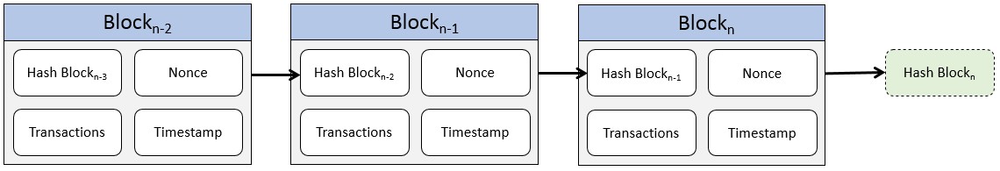
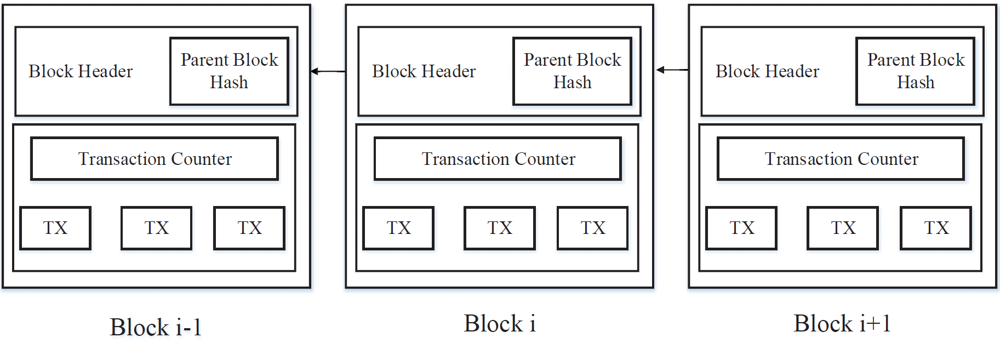
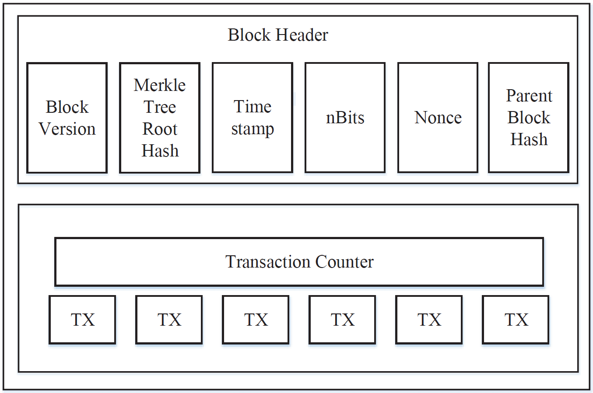
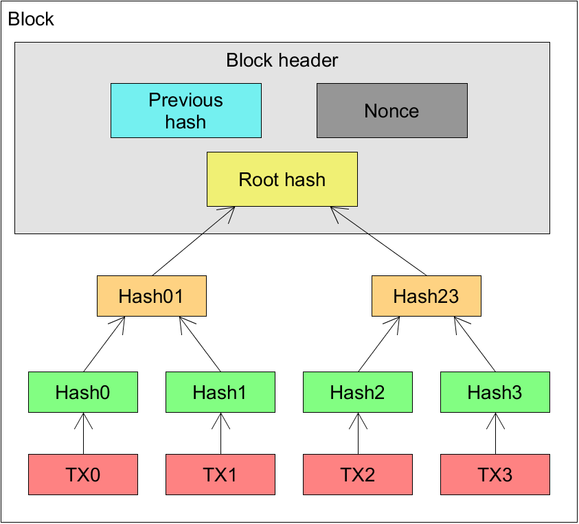

# Blockchain Technologie

## Architektur und Funktionsweise
Autor: Sebastian Janzen

Der Aufbau einer Blockchain ist eine Blocksequenz in denen die komplette Transaktionshistorie festgehalten wird, wie zum Beispiel einem öffentlichen Konto. Jeder Block zeigt auf den Vorgänger bis auf den ersten Block einer Blockchian, den sogenannten "Genesisblock". <a>[[ZHENG17]](#ref_Zheng17)</a>

<b>[[ANDE16]](#ref_Ande16)</a>

>___!!!Das nächste Unterkapitel "Block" überschneidet sich mit dem Unterkapitel "Blöcke" von Björn. Bleibt erstmal so stehen, wir entscheiden später wie wir vorgehen!!!___ 

### Block

### Digitale Signatur

### Hauptmerkmale einer Blockchain

__Dezentralisierung__

__Beständigkeit__

__Anonymität__

__Nachvollziehbarkeit__

### Arten einer Blockchain 

__Public__

__Private__ 

__Konsortium__

__Permissionless__

__Permissioned__

## Eigenschaften einer Blockchain 

Autor: Björn Enders-Müller

### Immutable

### Transaktion

### Blöcke

Der Begriff Blockchain setzt sich aus den englischen Wörten „block“ und „chain“ zusammen. Dies übersetzt bedeutet so viel wie Blockkette, Kette aus Blöcken oder verkettete Blöcke. Dieser Abschnitt behandelt den Aufbau eines einzelnen Blockes der Blockchain.

In jeder Blockchain gibt es einen besonderen Block. Den sogenannten „genesis block“ oder auch Ursprungsblock. Er ist der erste und älteste Block der Blockchain. Als Ursprungsblock kann nur er alleine keinen sogenannten „parent block“, frei übersetzt Elternblock, haben. Jeder andere Block der Blockchain verweist jeweils auf den vorherigen Block. Die Blockchain ähnelt somit der Datenstruktur einer einfach verketteten Liste.

Die Aufgabe von Blöcken ist es Transaktionen innerhalb der Blockchain zu bündeln. Diese Blöcke werden dann mit unterschiedlichsten Verfahren auf alle Netzwerkknoten verteilt. Ein Block lässt sich in einen „block header“ und den „block body“ unterteilen. Der Block header enthält Metainformationen über den Block selbst, Elternblock und die Transaktionen. 

Abbildung entnommen aus <a>[[ZHENG17]](#ref_Zheng17)</a>

Abbildung entnommen aus <a>[[ZHENG17]](#ref_Zheng17)</a>

Wie in der Abbildung zu sehen ist besteht der Block aus unterschiedlichen Elementen. Der Header unterteilt sich in die folgenden sechs Teile:

* Block Version: Mit der Block version wird beschrieben mit welchen Regeln der Block validiert werden muss.
* Merkle Tree Root Hash: Enthält die Wurzel des „Merkel Tree“ oder auch sogenannten Hash-Baum. Der Baum enthält Hash-Werte zu jeder Transaktion des Blockes. Was genau eine Transaktion und ein Merkel Tree ist wird in anderen Abschnitten genauer erläutert. 
* Timestamp: Ein Timestamp ist ein Integer-Wert der jeder Sekunde seit dem 1. Januar 1970 UTC inkrementiert wird. 
* nBits: Der sogenannte nBits Wert ist ein Schwellwert um die Validität des Blocks zu überprüfen. Wenn der Hash-Wert des Blockes selbst größer ist als der nBits Wert ist der Block nicht zulässig. 
* Nonce: Die Nonce ist 4-Byte großes Datenfeld, welches in der Regel bei 0 startet und bei jedem Hash-Versuch inkrementiert wird. Miner verändern den Wert der Nonce und Hashen den Block danach erneut um zu überprüfen ob er in einem bestimmten Wertebereich liegt. Wenn dies nicht der Fall ist wird die Nonce erneut verändert und der Wertebereich wird erneut geprüft. Falls der Wert passt kann der Block verteilt werden und von anderen Netzwerkknoten überprüft werden und an die Blockchain gehängt werden.
* Parent Block Hash: Speichert den Hash-Wert des Elternblockes um eine einfach verkettete Liste von Blöcken zu erzeugen. Diese Mechanik sorgt für die Sicherheit vor Manipulation der älteren Blöcke.

Im body des Blocks befindet sich ein Zähler für die Anzahl der Transaktionen des Blockes. Zusätzlich lassen sich die Transaktionen selbst dort finden. Der genaue Aufbau einer Transaktion wird in anderen Abschnitten erläutert.

<a>[[ZHENG17]](#ref_Zheng17)</a>

### Merkle Tree

Ein Merkle tree ist eine Datenstruktur die auf einem Binär-Baum basiert. Bei einem Merkle tree wird jedoch in jeder Ebene eine One-Way-Hash-Funktion verwendet um den Baum und die Blätter vor Manipulation oder Fehlern zu schützen. Häufig wird daher der Merkle tree auch Hash-Baum genannt. Die Funktionsweise innerhalb einer Blockchain ist wie folgt. Jeder Block der Blockchain hält einen Hash-Baum oder zumindest die Wurzel des Baums, dazu im Folgenden mehr. Für eine Blockchain werden als Blätter die abzusichernden Transaktionen verwendet. Die Knoten direkt über den Transaktionen werden mit der Hash-Funktion erzeugt. In der darüberliegenden Ebene werden jeweils zwei Knoten zusammengeführt in dem für die Hash-Werte der beiden Knoten erneut ein dritter Hash-Wert erzeugt wird. Dieser Prozess wird fortgesetzt bis in der höchsten Ebene nur noch ein Knoten befindet. Die sogenannte Wurzel bzw. Root-Hash des Hash-Baums. In der folgenden Abbildung ist der Vorgang nochmal verdeutlicht.  

Abbildung entnommen und angepasst aus <a>[[Vujičić18]](#ref_Vujičić18)</a>

Zuerst wird für jede Transaktion (TX0 bis TX3) ein Hash-Wert (Hash0 bis Hash3) generiert. Anschließend wird für jeweils zwei benachbarte Hash-Werte (z.B. Hash0 und Hash1) noch ein dritter Hash-Wert (Hash01) gebildet. In der Abbildung wird so aus Hash0 und Hash1 der darüberliegende Knoten Hash01. Wenn der Block mehr als vier Transaktionen halten würde hätte der Hash-Baum mehr Ebenen als in der Abbildung. Im Block header wird die Wurzel des Baums gespeichert. In vielen Blockchain Systemen werden nach der Verifizierung des Blocks alle Knoten des Hash-Baums gelöscht um Speicherplatz einzusparen. Nur die Wurzel und die Transaktionen bleiben erhalten, da die Wurzel zum überprüfen ausreicht. Falls nachträglich jemand versucht z.B. die Transaktion TX0 zu manipulieren so würde dies bei einer Verifizierung auffallen, da sich der Hash-Wert der Transaktion verändert und somit auch der von dem Knoten Hash01. So propergiert der Fehler sich bis zur Wurzel und somit kann eine Manipulation erkannt werden. Theoretisch würde es reichen für alle Transaktionen nur einen Hash-Wert abzuspeichern, jedoch kann dann nicht nachvollzogen werden welche der Transaktionen manipuliert wurde. 

<a>[[Vujičić18]](#ref_Vujičić18)</a>

## Crypto-Economics

Autor: Kevin Schima

### Abgrenzung: Token / Coins

### Tokenization

### Initial Coin Offering (ICO)

Ein Initial Coin Offering ist eine, bis dato, weitgehend unregulierte Methode der Kapitalaufnahme bei der im Gegensatz zum klassischen Initial Public Offering (IPO) (deutsch: Börsengang), die Kapitalaufnahme in Form von Kryptowährungen erfolgt. Vergleichbar mit dem Börsenhandel bei dem mit Echtgeldwährungen (FIAT Währungen) Anteile an einem Unternehmen in Form von Aktien erworben werden können, werden bei einem ICO üblicherweise Token ausgegeben die mittels Kryptowährungen gekauft werden. Die Mindestinvestition ist, ähnlich wie bei Crowdfunding Finanzierungsmodellen, so niedrig, dass auch private Kleininvestoren partizipieren können.

Während der traditionelle Finanzmarkt durch nationale und internationale Finanzaufsichten rechtlich stark reguliert ist, ist dies bei den neuartigen ICOs durch die rasante technische Entwicklung und unterstützt durch die anonymen bzw. pseudonymen Transaktionen von Kryptowährungen bisher kaum der Fall.

#### Typischer Ablauf eines ICOs basierend auf Ethereum (ERC20) Token

* Ein Unternehmen bzw. loses Entwicklerkollektiv veröffentlich ein Whitepaper in dem eine Geschäftsidee / Anwendungsbereich für den Token und eventuell zukünftige Entwicklungsziele formuliert sind

* Ein Smart Contract auf ERC20 Basis wird für den ICO erstellt in dem unteranderem Bezeichnung und Maximalmenge an Token definiert wird

* Der Token Verkauf (Sale) beginnt, der ICO Ersteller legt einen initialen Verkaufspreis fest, bespielsweise 1000 Token / 1 Ether

* Der Token Sale endet

* Der Token wird an speziellen Kryptowährungs / Token Börsen gelistet, und kann öffentlich gehandelt werden, der Wert der Token wird durch die Marktmechanismen Angebot/Nachfrage bestimmt

Für die Investoren des ICOs hat sich der Wert der Token im Idealfall durch mediale Aufmerksamkeit, Entwicklungsfortschritt und Kooperationen mit anderen Unternehmen gegenüber des intialen Sales bzw. Pre-Sales vervielfacht. 

#### Risiken

## Herausforderungen und Risiken

### Technische Herausforderungen
Autor: Fynn Klöpper

Angriffsszenarios (Sybil attack, 51%-Attack)
Skalierung (-sprobleme)

Quellen:
https://www.freehaven.net/anonbib/cache/sybil.pdf

#### Angriffsszenarien

##### Sybil Attacke

###### Definition
Eine Sybil-Attacke beschreibt eine Art des Angriffs auf eine Blockchain, bei der eine schadhafte Entität mehrere Identitäten vorgibt, um einen substantiellen Teil des Systems zu kontrollieren und so die Sicherheit der Redundanz zu komprimieren.

Für Peer-to-Peer-Systeme ist es essentiell, dass Daten redundant gespeichert werden. Durch die Redundanz der Speicherung derselben Daten auf verschiedenen Entitäten kann so die Integrität der Daten sichergestellt werden. Weiterhin setzen viele P2P-Systeme auf die Fragmentierung der Daten, um sich gegen Datenlecks abzusichern.
   
Falls das System scheitert Identitäten zu Entitäten zu mappen, kann nun eine Entität mehrere Identitäten vortäuschen und von dem System mehrmals Daten oder zusammenhängende Daten zugewiesen bekommen. Hierdurch wäre die Redundanz, als auch die Fragmentierung der Daten komprimiert. 
###### Lösungsansätze

Mit Identifizierungs-Authorität:
- VeriSign
- CFS
- SFS
- EMBASSY
- ICANN / Wave Systems

Ohne Identifzierungs-Authorität:

Ein Schutz ohne dedizierte Identifizierungs-Authorität stellt sich als äußerst schwierig heraus.
Oftmals fällt der erste Gedanke auf ein System, bei dem ältere, etablierte Identitäten neue Identitäten kollektiv verifizieren. Dieser Lösungsansatz geht allerdings davon aus, dass die erste Generation von Identitäten vertrauenswürdig ist, welche bereits durch eine Sybil-Attacke komprimiert sein könnte und somit den weiteren Verlauf der Kette unsicher macht.  

##### 51%-Attack

###### Definition

###### Lösungsansätze

#### Skalierung (-sprobleme)

### Ökonomische und gesellschaftliche Herausforderungen

Autoren: Mario Cichonczyk und Martin Teuber

Konsequenzen
Sozial-wissenschaftlich
betriebswirtschaftlich

=======
#### Ökonomische Implikationen
Autor: Mario Cichonczyk
##### Intermediation
Im Intermediationskonzept agieren nach <a>[[WALTER07]](#ref_walter07)</a> unabhängige, gewinnmaximierende ökonomische Agenten basierend auf den Bedürfnissen der Vermittlung von Angebot und Nachfrage. Die Aufhebung von Marktintransparenzen unter Erhebung einer Vermittlungsgebühr bildet dabei den Ertragsüberschuss im Cashflow des Intermediärs. Das Ziel ist also je nach Anwendungsfall die Allokation von Angebot->Nachfrage oder Nachfrage->Angebot.

Wenn ein Marktteilnehmer dem Markt beitritt ist er mit der unbestimmt zeitverzögerten Suche nach seinem Vertragspartner konfrontiert. Das Resultat sind Suchkosten, die sich vorab nur schwierig beziffern lassen. Ein Zwischenhändler bietet die Fixierung von Kosten und/oder Zeit, die zwischen Anbahnung und Vertragsschluss aufgewendet werden müssen. Intermediäre haben demnach eine ständige Präsenz am Markt, da sie im Vergleich zu ihren Vertragspartnern den Handel nach Vertragsschluss nicht verlassen. Wenn ein Asset in ihren Besitz übergeht, leiten sie es an Käufer weiter, welche das Asset höherwertig beziffern. Vergleichbar versuchen diese das Asset aus Quellen zu beschaffen, die es geringwertiger einstufen. <a>[[SHEN16]](#ref_shen16)</a>. Intermediäre schöpfen also Wert, wenn ein Assetflow mit Unkenntnis über den Gesamtmarkt verknüpft ist. Dieses Nichtwissen ist das Resultat der imperfekten Natur realer Märkte, in denen die vollständige Information über alle Produzenten und Konsumenten nicht vorliegt <a>[[BUDIC18]](#ref_budic18)</a>. 

Offensichtlich kann sich auf diese Weise eine komplexe Kette von Handelsstufen zwischen Produkterschaffung und Endverbraucher bilden. Das Hinzukommen von Handelsstufen scheint im Zeitalter des eCommerce aber einem gegenläufigen Trend zu unterliegen<a>[[ETLA16]](#ref_etla16)</a>. Internetunternehmen wie Amazon konsolidieren komplexe Handelsketten in einfach nutzbaren Plattformen. Das Geschäftsmodell der Realweltvermittlung von Kontakten ist in diesem schnelllebigen Kontext nicht mehr nachaltig. Wichtig ist es hier zu beachten, dass das Intermediationsprinzip dennoch weiter existiert. Der heterogene Assetflow zentralisiert sich lediglich in einem monopolistisch geprägten Intermediär. Diese Entwicklung lässt sich teilbegründen mit einer inhärenten Eigenschaft des Internets als verteiltes System: Misstrauen<a>[[ETLA16]](#ref_etla16)</a>. Produzenten und Konsumenten gravitieren zu dem Vermittler, welcher das größte Vertrauen im suspekten Austauschmedium repräsentiert. Diese Beobachtung stellt die Basis des disruptiven Disintermediationspotentials der Blockchain dar. 

TODO: Risiken,  Bedeutung

##### Wertschöpfungstransparenz
...
##### Wirtschaftsautomation - M2M Transaktionen

...

## Literaturverzeichnis
<a name="ref_walter07">[WALTER07]</a>: Walter, Benedikt: Intermediation und Digitalisierung. Springer-Verlag, 2007, ISBN: 3835096303 
<a name="ref_shen16">[SHEN16]</a>: Shen, Ji ; Wei, Bin ; Yan, Hongjun: Financial Intermediation Chains in an OTC Market. 2016, SSRN: https://ssrn.com/abstract=2577497
<a name="ref_budic18">[BUDIC18]</a>: BusinessDictionary.com : What is intermediation? definition and meaning ; URL: http://www.businessdictionary.com/definition/intermediation.html ; Date Accessed: April 29, 2018
<a name="ref_etla16">[ETLA16]</a>: ETLA; Mattila, Juri: The Blockchain Phenomenon – The Disruptive Potential of Distributed Consensus Architectures. ETLA Working Papers, 2016 ; ISSN: 2323-2420

<a name="ref_Zheng17">[ZHENG17]</a>: Zheng, Zibin ; Xie, Shaoan ; Dai, Hongning ; Chen, Xiangping ; Wang, Huaimin : An Overview of Blockchain Technology: Architecture, Consensus, and Future Trends. Honolulu, HI, USA : IEEE International Congress on Big Data, 2017, ISBN: 978-1-5386-1996-4

<a name="ref_Vujičić18">[Vujičić18]</a>: Vujičić, Dejan ; Jagodić, Dijana ; Ranđić, Siniša : Blockchain Technology, Bitcoin, and Ethereum: A Brief Overview. East Sarajevo, Bosnia and Herzegovina : IEEE INFOTEH-JAHORINA (INFOTEH), 17th International Symposium, 2018, ISBN: 978-1-5386-4907-7 

<a name="ref_Hofmann17">[Hofmann17]</a>: Hofmann, Frank ; Wurster, Simone ; Eyal, Ron ; Böhmecke-Schwafert, Moritz : The immutability concept of blockchains and benefits of early standardization. Nanjing, China : ITU Kaleidoscope: Challenges for a Data-Driven Society (ITU K), 2017, ISBN: 978-9-2612-4281-7 

<a name="ref_Ande16">[ANDE16]</a>: Nicolai Andersen: Vorstellung der Blockchain-Technologie „Hallo, Welt!”, Deloitte, 03.2016, URL: https://www2.deloitte.com/content/dam/Deloitte/de/Documents/Innovation/Vorstellung%20der%20Blockchain-Technologie.pdf