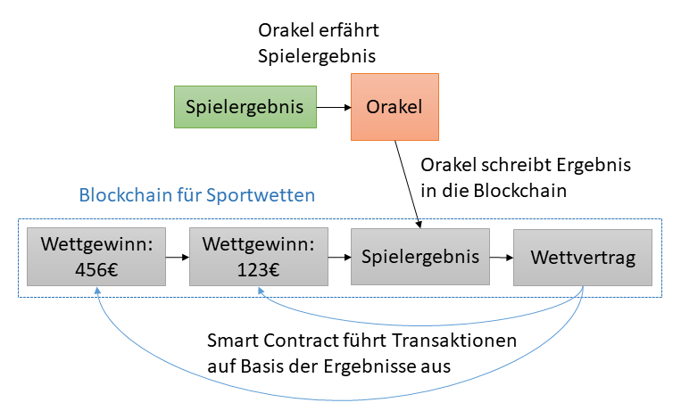

# Blockchain Use Cases

## Entscheidungsmodell 

Autor: Niklas Röhling

* Do you need a Blockchain? :  https://eprint.iacr.org/2017/375.pdf

## Smart Contracts

Der Begriff *"Smart Contract"* wurde erstmals 1996 von dem Computerwissenschaftler Nick Szabo verwendet, der ihn wie folgt definierte:

*"New institutions, and new ways to formalize the relationships that make up these institutions, are now made possible by the digital revolution. I call these new contracts "smart", because they are far more functional than their inanimate paper-based ancestors. No use of artificial intelligence is implied. A smart contract is a set of promises, specified in digital form, including protocols within which the parties perform on these promises."* [[SZAB96]](#ref_szab96)

Ein Smart Contract ist laut Szabo also die digitale Abbildung handelsüblicher Verträge, erweitert mit zusätzlichen Funktionalitäten für die Vertragsteilnehmer. So sollen beispielsweise kryptographische Protokolle und ähnliche Sicherheitsmaßnahmen bei der Überprüfung und Durchsetzung der Vertragsklauseln einen großen Vorteil bieten.

Das heutige Verständis eines Smart Contract begrenzt sich nicht auf das allgemeine Konzept eines Vertrags, sondern kann jede Form von Software sein. Durch aktuelle Implementierungen basierend auf einer Blockchain, werde außerdem nachvollziehbare und endgültige Transaktionen realisiert, sodass beim Erfüllen oder Brechen des Vertragen (oder Erreichen spezieller Konditionen) vorher festgelegte Aktionen eigenständig und automatisch ausgeführt werden. Durch solche Automatismen und dazugehörige Sicherheitsmaßnahmen wird eine dritte, unabhängige Partei, zur Überwachung von Transaktionen, überflüssig. [[GOLL17]](#ref_goll17)

Bei Implementierungen mittels Blockchain werden zu Beginn alle Vertragsbedingungen und damit zusammenhängende Aktionen definiert, in Quellcode geschrieben und in die Blockchain gehangen. Der fertige Vertrag beziehungsweise das fertige Programm wird auf die Knoten des Netzwerks kopiert und beim Eintreffer der festgelegten Bedingungen verifiziert und ausgeführt. Anzumerken ist, dass alle Vertragsteilnehmer den Vertrag  und dessen Bedingungen digital signieren und sich dadurch an diesen binden.

 Quelle: Eigene Darstellung

Vom Prinzip her können Smart Contracts nur auf die Informationen zugreifen, die in der dazugehörigen Blockchain hinterlegt sind. Die Verbindung zur echten Welt wird mittels konventionellen Anwendungen hergestellt, die auf externen Server laufen. Diese Anwendungen werden im Blockchain-Umfeld als "Orakel" bezeichnet und nehmen Einfluss auf die Blockchain, sobald spezielle Events eintreten. Die [Abbildung 1](#ref_smart_contract_oracel) verbildlicht die Funktion eines Orakels am Beispiel von Sportwetten. Dabei überwacht das Orakel die Ergebnisse von Spielen und schreibt diese in die Blockchain. Durch diese Informationen kann der Smart Contract die vorher definierten Aktionen ausführen und die Wetteinsätze passend verteilen. Beim Entwerfen von Smart Contracts und dazugehörige Orakel sollte die Sicherheit im Vordergrund stehen, da spätere Änderungen unmöglich sind. Sollte ein Orakel also falsche Informationen erhalten oder Situationen im Vertrag nicht bedacht worden sein, so kann dies unter Umständen fatale Folgen haben. [[CHAI17]](#ref_chai17)

Autor: Björn Böing

## Decentralized Autonomous Organization (DAO)

Das Prinzip einer *"Decentralized Autonomous Organization"*, also einer dezentralen und autonomen Organisation, beschreibt eine Unternehmensform, in der Regeln und Abläufe mittels Smart Contracts abgebildet werden. Die Idee ist, dass ein Unternehmen einzig für das initiale Aufsetzen der Smart Contracts Hilfe von Außerhalb braucht und danach vollkommen ohne hierarchische Strukturen auskommt. Zum Start einer DAO sind gewisse Regeln festgelegt, um das virtuelle Unternehmen zu festigen. Danach werden  Entscheidungen zu Regeländerungen und Investitionen durch Abstimmungen getroffen und mithilfe einer Blockchain unveränderlich gespeichert. Dabei können in der Regel größere Investoren auch größeren Einfluss nehmen. Eine DAO kann gänzlich transparent sein und von jederman verifiziert werden, sollte sie eine öffentliche Blockchain verwendet. [[HERT18]](#ref_hert18)

Neben der Sicherstellung von demokratischen Wahlen und der Unabhängigkeit von einer dritten Partei wie beispielsweise einer Bank, birgt das Prinzip der Smart Contracts allerdings auch Risiken. Sobald die Smart Contracts einer DAO einmal der Blockchain hinzugefügt sind und laufen, so lassen sich diese und die dazugehörigen Regeln nicht mehr einfach ändern. Das hat zwar den Vorteil, dass kein einzelner diese Regeln verändern kann, aber andersherum lassen sich auch keine Fehler einfach ausbessern. [[REIF18]](#ref_reif18)

In diesem Zusammenhang erlang die DAO, die auf Basis der Ethereum-Blockchain am 30.04.2016 gegründet wurde, die meiste Aufmerksamkeit. Sie sollte als dezentrale Organisation die Finanzierung von Startup-Unternehmen übernehmen, indem die Teilhaber für die Investitionen abstimmen konnten. Anteile an diese DAO konnten sich mit Ether gekauft werden, wobei größere Investoren auch größeren Einfluss auf die Abstimmungen nehmen konnten. In weniger als einem Monat wurden soviele Anteile verkauft, dass die DAO über 150 Millionen US-Dollar zur Verfügung hatte. Etwa zeitgleich wurden die ersten Berichte veröffentlicht, die Programmierfehler und generelle Schwachstellen aufdeckten und gleichzeitig die Investoren zur Vorsicht anhielten. Am 17. Juni 2016 wurde die DAO Opfer eines Angriffs, welcher mehrere dieser Schwachstellen ausnutze und somit ca. 50 Millionen US-Dollar auf einen einzelnen Account übertragen konnte. Genauer ermöglichten es Probleme bei rekursiven Aufrufen, dass von der DAO wiederholt Ether zurückverlangt werden konnte, bevor der dahinterliegende Smart Contract seinen internen Token-Zähler aktualisierte. Dieser Vorfall sorgte für rege Diskussion innerhalb der Ethereum-Community und führte schließlich zu einer Aufspaltung derselben. Die ursprünglichen Entwickler setzten die Blockchain auf einen Stand vor dem Angriff zurück, während andere, unter dem Namen *"Ethereum Classic"*, mit der zu dem Zeitpunkt aktuellen Blockchain weiter machten. [[NORT16]](#ref_nort16) [[POPP16]](#ref_popp16)

Am 25. Juli 2017 veröffentlichte die *"U.S. Security and Exchance Commission"* einen Beschluss, dass die Angebote und Verkäufe von virtuellen Unternehmen, wie die DAO, unter die "federal securities laws" fallen. Diese Gesetze sind das amerikanische Gegenstück zu den Bundeswertpapiergesetzen, die unter anderem sicherstellen, dass der Verkauf von Firmenanteilen staatlich überprüft und angemeldet ist. Diese Regelung der SEC sorgt dafür, dass *"Inital Coin Offer (ICO)"*, wie die anfängliche Finanzierung der DAO angemeldet sein müssen, da sich sonst die Gründer und Investoren der DAO strafbar machen. [[USSE17]](#ref_usse17)

Das schnelle und unschöne Ende der Ethereum-DAO dient auch noch heute als Negativbeispiel für weitere Blockchain Entwicklungen und Ansätze. Zum einen wurde aufgezeigt, wie enorm wichtig die Sicherheit und Qualität von Softwareprogrammen ist, selbst wenn sie auf längst etablierten Verfahren, wie der Blockchain, arbeiten. Zum anderen hat die Regelung der SEC für neue Ideen gesorgt, um staatliche Regulierungen zu umgehen beziehungsweise überflüssig zu machen. Einer dieser Ideen ist als *"Simple Agreement for Future Tokens (SAFT)"* bekannt und ist verleichbar mit dem Kauf einer Geschenkkarte für ein Unternehmen, das noch nicht eröffnet. Dabei erhalten Investoren beim ICO das Versprechen, dass sie einen festen Anteil von Tokens erhalten, sobald das Unternehmen läuft und die Tokens von Wert sind. [[FALK17]](#ref_falk17) [[PETE17]](#ref_pete17)

Autor: Björn Böing

## Legal technology

- Technologie und Software, um juristische Dienstleistungen anzubieten
- Meistens StartUp Unternehmen, die versuchen durch ihre Ideen den traditionellen Markt zu unterbrechen
- StartUps wollen den Bürgern Recht oft zugänglicher machen. Ob über einfachere Suche von Anwälten oder direkten Zugang zu einfachen Rechtsmöglichkeiten
- https://berlinlegal.tech/2018/
- Kontakt zu einem Anwalt überflüssig machen oder die Kontaktaufnahme erleichtern
- Laut "Law Technology Today" hat sich das Verhältnis zwischen Kunden und Kanzleien in den letzten 50 Jahren kaum verändert http://www.lawtechnologytoday.org/2014/12/smart-startups/
- Klassische und aktuelle Einsatzgebiete erläutern
- Steigener Wachstum von relevanten Dokumenten (speziell Emails) lässt sich mittels Deep Learning vereinfachen. "Legal predictive analytics"
- Wichtigkeit wird dadurch unterstrichen, dass die Johann Wolfgang Goethe-Universität Frankfurt Legaltech als Schlüsselqualifikations-Modul hinzugefügt wurde https://legal-tech-blog.de/goethe-2-0-legaltech-an-der-johann-wolfgang-goethe-universitaet-frankfurt
- Beispiel von Geld-Für-Flug.de anbringen. Bei Stornieren oder Nicht-Antreten eines Fluges, ist eine Airline verpflichtet einen gewissen Anteil des Ticketpreises zurückzubezahlen. Das Unternehmen kauft das Anklagerecht des Nutzers ab und reicht es als Sammelklage vor Gericht ein. Der Nutzer erhält sein Geld dabei innerhalb von 24h überwiesen, egal wie das Verfahren läuft. https://legal-tech-blog.de/wie-geld-fuer-flug-de-die-airline-branche-aufmischt-interview-mit-co-founder-head-of-legal-benedikt-quarch
- Recht ist schwer zugänglich durch hohe Aufwände und Kosten
- Bestimmte Technologien könnten Anwälten helfen, andere machen wenig Sinn https://www.law.ox.ac.uk/business-law-blog/blog/2017/12/legal-tech-era-bad-ideas

Autor: Björn Böing

## Blockchain in Education

Autor: Matthias Kersting

## Blockchain und KI

* https://arxiv.org/abs/1802.04451

Autor: Matthias Kersting

## Literaturverzeichnis

<a name="ref_chai17">[CHAI17]</a>: Chainfrog: What are smart contracts? 2017 ; URL: <a>http://www.chainfrog.com/wp-content/uploads/2017/08/smart-contracts.pdf</a> (abgerufen am 03.05.2018)

<a name="ref_falk17">[FALK17]</a>: Falkon, Samuel ; 24.12.2017: The Story of the DAO - Its History and Consequences ; URL: <a>https://medium.com/swlh/the-story-of-the-dao-its-history-and-consequences-71e6a8a551ee</a> (abgerufen am 05.05.2018)

<a name="ref_goll17">[GOLL17]</a>: Ethereum Wiki: White Paper 2017 ; URL: <a>https://github.com/ethereum/wiki/wiki/White-Paper/f18902f4e7fb21dc92b37e8a0963eec4b3f4793a</a> (abgerufen am 03.05.2018)

<a name="ref_hert18">[HERT18]</a>: Hertig, Alyssa: What is a DAO? ; URL: <a>https://www.coindesk.com/information/what-is-a-dao-ethereum/vvvv</a> (abgerufen am 04.05.2018)

<a name="ref_nort16">[NORT16]</a>: Norton, Steven ; 20.05.2016: Downfall of DAO Digital Currency Fund Shows Blockchain Reputational Risk ; URL: <a>https://blogs.wsj.com/cio/2016/06/20/downfall-of-dao-digital-currency-fund-shows-blockchain-reputational-risk/</a> (abgerufen am 04.05.2018)

<a name="ref_pete17">[PETE17]</a>: Peterson, Becky ; 19.11.2017: Venture capital has a new way of cashing in on blockchain bonanza — here’s what you need to know about SAFTs ; URL: <a>https://www.businessinsider.de/bitcoin-price-what-is-a-saft-blockchain-the-crypto-fundraising-craze-shaking-up-venture-capital-2017-11</a> (abgerufen am 05.05.2018)

<a name="ref_popp16">[POPP16]</a>: Popper, Nathaniel ; 17.06.2016: A Hacking of More Than $50 Million Dashes Hopes in the World of Virtual Currency ; URL: <a>https://www.nytimes.com/2016/06/18/business/dealbook/hacker-may-have-removed-more-than-50-million-from-experimental-cybercurrency-project.html</a> (abgerufen am 04.05.2018)

<a name="ref_reif18">[REIF18]</a>: Reiff, Nathan; 25.01.2018: What Is the DAO? ; URL: <a>https://www.investopedia.com/tech/what-dao/</a> (abgerufen am 04.05.2018)

<a name="ref_usse17">[USSE17]</a>: U.S. SEC ; 25.07.2017: SEC Issues INvestigative Report Concluding DAO Tokens, a Digital Asset, Were Securities ; URL: <a>https://www.sec.gov/news/press-release/2017-131</a> (abgerufen am 05.05.2018)

<a name="ref_szab96">[SZAB96]</a>: Smart Contracts: Building Blocks for Digital Markets 1996 ; URL: <a>http://www.fon.hum.uva.nl/rob/Courses/InformationInSpeech/CDROM/Literature/LOTwinterschool2006/szabo.best.vwh.net/smart_contracts_2.html</a> (abgerufen am 03.05.2018)