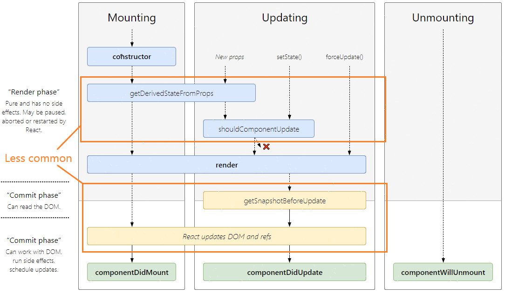

# Frontend
## FRP
## React.js
*Stand: Version 16.3.2*
- [Einführung](#Einführung)
  - [SPA / Progressive Web App](#SPA-/-Progressive-Web-App)
  - [JSX](#JSX)
- [Komponenten](#Komponenten)
  - [Dumb Components & Smart Components](#Dumb-Components-&-Smart-Components)
  - [Children](#Children)  
  - [Rendern](#Rendern)
  - [Bedingtes Rendern](#Bedingtes-Rendern)
  - [Events](#Events)
  - [Styling](#Styling)
  - [Lifecycle](#Lifecycle)
- [Patterns / Architektur](#Patterns-/-Architektur)
  - [State management (Redux)](#State-management-(Redux))
  - [Komposition vs. Vererbung](#Komposition-vs.-Vererbung)
  - [Higher Order Components (HOCs)](#Higher-Order-Components-(HOCs))
  - [Flux](#Flux)
- [Weitere React-Themen](#Weitere-React-Themen)
  - [Virtuelles DOM & Reconciliation](#Virtuelles-DOM-&-Reconciliation)
  - [Type checking/static types in JavaScript](#Type-checking/static-types-in-JavaScript)
    - [PropTypes](#PropTypes)
    - [Flow](#Flow)
    - [Typescript](#Typescript)
  - [Error Handling (Error Boundaries)](#Error-Handling-(Error-Boundaries))
  - [Code-Splitting](#Code-Splitting)
  - [Strict Mode](#Strict-Mode)
  - [React Router](#React-Router)
  - [Serverseitiges Rendern](#Serverseitiges-Rendern)

### Einführung
#### SPA / Progressive Web App

#### JSX
JSX erweitert die Programmiersprache JavaScript, indem es eine XML/HTML-artige Struktur zur Programmierung der GUI-Elemente innerhalb des JavaScript Codes erlaubt. Damit aus einem JSX-Code standardmäßiges JavaScript wird, muss der Code übersetzt werden. Dieser Vorgang wird i.d.R. mithilfe des JavaScript-Compilers "Babel" durchgeführt. Streng genommen ist JSX kein zwingendes Muss bei der Verwendung von React, jedoch ist zu vermuten, dass die meisten Programmierer die JSX-Version dem compilierte JavaScript Äquivalent aufgrund der Übersichtlichkeit bevorzugen würden. Außerdem können so hilfreichere Tool-Unterstützungen (Warnungen, Fehler etc.) angezeigt werden [[FACE18a]](#ref_face18a).

Als Beispiel soll folgender JSX-Code dienen:

```jsx
function render() {
    return (
      	<div>
          <h1>Master Informatik</h1>
          <h2>Campus Minden</h2>
          <h3>Modulname:</h3>
          <input type="text" autofocus name="moduleName"/>
    	</div>
    );
};
```
Dieser Code wird von Babel folgendermaßen übersetzt:

```javascript
function render() {
    return React.createElement("div", null,
             React.createElement("h1", null, "Master Informatik"),
             React.createElement("h2", null, "Campus Minden"),
             React.createElement("h3", null, "Modulname:"),
             React.createElement("input", {
                 type: "text", 
                 autofocus: true, 
                 name: "moduleName"
             })
    );
};
```

*Das Beispiel lässt sich [hier](https://babeljs.io/repl/#?babili=false&browsers=&build=&builtIns=false&code_lz=GYVwdgxgLglg9mABAJwKZgCauQCgJSIDeAUAJBpQjJI7GL0OkA8GMAbgHx0M_1MAWARg4BZAIYBnKNkQBJMMDjIAtmNgBrJgHohXXrwEAmDgGExygA4gJiETEzpt_Y9319-AZlFwMIADZg5qgAXE5erm5M9lZQiFAAnhaoALwARNIAHlCpiGIgUHCKENaIgcopqco-_qgAckE5WnqM2qycEXgA3MQAvt3EQA&debug=false&forceAllTransforms=false&shippedProposals=false&circleciRepo=&evaluate=false&fileSize=false&lineWrap=true&presets=es2015%2Creact%2Cstage-2&prettier=false&targets=&version=6.26.0&envVersion=) online ansehen und bearbeiten.*

Da es sich bei den JSX-Elementen um JavaScript-Objekte handelt, können die Elemente auch beispielsweise Variablen zugewiesen werden:

```jsx
const header = <h1>Das ist eine Überschrift</h1>;  
```

Des Weiteren lässt sich auch weiterer JavaScript Code direkt als sogenannte "Expressions" einfügen, indem dieser in geschweifte Klammern gesetzt wird:

```jsx
const items = ["book", "pen"];
const itemCounter = <div>Anzahl an Items: {items.length}</div>;

===============================================================
Render-Ausgabe:
    Anzahl an Items: 2
===============================================================
```

#### Komponenten

##### Dumb Components & Smart Components
Grundsätzlich unterscheidet man zwischen zwei Arten von Komponenten. Die sogenannten "dumb components" und die "smart components". Sie unterscheiden sich darin, dass dumb components über keinen Zustand (*state*) verfügen. Soll heißen, dass sie einmalig Eigenschaften zugewiesen bekommen (*properties*, im Folgenden auch *props* genannt) und auf Basis dieser Werte ihr Aussehen anpassen. Es ist darauf zu achten, dass Javascript standardmäßig über keine Typprüfung verfügt und somit auch die Verwendung der Properties ein sorgsames Vorgehen verlangt. Möglichkeiten zur statischen  werden im Kapitel "Type checking/static types in JavaScript" vorgestellt.

Das nachfolgende Beispiel zeigt eine beispielhafte dump component.

```jsx
const Header = (props) => {
  return (
  <div>
    { props.title }
  </div>
  )
}
```

 Sie wird in der Variable "Header" als Arrow Function gespeichert. Die Funktion erhält als Parameter die Properties. Es handelt sich hierbei immer um ein Objekt, das die übergebenen Eigenschaften in Form von Key-Value Paaren bereitstellt. In diesem Fall wird der Wert des Schlüssels "title" innerhalb eines div-Containers angezeigt.  

 Die Props werden im JSX als Attribut angelegt: 

 ```jsx
 /// props = {
 ///   title: "Informatik Minden"
 /// }
<Header title="Informatik Minden" />
 ```

Smart components verfügen hingegen über einen *Status*. Hierbei handelt es sich ebenfalls um ein Objekt, das aus Key-Value Paaren besteht. Besonders ist hierbei jedoch, dass sich der Status innerhalb des Lebenszyklus der Komponente ändern kann. 

Smart components werden in Form Klassen realisiert und erhalten die Properties über ihren Konstruktor. Die folgende Komponente stellt einen Zähler dar, der als Property einen Startwert (*startValue*) erhält und bei Betätigung des Buttons den Zähler um eins erhöht. Dieser Zähler wird als Statusvariable (*this.state.count*) realisiert und wird mithilfe der Rendermethode (dazu im nächsten Kapitel mehr) angezeigt. 

```jsx
class Counter extends React.Component {
  constructor(props) {
    super(props);
    // der Startwert des Zählers muss als Property übergeben werden
    this.state = {count: props.startValue};
    // diese Bindung wird später erklärt; bitte erst einmal ignorieren
    this.increment = this.increment.bind(this);
  }
  increment() {
    this.setState({
      count: this.state.count + 1
    })
  }
  render() {
    return (
      <div>
        <button onClick={this.increment}>+1</button>
        <h1>Aktueller Wert: {this.state.count}</h1>
      </div>
    );
  }
}
```

Bei der Verwendung des Status ist zu beachten, dass Werte von Statusvariablen mit der Methode *setState()* geändert werden müssen. Diese Methode erhält ein Objekt mit den Key-Value Paaren, die geändert werden sollen. Auf diese Art und Weise wird die Anzeige direkt nach dem Ändern eines Statuswerts aktualisiert. 
Weitere Informationen zum "Lifecycle" von smart components finden sich im gleichnamigen Kapitel.


##### Children

Die vorherigen Beispiele haben bereits gezeigt, dass die Oberfläche aus hierarchisch Strukturierten Elementen besteht. Innerhalb von Komponenten, kann auf die direkten Vorfahren (*children*) zugegriffen werden.

```jsx
const List = (props) => {
  return (
    <div>
      <p>Anzahl an Items: {React.Children.count(props.children)}</p>
      <ul>
        {props.children}
      </ul>
    </div>
  )
}
```
Aufruf:
```jsx
  <List>
    <li>Item 1</li>
    <li>Item 2</li>
  </List>
  
  //======================
  // Ausgabe:
  //======================
  // Anzahl an Items: 2
  //  • Item 1
  //  • Item 2
  //======================
```
##### Rendern

Die Methode *render* ist - wie ihr Name bereits vermuten lässt - die Rendermethode eines React-Elements. Sie wird aufgerufen, wenn die Komponente im Browser dargestellt werden soll (siehe Lifecycle Kapitel). Als Rückgabewert erhält sie genau **ein** React Element. 
Ist es erforderlich, dass mehrere Elemente zurückgegeben werden, müssen diese in einem Container (z.B. *div*) gebündelt werden. 

```jsx
render() {
  return (
    <div>
      <ChildA />
      <ChildB />
      <ChildC />
    </div>
  );
}
```

Hieraus resultiert ein weiteres Element im DOM (ein div Element). 
Diesen Umstand kann man durch Verwendung von React *Fragments* umgehen. Sie gruppieren die Elemente, ohne selber im DOM eingefügt zu werden [[FACE18d]](#ref_face18d).

```jsx
render() {
  return (
    <React.Fragment>
      <ChildA />
      <ChildB />
      <ChildC />
    </React.Fragment>
  );
}

// oder die neue Schreibweise mit <> und </>
// (wird noch nicht von allen Tools unterstützt)
render() {
  return (
    <>
      <ChildA />
      <ChildB />
      <ChildC />
    </>
  );
}
```
===================
TODO
===================
```jsx
ReactDOM.render(
  <AppComponent />,               // React Komponente
  document.getElementById('root') // Element in der HTML-Datei, an der die      Komponente eingebaut wird
);

```
##### Bedingtes Rendern
Aufgrund des in JSX - also Javascript - eingebetteten Codes für das Rendern von Komponenten, kann ein bedingtes Rendern relativ einfach eingebaut werden. Im folgenden Beispiel wird, abhängig vom Zustand der Komponente, entweder ein Button "Start"- oder ein "Stopp"-Button angezeigt. 

```jsx
class StartStopButton extends React.Component {
  constructor(props) {
    super(props);
    this.state = { isRunning: false };

    this.start = this.start.bind(this);
    this.stop = this.stop.bind(this);
  }
  
  start() {
    this.setState({ isRunning: true });
  }
  stop() {
    this.setState({ isRunning: false });
  }

  render() {
    return (
      this.state.isRunning 
      ?
        // wird gerendert, wenn this.state.isRunning true ist
        <button onClick={this.stop}>
          Stopp
        </button>
      :
        // wird gerendert, wenn this.state.isRunning false ist
        <button onClick={this.start}>
          Start
        </button>
    );
  }
}
```

Statt des hier verwendeten Konditionaloperator (... ? ... : ...) kann auch z.B. ein if-Konstrukt verwendet werden. In diesem Fall darf die entsprechende Logik jedoch nicht "inline" in das return-Statement, sondern muss als extra Code davor. 

Beispiel: 

```jsx
//...
render() {
    let button; // Rückgabewert, kann natürlich auch als Expression in einen JSX-Code eingebaut werden
    if (this.state.isRunning) {
      button = (
        <button onClick={this.stop}>
          Stopp
        </button>
      );
    } else {
        button = (
          <button onClick={this.start}>
            Start
          </button>
       );
    }
    return button;
  }
}
//...
```

##### Events

*Innerhalb dieses Abschnittes wird eine beispielhafte Komponente betrachtet, die aus einem Button besteht, der bei Aktivierung (Betätigung der Schaltfläche) eine Funktion mit dem Namen "start" aufruft.*

Die Verwendung von UI-Komponenten erfordert oftmals eine ereignisbasierte Interaktion mit den einzelnen Elementen. Bei React Elementen werden die Events ähnlich wie bei herkömmlichen DOM Elementen gehandhabt.


HTML:
```html
<button onclick="start()">
  Start
</button>
```
JSX:
```jsx
<button onClick={start}>
  Start
</button>
```

In diesem Beispiel sind prinzipiell zwei Unterschiede zu erkennen:

1. die Eventnamen entsprechen den herkömmlichen Bezeichnungen in *camelCase* Schreibweise
2. die verbundenen Event-Handler werden als Expression (siehe JSX Kapitel) eingebunden

Meistens werden die Event-Handler innerhalb einer Klassenkomponente in Form von Klassenmethoden realisiert. In diesem Fall muss sichergestellt werden, dass die Klassenmethode an die Klasse gebunden ("bound") wird und somit in deren Kontext enthalten ist. Da dies in JavaScript standardmäßig nicht der Fall ist, bedarf es einer manuellen Bindung.

React bietet hierfür verschiedene Möglichkeiten [[FACE18c]](#ref_face18c).

**Bindung im Konstruktor**
```jsx
class StartButton extends React.Component {
  constructor(props) {
    super(props);

    // Hier wird die Methode gebunden
    this.start = this.start.bind(this);
  }
  
  start() {
    this.doStuff(); // "this" kann hier verwendet werden
  }

  // ...

  render() {
    return (
      <button onClick={this.start}>
        Start
      </button>
    );
  }
}
```

**Public class field Syntax (*experimentelles Feature*)**
```jsx
class StartButton extends React.Component {
  // !!! Experimentelles Feature !!!
  // Babel konvertiert diese Funktion zu einer öffentlichen Klassenmethode.
  // Je nach Projekteinstellung ist diese Funktion ggf. standardmäßig nicht aktiviert 
  start = () => {
    this.doStuff(); // "this" kann hier verwendet werden
  }

  // ...

  render() {
    return (
      <button onClick={this.start}>
        Start
      </button>
    );
  }
}
```

**Arrow Function (*nicht empfohlen*)**

Arrow Functions verfügen in JavaScript nicht über ein eigenes *this* und umgehen somit die angesprochene Problematik [[MOZI18]](#ref_mozi18). Diese Art der Programmierung wird jedoch nicht empfohlen, da jeder Rendervorgang der Komponente eine neue Funktion erzeugt. Wird dieser Callback als Property an andere Komponenten weitergegeben, werden diese eventuell ebenfalls neu gerendert , wodurch die Performance leidet.

```jsx
class StartButton extends React.Component {

  start() = {
    this.doStuff(); // "this" kann hier verwendet werden
  }

  // ...

  render() {
    return (
      <button onClick={() => this.start()}>
        Start
      </button>
    );
  }
}
```

Callback-Methoden können ebenfalls Parameter mitgegeben werden [[FACE18c]](#ref_face18c):

```jsx
const someValue = 1;
// ...
<button onClick={(e) => this.start(someValue, e)}>Start</button>
<button onClick={this.start.bind(this, someValue)}>Start</button>
```

In beiden Fällen wird das React Event *e* als zweiter Parameter an die Methode *start* übergeben. Werden bei der *bind*-Methode mehrere Parameter übergeben, wird der Eventparameter entsprechend nach hinten verschoben. Hier geschieht die Parameterübergabe implizit und muss somit nicht angegeben werden. 

##### Styling
Das Styling von React Komponenten kann prinzipiell auf unterschiedliche Arten geschehen. Im Folgenden werden drei häufige Verfahren vorgestellt.

***style*-Attribut**

Das Aussehen von Elementen kann z.B. direkt über ihr **style**-Attribut angepasst werden. Hierbei ist darauf zu achten, dass die Style-Bezeichner ihrem CSS-Äquivalent als *camelCase* entsprechen. So wird "font-size" z.B. zu "fontSize".

```jsx
const divStyle = {
  color: 'red',
  fontSize: '12px',
};

// ...

function someComponent() {
  return <div style={divStyle}>Roter Text</div>;
}
```

**CSS**

Eine weitere Möglichkeit ist das Verwenden von herkömmlichen CSS-Dateien.
Es ist darauf zu achten, dass das *class*-Attribut in JSX *className* lautet.
Das "id" Attribut kann wie in HTML gewohnt verwendet werden.

CSS:
```css
.red-text {
  color: red;
}
#some-id {
  font-size: 12px;
}
```
JSX:
```jsx
function someComponent() {
  return <div className="red-text" id="some-id">Roter Text</div>;
}
```

**Styled Components**

Darüber hinaus kann z.B. auch die Bibliothek [*styled-components*](https://www.styled-components.com/) verwendet werden. Diese verwendet eine Mischung aus CSS und JavaScript. Als Kennung für eine Style-Beschreibung dient das Gravis-Symbol ( ` ) am Anfang und Ende des Styles. Dadurch wird eine React-Komponente erzeugt, die zum Rendern verwendet werden kann.

```jsx
const RedText = styled.div`
    color: red;
    font-size: 12px;
`;

// ...

function someComponent() {
  return <RedText>Roter Text</RedText>;
}
```
##### Lifecycle

Der Lebenszyklus einer React Klassenkomponente besteht aus verschiedenen Schritten und Phasen, siehe nachfolgende Abbildung. Es existieren noch weitere Lifecycle-Methoden. Da diese jedoch als veraltet gelten und mit der Version 17 entfernt werden, werden diese im Folgenden außer Acht gelassen. Als Informationsquelle für diesen Abschnitt wird, sofern nicht anders angegeben, [[FACE18b]](#ref_face18b) verwendet.

<a name="ref_lifecycles"></a>

Abbildung bearbeitet; entnommen aus <a>[[MAJ18]](#ref_maj18)</a> (dort als interaktive Abbildung vorhanden)

**Mounting**

Noch bevor die Komponente zum DOM hinzugefügt wird (man spricht hierbei vom "mounting"), wird ihr Konstruktor (**constructor(props)**) aufgerufen (in der Abbildung etwas missverständlich dargestellt). Hierbei sollte darauf geachtet werden, dass als erstes der Konstruktor der Basisklasse aufgerufen wird (*super(props)*), da andernfalls das Klassenattribut *this.props* noch nicht definiert ist und es somit zu Bugs kommen kann. Der Konstruktor sollte z.B. dafür genutzt werden den Status des Objekts zu initialisieren (mit this.state).

Nachdem das Objekt initialisiert wurde, wird die Methode **getDerivedStateFromProps(nextProps, prevState)** aufgerufen. Als Rückgabewert wird ein Objekt erwartet, das den Status auf Basis der angepassten Properties enthält oder *null*, um zu signalisieren, dass sich der Status auf Basis der Props nicht geändert hat. Um zu prüfen welche Props sich geändert haben (bzw. ändern werden), kann der Parameter *nextProps* mit den aktuellen Properties des Objekts verglichen werden.

Es folgt der Aufruf der **render**-Methode und anschließend das Updaten des "nativen DOMs" und der "refs" (Verweise auf die Elemente des nativen DOMs).

Mit dem Aufruf von **componentDidMount** endet der Mounting-Vorgang. Innerhalb dieser Methode können beispielsweise Initialisierungen eingebaut werden, die Zugriff auf den nativen DOM benötigen sowie Netzwerkzugriffe durchgeführt werden (AJAX-Requests). Obwohl **render** bereits ausgeführt wurde, kann hier jedoch noch der Status mit *setState()* aktualisiert werden, bevor die Änderungen tatsächlich im Browser sichtbar werden (**render** würde in dem Fall erneut aufgerufen werden; Achtung, die Performanz kann hierunter leiden).

**Updating**

React Komponenten können in ihrem Lebenszyklus auf 3 verschiedene Arten aktualisiert werden. Zum einen können sie von ihrem hierarchischen Vater (bezogen auf die ReactDOM-Hierarchie) neue Props erhalten. In diesem Fall wird die Methode **getDerivedStateFromProps** (s.o.) erneut aufgerufen. Der Unterschied zum Aufruf während des Mounting-Vorgangs ist, dass nun vor **render** eine weitere Methode aufgerufen wird, mithilfe der entschieden werden kann, ob ein erneutes Rendern wirklich erforderlich ist. Es handelt sich um die Methode **shouldComponentUpdate(nextProps, nextState)**. Defaultmäßig liefert sie *true* zurück, sodass der Rendervorgang durchgeführt wird. Implementiert man diese Methode und gibt *false* zurück (z.B., weil die neu erhaltenen Props keine Relevanz für die Anzeige haben), wird der Update-Vorgang ohne Rendern abgeschlossen. Ein durch *setState()* geänderter Zustand ruft shouldComponentUpdate ebenfalls auf.

Ein Aufruf der Methode *forceUpdate()* initiiert ebenfalls ein erneutes Rendern. Nach Möglichkeit sollte *forceUpdate* nur aufgerufen werden, wenn eine GUI-Änderung andernfalls nicht bemerkt werden würde (das sollte im Normallfall jedoch nicht notwendig sein).

Bevor die Änderungen in den nativen DOM übertragen werden, wird die Methode **getSnapshotBeforeUpdate(prevProps, prevState)** aufgerufen. Hiermit können Werte gespeichert werden, die sich potentiell nach dem Update ändern könnten (z.B. eine Scrollbar-Position). Alle Bestandteile des Rückgabewertes werden an die Methode **componentDidUpdate(prevProps, prevState[, snapshot])** weitergeleitet. Diese Methode wird demnach aufgerufen, nachdem die Änderungen im nativen DOM angepasst wurden. 

**Unmounting**

Unmittelbar bevor eine Methode unmountet und zerstört wird, wird die Methode **componentWillUnmount()** aufgerufen. Sie dient zum Aufräumen von Timern, Netzwerkverbindungen etc.


### Patterns / Architektur 
[[CHAN17]](#ref_chan17)
#### Flux

Flux ist ein Architektur Pattern, das beim Erstellen von User Interfaces verwendet werden kann. Es wurde erstmal 2014 von Facebook vorgestellt. Facebook nutzt Flux intern für ihre React Projekte, da ihnen die bidirektionalen Verbindungen bei Verwendung eines MVC Patterns aufgrund des großen Umfangs ihrer Projekte Probleme bereiteten [[FACE14]](#ref_face14). 
Im Gegensatz zu MVC handelt es sich bei Flux um ein unidirektionales Pattern.

Der prinzipielle Architektur von Flux wird in der folgenden Abbildung dargestellt:

<a name="ref_flux_achitecture"></a>

Abbildung entnommen aus [[TSON18]](#ref_tson18)

Das Pattern besteht aus 4 Bestandteilen, [[TSON18]](#ref_tson18):

**Action**

Ereignisse/Benachrichtigungen, die Informationen/Daten an den Dispatcher weiterleiten. Sie werden von der View oder sonstigen Services (z.B. HTTP Requests) ausgelöst.

**Dispatcher**

Der Dispatcher ist der hauptsächliche Akteur. Alle eingehenden Ereignisse des Systems (bzw. *Actions*) werden im Dispatcher gesammelt und dort an die Entsprechenden *Stores* verteilt.

**Store**

Die Stores empfangen die Benachrichtigungen vom Dispatcher und ändern auf Basis der neuen Informationen ggf. ihren Zustand, um Änderungen in der entsprechenden View auszulösen. Verglichen mit dem MVC Pattern handelt es sich bei den Stores also im Prinzip um das Model.

#### State management (Redux)
[[TSON18]](#ref_tson18)
#### Komposition vs. Vererbung
#### Higher Order Components (HOCs)
Higher order components erweitern Komponenten, indem sie ihnen zusätzliche Funktionalitäten oder Properties zur Verfügung stellen (ähnlich wie beim Decorator Pattern) [[TSON18]](#ref_tson18). Möchte man beispielsweise bei jedem Mounting- und Rendervorgang von Komponnten ein Log-Nachricht ausgeben, so müsste man den gleichen Code an vielen Stellen des Projekts einbauen (in der componentDidMount- und der render-Methode der jeweiligen Komponente).
Eine HOC kann hier Abhilfe schaffen:

```jsx
// Beispielhafte Komponente, die später erweitert wird
const Title = (props) => <h1>{props.title}</h1>;

// HOC
function withLogger(WrappedComponent) {
  return class extends React.Component {
    componentDidMount() {
      console.log(this.props.prefix + ' component did mount')
    }

    render() {
      console.log(this.props.prefix + ' render')
      // mit "{...this.props}" werden alle Properties des HOCs kopiert,
      // sodass die erweiterte Komponente diese erhält.
      // Es können auch weitere Properties hinzugefügt werden.
      // Weitere Infos: Nach "Spread-Operator" suchen
      return (
        <WrappedComponent {...this.props}> />
      )
    }
  }
};
```
Bei der HOC handelt es sich um eine Art Factory-Methode. die als Parameter die zu erweiternde Komponente erhält und auf Basis dieser die high-order Komponente erstellt.

Dementsprechend muss die Funktion wie folgt aufgerufen werden:
```jsx
const LoggedComponent = withLogger(Title);
```

Die so erstellte Komponente kann anschließend wie üblich verwendet werden:
```jsx
<LoggedComponent 
    prefix="LoggedComponent:" // Property für den Logger
    title="test"              // Property für die Komponente
/>           
```

In diesem recht simplen Beispiel wird deutlich, dass so Logik und Anzeige besser getrennt werden können, wodurch die Wiederverwendbarkeit der einzelnen Teile verbessert wird. Die Anzeige kann so oftmals durch dump components realisiert werden. Es ist z.B. denkbar, dass eine HOC Daten aus dem Netz abruft und sie dann einer statuslosen "Anzeigekomponente" zur Verfügung stellt [[CHAN17]](#ref_chan17). Ebenso könnte eine HOC die Konfiguration einer anderen Komponente übernehmen. All das erleichtert zudem das Testen der Komponenten, da die Aufgaben strikter getrennt werden und so einfacher Mock-Komponenten erstellt werden können [[TSON18]](#ref_tson18).


### Weitere React-Themen
#### Virtuelles DOM & 
https://medium.com/@gethylgeorge/how-virtual-dom-and-diffing-works-in-react-6fc805f9f84e
#### Type checking/static types in JavaScript
...
##### PropTypes
Durch das Importieren des Packets "prop-types" erhält man Zugriff auf das in React eingebaute Typechecking-Werkzeug *PropTypes*. Mithilfe von PropTypes kann überwacht werden, ob alle benötigten Properties einer Komponente übergeben wurde und ob der Typ des Übergabewertes korrekt ist.

Im folgenden Beispiel werden zwei Strings als Props festgelegt. Hierzu wird der Komponente eine Variable mit dem Namen *propTypes* zugewiesen.
Innerhalb dieser Variable werden die Properties und deren Typen definiert. Das Anfügen von *isRequired* führt dazu, dass die Property zwingend einem Wert des angegebenen Typs zugewiesen werden muss.
Ist dies nicht der Fall, erscheint eine entsprechende Fehlermeldung in der Konsole des verwendeten Browsers.

```jsx
import PropTypes from 'prop-types';

class Header extends React.Component {
  render() {
    return (
      <div>
        <h1>{this.props.title}</h1>
        {this.props.children}
      </div>
    );
  }
}

Header.propTypes = {
  title: PropTypes.string.isRequired, // zwingend notwendig
  children: PropTypes.element         // optional
};
```

Es können viele Typen überprüft werden, z.B.:
* PropTypes.string
* PropTypes.number
* PropTypes.array
* PropTypes.bool
* PropTypes.func -> Funktion
* PropTypes.element -> React Element
* PropTypes.instanceOf(*Klasse*)
* PropTypes.oneOf(['EnumA', 'EnumB']) -> wie eine Enumeration

PropTypes überprüft die Typen aus Gründen der Performance nur im Entwicklermodus [[FACE18e]](#ref_face18e).


##### Flow

##### Typescript
Typescript ist eine von Microsoft entwickelte Programmiersprache. Da sie JavaScript erweitert und somit auch kompatibel zu JavaScript ist, lassen sich JavaScript Projekte i.d.R. recht einfach migrieren.

TSLint

Schnellstart: [link](https://github.com/Microsoft/TypeScript-React-Starter#typescript-react-starter)

#### Context


#### Error Handling (Error Boundaries)
#### Code-Splitting
#### Strict Mode
#### React Router
#### Serverseitiges Rendern

### Literaturverzeichnis

<a name="ref_chan17">[CHAN17]</a>: Tsonev, Krasimir: React Patterns. URL: https://reactpatterns.com/ (abgerufen am 09.05.2018)

<a name="ref_maj18">[MAJ18]</a>: Maj, Wojciech: Interactive React lifecycle methods diagram. URL: https://github.com/wojtekmaj/react-lifecycle-methods-diagram
(abgerufen am 05.05.2018)

<a name="ref_face18a">[FACE18a]</a>: Facebook Inc.: Introducing JSX. URL: https://reactjs.org/docs/introducing-jsx.html
(abgerufen am 05.05.2018)

<a name="ref_face18b">[FACE18b]</a>: Facebook Inc.: React.Component. URL: https://reactjs.org/docs/react-component.html
(abgerufen am 05.05.2018)

<a name="ref_face18c">[FACE18c]</a>: Facebook Inc.: Handling Events. URL: https://reactjs.org/docs/handling-events.html
(abgerufen am 06.05.2018)

<a name="ref_face18d">[FACE18d]</a>: Facebook Inc.: React.Component. URL: https://reactjs.org/docs/fragments.html
(abgerufen am 06.05.2018)

<a name="ref_face18e">[FACE18e]</a>: Facebook Inc.: Typechecking With PropTypes. URL: https://reactjs.org/docs/typechecking-with-proptypes.html
(abgerufen am 06.05.2018)

<a name="ref_face14">[FACE14]</a>: 
Facebook
: Hacker Way: Rethinking Web App Development at Facebook. URL: https://www.youtube.com/watch?v=nYkdrAPrdcw&feature=youtu.be&t=568
(abgerufen am 11.05.2018)

<a name="ref_mozi18">[MOZI18]</a>: Mozilla and individual contributors: Arrow functions. URL: https://developer.mozilla.org/en-US/docs/Web/JavaScript/Reference/Functions/Arrow_functions
(abgerufen am 06.05.2018)

<a name="ref_tson18">[TSON18]</a>: Tsonev, Krasimir: React in patterns. URL: https://legacy.gitbook.com/book/krasimir/react-in-patterns/details (abgerufen am 09.05.2018)

<a name="ref_zeig16">[ZEIG16]</a>: Zeigermann, Oliver ; Hartmann, Nils: React : Die praktische Einführung in React, React Router und Redux. 1. Aufl. s.l. : dpunkt, 2016 
