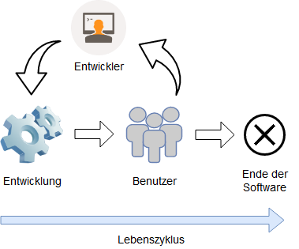
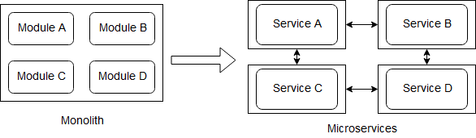

# Microservices

>Ein Microservice ist ein leichtgewichtiger autonomer Dienst, der eine einzige Aufgabe erfüllt und mit anderen ähnlichen Diensten über eine gut definierte Schnittstelle kollaboriert. <a>[[NAMI14]](#ref_Nami14)</a>

Die Abbildung _Architektur_ zeigt einen möglichen Aufbau von Microservices. Jedem Dienst entspricht eine Funktionalität. Einige Dienste haben eigene Datenbanken, andere greifen auf eine gemeinsame Datenbank zu.

_Architektur_, Abbildung aus <a>[[MIRI17]](#ref_Miri17)</a>

## Charakteristiken einer Microservice-Architektur

Es gibt keine formale Definition dieses Architekturstils. Allerdings gibt es gemeinsame Charakteristiken, welche von vielen Microservices geteilt werden. <a>[[LEWI14]](#ref_Lewi14)</a>

### Komponentisierung via Services

Normalerweise wird unter einem Komponenten der Teil einer Software verstanden, welches unabhängig von Anderen veränderbar ist. Microservices bezeichnen einzelne Services, aber auch Bibliotheken, als Komponenten. Eine Bibliothek ist eine eingebundene Komponente und wird durch Funktionsaufrufe aus dem Speicher aufgerufen. Ein Service hingegen wird durch Remote Calls bzw. Web Requests aufgerufen.
Der Vorteil eines Service gegenüber einer Bibliothek liegt in der Unabhängigkeit des Ersten. Ein einziger Prozess kann aus mehreren Bibliotheken bestehen und wäre eine davon verändert, müsste die gesamte Applikation neu aufgesetzt werden. Eine Aufteilung in Services wirkt dem entgegen, weil meistens nur der jeweilige Service geändert werden muss. Desweiteren bringt eine solche Aufsplittung sauber definierte Komponentenschnittstellen mit sich. Das bedeutet, dass einzelne Softwarekomponenten besser voneinander getrennt sind. <a>[[LEWI14]](#ref_Lewi14)</a>

### Aufbau um Business Capabilities

Microservices sollten rund um die Business Capabilities der Organization aufgebaut werden, ganz nach dem Gesetz von Conway. Das Gesetz von Conway besagt, dass die Struktur eines Systems die Kommunikationsstruktur der umsetzenden Organisation nachbildet. Es wird ein breites Feld von Software abgedeckt, wie GUI, Datenbanken, Schnittstellen. Das wiederum bedeutet, dass es cross-functional Teams sein müssen, um all die Bedingungen zu erfüllen. <a>[[LEWI14]](#ref_Lewi14)</a>

Die nächste Abbildung stellt dar, wie Microservices sich den Business Capabilities einer Organisation anpassen.

_Microservices und Business Capabilities_, Abbildung entnommen aus <a>[[LEWI14]](#ref_Lewi14)</a>

### Service als Produkt

Software sollte nicht als ein Projekt, sonder vielmals als ein Produkt gesehen werden. Das bedeutet, dass ein Entwicklungsteam während des gesamten Lebenszyklus sich darum kümmert. Auf diese Weise hat diese Team den Feedback, wie sich die Software in realen Arbeitsbedingungen verhält und hat einen engeren Kontakt zu den Benutzern. Das kreiert eine engere Bindung an das eigene Produkt. <a>[[LEWI14]](#ref_Lewi14)</a>

_Betreuung während des Lebenslaufs_, eigene Abbildung

### Smart endpoints and dumb pipes

Die Applikationen der Microservices sollten abgekoppelt und zusammenhängend wie möglich sein. Im Sinne von empfangen einer Anfrage, deren Bearbeitung und senden einer Antwort. Die Protokolle hingegen sollten hingegen unkompliziert sein. Einer der meistgenutzten Protokolle ist HTTP. Das erlaubt die Infrastruktur des Webs zu nutzen, um Ressourcen zu sparen.
Eine andere populäre Möglichkeit ist es lightweight message bus zu nutzen, wo die Infrastruktur nur als Router von Nachrichten fungiert (dumb pipes). <a>[[LEWI14]](#ref_Lewi14)</a>

### Dezentralisierte Führung

Dezentralisierte Führung ist ein Konzept welches aus mehreren Ansätzen besteht. Eines davon erlaubt den einzelnen Entwicklerteams ihre Stärken in verschiedenen Technologien anzuwenden und zusammen ein leistungsfähiges Produkt zu entwickeln, anstatt ihnen einen technologischen Standard aufzuzwingen. Das heißt, dass unter anderem jeder einzelner Service in der dafür am besten passenden Programmiersprache geschrieben werden kann, aber nicht unbedingt muss. Die Entscheidung liegt auf der Ebene der Entwickler, was nicht bedeutet, dass es überhaupt keine Richtlinien gibt.
Einen weiterer Ansatz der dezentralisierten Führung bringt die Amazon Herangehensweise zur Geltung: "You build it, you run it!". Damit ist gemeint, dass ein Entwicklungsteam nicht nur die eigentliche Entwicklung übernimmt, sondern auch die Installation, die Überwachung und die Steuerung dieses Produktes im Einsatz. Das geht weg von dem üblichen Konzept "Entwickeln und vergessen", wo nach der Entwicklung andere Gruppen sich darum kümmern. <a>[[LEWI14]](#ref_Lewi14)</a>, <a>[[PECK17]](#ref_Peck17)</a>

### Dezentralisiertes Datenmanagement

Die Dezentralisierung bei Microservices betrifft auch die Datenbanken. Es wird bevorzugt pro Service eine Datenbank zu haben, seien es nur unterschiedliche Datenbank-Instanzen oder komplett unterschiedliche Datenbanktechnologien. <a>[[LEWI14]](#ref_Lewi14)</a>

Die nächste Abbildung vergleicht ein monolithisches System mit Webservices in Bezug auf die Datenbanken.

_Dezentralisierte Datenbanken_, Abbildung entnommen aus <a>[[LEWI14]](#ref_Lewi14)</a>

### Infrastructure Automation

Testautomatisierung und Ansätze wie Continuous Integration und Continuous Delivery helfen bei der Entwicklung von stabiler und hochwertiger Software. <a>[[LEWI14]](#ref_Lewi14)</a>

### Design for failure

Ein Service ist nicht gegen Ausfälle und Fehler geschützt, deshalb sollte er immer gegen mögliche Fehlerfälle ausgiebig getestet werden. Da allerdings nicht alle möglichen Probleme abgedeckt und vorhergesehen werden können, kommt Monitoring zum Einsatz. Relevanten Metriken und weitere wichtige Information über den Softwarestatus erlauben es rechtzeitig Fehler zu beheben. <a>[[LEWI14]](#ref_Lewi14)</a>

### Evolutionäres Design

Eine Software sollte so designt werden, dass statt es bei größeren Änderungen zu verwerfen, sie weiterentwickelt werden kann. Die wichtigsten Eigenschaften eines Komponenten sind Austauschbarkeit und Erweiterungsfähigkeit - wie kann eine Komponente überarbeitet werden, ohne dass andere Komponenten davon betroffen sind. Oftmals wird ein Service verworfen anstatt auf lange Sicht überarbeitet zu werden. Manchmal macht es Sinn mehrere Dienste zu gruppieren, falls diese immer wieder Abhängigkeiten während Änderungen zeigen. <a>[[LEWI14]](#ref_Lewi14)</a>

Zusammengefasst sind die Vorraussetzungen für Microservices: <a>[[NAMI14]](#ref_Nami14)</a>
1. Request/Response calls mit willkürlich strukturierten Daten
2. Asynchrone Events in Echtzeit
3. Bidirektionale Requests und Responses
4. Requests und Responses können willkürlich geschachtelt sein
5. Nachrichtenformat: wie JSON, XML

Wenn es um Microservices geht müssen die Remote Calls näher betrachtet werden.

### Kommunikation mit Microservice

Einige häufig anzutreffende Entwürfen von Remote Calls sind Direct Call, Gateway und Message Bus.

__Direct Call__

_Direct Call_, Abbildung angepasst aus <a>[[NAMI14]](#ref_Nami14)</a>

__Gateway__

_Gateway_, Abbildung angepasst aus <a>[[NAMI14]](#ref_Nami14)</a>

__Message-bus__

_Message Bus_, Abbildung angepasst aus <a>[[NAMI14]](#ref_Nami14)</a>

Eine der Hauptaufgaben von Microservices ist eine Minimierung von Einflüssen im Falle einer möglichen Schnittstellenänderung. <a>[[NAMI14]](#ref_Nami14)</a>

## Unterschiede zu monolithischen Anwendungen

Monolithischen Anwendungen werden als ein Ganzes entwickelt. Sie bestehen oft aus drei Schichten:
- Clientseitige Applikation
- Serverseitige Applikation
- Datenbank

Eine serverseitige Applikation ist ein solches Monolith, weil sie für HTTP-Anfragen zuständig ist, Zugriffe auf die Datenbank steuert und mit dem Browser interagiert. Eine Änderung im System führt zu einer neuen Version der ganzen Software. Die ganze Logik konzentriert sich in einer ausführbaren Datei. Es ist ein natürlich Weg zu entwickeln. Optimierung kan mithilfe eines Load Balancer erfolgen, damit mehrere Instanzen der Applikation nebenbei laufen können.
Allerdings kann schwierig werden eine solche Anwendung auf Dauer zu entwickeln. Es erfordert viel Aufwand ständige Änderungen und Korrekturen zu implementieren, denn bei einem Monolith muss jedes Mal das ganze System neu erstellt werden. Desweiteren ist es aufwändig die Modularität der Software aufrecht zu erhalten, ohne das intern ungewollte Abhängigkeiten zwischen den Modulen entstehen. Auch eine Skalierung des ganzen Systems erfordert viel mehr Ressourcen, als eines einzelnen Moduls. <a>[[LEWI14]](#ref_Lewi14)</a>

Eine schematischer Aufteilung einer monolithischen Anwendung in Microservices kann in der nächsten Abbildung betrachtet werden.

_Microservices vs Monolith_, Eigene Darstellung

Jedes einzelnes Microservice kann in komplett anderer Programmiersprache geschrieben sein. Im Gegensatz dazu kann eine monolithische Architektur zwar mehrere Dienste oder Komponenten enthalten - sie bilden aber trotzdem ein Ganzes.<a>[[NAMI14]](#ref_Nami14)</a>

### Vorteile

- übersichtlicher Code, weil je Dienst, deswegen einfacher neuer Entwickler reinzubringen
- Modifizierbarkeit, muss nicht die gesamte Architektur verändert werden
- Macht kontinuierliche Entwicklung einfacher
<a>[[LEWI14]](#ref_Lewi14)</a>

- Erhöhte Einsatzfähigkeit
- Unabhängigkeit in der Entwicklung pro Dienst
- Kürzere Entwicklungszeiten
- Resistenz
- Erleichterte Umsetzung innovativer Lösungen
<a>[[NAMI14]](#ref_Nami14)</a>

- Besser testbarkeit - kleine Services sind einfacher zu testen
- bessere Einsatzfähigkeit - Services sind unabhängiger
- "Zwei Pizzen" Teams - mehrere autonome Gruppen pro Service
- Service ist relativ klein gehalten wegen Einfachheit, schnellerer Entwicklung und größerer Produktivität
- Bessere Fehlereingrenzung
- Unabhängigkeit und Stabilität - andere Services arbeiten weiter
-  Technologie-unabhängig, Vorteile von neuen Technologien und Sprachen, hohe Modifizierbarkeit
<a>[[RICH17]](#ref_Rich17)</a>

http://microservices.io/patterns/microservices.html

### Nachteile

- Viele Remote Calls
- Bis zu einer bestimmten Größe, schwieriger zu entwickeln, da Partitionierung
- Schwerer aufzusetzen als eine monolithische Struktur (größter Nachteil)
- Mehrere Kopien gleichzeitig laufen zu lassen nicht möglich, Load Balancer
- Zusätzliche Komplexität, weil ein System in unterschiedliche Dienste partitioniert werden soll
- Größerer Speicherbedarf, weil jeder Dienst eigenen Platz beansprucht
- Testen ist komplizierter, da die Dienste verteilt sind
<a>[[NAMI14]](#ref_Nami14)</a>

- Remote Calls verbrauchen mehr Ressourcen als In-Prozess Calls
- Prozessgrenzen machen Verteilung der Kompetenzen schwieriger
<a>[[LEWI14]](#ref_Lewi14)</a>

- mehr Komplexität da verteilte Systeme, managen und einsetzen
- Testen wird aufwendiger
- Die Kommmunikation zwischen den Services muss gerwährleistet sein
- UseCases können über mehrere Services gehen
- Größerer Speicherbedarf
-
<a>[[RICH17]](#ref_Rich17)</a>

http://microservices.io/patterns/microservices.html

## Humane Registries

Humane Registry ist eine automatisierte Dokumentation für Webservices, designt um Informationen automatisch in menschlich lesbaren Form zu schreiben und zu aktualisieren. Die wichtigesten Merkmale so einer Dokumentation sind:
- _Verständlichkeit_: der Format sollte für alle lesbar und verständlich sein
- _Automation_: Entwickler haben selten Zeit eine Dokumentation zu pflegen
- _Einfachheit_: eine Erweiterung der Informationen sollte unkompliziert sein

Solch ein Dokumentationswerkzeug durchsucht den Quellcode des Systems und stellt detaillierte Informationen darüber bereit, welcher entwickler wann und wieviel zum Webservice beigetragen hat. So können Mitarbeiter sehen an wem sie sich in bestimmten Fällen wenden können. Mithilfe von Daten aus verschiedensten Systemen, wie Continuous-Integration-Servern, von Versionsverwaltungsprogrammen und Issue-Tracking-Systemen, wird eine übergreifende Dokumentation erschaffen. <a>[[FOWL08]](#ref_Fowl08)</a>

## Abgrenzung zu Self-Contained Systems

http://scs-architecture.org/vs-ms.html

## Serverless

Serverless steht für Serverless computing und wird in zwei Bereichen eingesetzt:
1. Es wird komplett auf die serverseitige Logik verzichtet und stattdessen werden Cloud-Services von Drittanbietern integriert. Übliche Anwender sind sogenannte "Rich Clients" - Single-Page-Webanwendungen und mobile Apps. Zu solchen Cloud-Services zählen Datenbanken, Authentifizierungsmechanismen und so weiter. Weshalb dieser Typ von Webservices auch "Backend as a Service" genannt wird.
2. Ein anderer Bereich von Serverless ist "Function as a Service" (FaaS). In diesem Szenario wird serverseitige Logik immer noch vom Entwickler geschrieben, jedoch verpackt in Container und von einer Cloud gemanagt. Diese Container sind zustandslos, ereignisgesteuert und kurzlebig. Der bekannteste Beispiel ist AWS Lambda von Amazon.

Die folgende Abbildung zeigt die Unterschiede zwischen der üblichen Architektur und Serverless. Die Authentifizierung erfolgt über den Cloud-Service. Der Client hat Zugriff auf die Produkt-Datenbank, welche von Drittanbietern gehostet wird. Ein Teil der früheren Serverlogik der alten Architektur kann in den Client implementiert werden, siehe Single-Page-Webanwendung. Mit HTTP-Anfragen kann über die API eine Suche in der Datenbank getriggert werden - es ist nicht nötig, dass ständig ein Server am laufen sein muss. Es ist möglich Teile von eigenem Quellcode in Plattformen wie AWS Lambda zu verwenden, falls die Programmiersprache unterstützt wird. Die Funktionalität "Kaufen" kann ebenfalls durch "Function as a Service" ersetzt werden. Zum einen, um den Client leichtgewichtiger zu halten, zum anderen aus Sicherheit. <a>[[ROBE18]](#ref_Robe18)</a>

_Serverless_, Abbildung angepasst aus <a>[[ROBE18]](#ref_Robe18)</a>

Vereinfacht ausgedrückt - FaaS ist eine Ausführung von Backend-Quellcode ohne dabei einen eigenen Server oder dauerhaft arbeitende Serverprogramme laufen zu haben. FaaS ist darauf ausgelegt innerhalb kürzester Zeit (Millisekunden) benötigte Anwendungen je nach Anfrage zu starten und zu beenden. Die Vorteile sind eine Vereinfachung der Architektur durch den Wegfall einer Schicht und Übergabe der serverseitigen Logik an die Cloud-Services. Die Einsparung von Entwicklungs-, Installations- und Instandhaltungsaufwänden zählt ebenfalls zu den Vorteilen gegenüber der üblichen Drei-Schichten-Architektur. <a>[[ROBE18]](#ref_Robe18)</a>

## Microservice as frontends

https://medium.com/@tomsoderlund/micro-frontends-a-microservice-approach-to-front-end-web-development-f325ebdadc16

## Einsatz von Microservices

- Schwierig zu entscheiden wann einzusetzen
- Probleme tauchen mittelfristig auf
- wenn schnelle Lösungen gefragt sind, nicht sehr populär, da langsamer wegen komplizierten Struktur
- im Nachhinein funktionelle Dekomposition, schwierig Verworrenheit wieder aufzubröseln

Wie aufteilen?
- Dekomponierung nach Business Capabilities
- Dekomponierung nach Domain-Driven Design
- Aufteilung nach UseCase oder Verb, wenn Service für Aktionen zuständig sind
- Aufteilung nach Nomen oder Ressourcen, wenn Service für Operationen an Ressourcen zuständig ist
- Ein Service sollte ein Set an Verantwortlichkeiten haben, Single Responsibility Principle
- Eine Aufgabe pro Service
<a>[[RICH17]](#ref_Rich17)</a>

- Netflix, Amazon, EBay evolutionierten von Monolith bis Microservices Architektur 
- Netflix 30% des Internetverkehr, 1 Milliarde Aufrufe, 800 verschiedenen Geräten
- Amazon hat bis zu 150 Services für die Webseite
- Ebay hat mehrere Applikationen und kam von Monolith-Architektur

<a>[[RICH17]](#ref_Rich17)</a>

## Quellen

<a name="ref_Chen18">[CHEN18]</a>: Chen, Lianping: Microservices: Architecting for Continuous Delivery and DevOps, IEEE International Conference on Software Architecture, 2018, URL: https://www.researchgate.net/publication/323944215_Microservices_Architecting_for_Continuous_Delivery_and_DevOps

<a name="ref_Fowl08">[FOWL08]</a>: Fowler, Martin: HumaneRegistry, 01.12.2008, URL: https://martinfowler.com/bliki/HumaneRegistry.html (letzter Zugriff: 27.05.2018)

<a name="ref_Miri17">[MIRI17]</a>: Miri, Ima: Microservices vs. SOA, 04.01.2017, URL: https://dzone.com/articles/microservices-vs-soa-2

<a name="ref_Lewi14">[LEWI14]</a>: Lewis James; Fowler, Martin: Microservices, a definition of this new architectural term, 25.03.2014, URL: https://martinfowler.com/articles/microservices.html (letzter Zugriff: 24.05.2018)

<a name="ref_Nami14">[NAMI14]</a>: Namiot, Dmitry; Sneps-Sneppe, Manfred: On Micro-services Architecture, International Journal of Open Information Technologies ISSN: 2307-8162 vol. 2, no. 9, 2014,
URL: https://cyberleninka.ru/article/v/on-micro-services-architecture (letzter Zugriff: 26.04.2018)

<a name="ref_Peck17">[PECK17]</a>: Peck, Nathan: Microservice Principles: Decentralized Governance, 05.09.2017, URL: https://medium.com/@nathankpeck/microservice-principles-decentralized-governance-4cdbde2ff6ca (letzter Zugriff: 24.05.2018)

<a name="ref_Rich17">[RICH17]</a>: Richardson, Chris: Pattern: Microservice Architecture, 2017, URL: http://microservices.io/patterns/microservices.html (letzter Zugriff: 26.05.2018)

<a name="ref_Robe18">[ROBE18]</a>: Roberts, Mike: Serverless Architectures, 22.05.2018, URL: https://martinfowler.com/articles/serverless.html (letzter Zugriff: 27.05.2018)